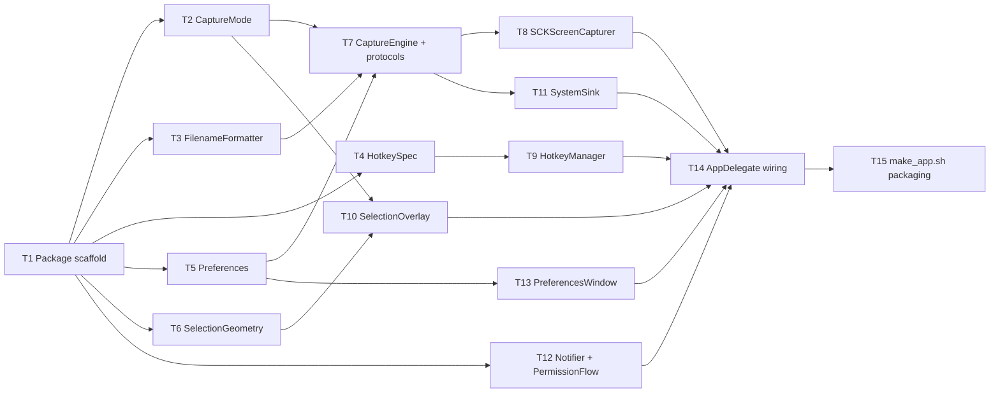

# M1 Capture Core — Implementation Plan

> **For agentic workers:** REQUIRED SUB-SKILL: Use `executing-plan-time` to run this plan. It handles worktree setup, overlap analysis, parallel-wave dispatch, per-task spec + code-quality review, and branch finishing in one runner. Steps use checkbox `- [ ]` syntax for tracking.

**Goal:** A menu-bar macOS app that captures area/window/fullscreen screenshots via global hotkeys, copies to clipboard + saves a PNG, and notifies — replacing the system ⌘⇧4.
**Architecture:** SwiftPM package. `MacShotCore` library holds all headless-testable logic behind protocols; `MacShot` executable is a thin AppKit/ScreenCaptureKit/Carbon shell wired in `AppDelegate`. `Scripts/make_app.sh` bundles `MacShot.app`.
**Tech Stack:** Swift 6, SwiftUI + AppKit, ScreenCaptureKit, Carbon hotkeys, UserNotifications, UserDefaults, XCTest.
**Max wave width:** 6 tasks in parallel at peak (W4, GUI shell).

> **Autonomous-mode note:** planned under `/dev --auto`, greenfield repo, no graphify graph. Manifest is an all-**Create** list — complete by construction (nothing pre-exists to miss). Planning decisions logged to `.dev/memory/decisions.md` tagged `[auto]`.

> **Verification convention:** `MacShotCore` tasks follow strict TDD-before-commit (failing test → impl → passing test → commit). `MacShot` executable tasks touch AppKit/ScreenCaptureKit/Carbon/TCC surfaces that cannot run in a headless `swift test`; their gate is **`swift build` succeeds + the task's manual-smoke checklist item**, not a fabricated unit test. All pure logic was pushed down into `MacShotCore` (incl. `SelectionGeometry`) precisely to keep the untestable shell thin.

---

## File Edit Manifest

| Path | Action | Purpose | First touched in |
|------|--------|---------|------------------|
| `Package.swift` | Create | SwiftPM manifest: 3 targets | T1 |
| `.gitignore` | Modify | already has `.build/`; add `MacShot.app/`, `*.dmg` | T1 |
| `Sources/MacShotCore/CaptureMode.swift` | Create | capture mode enum + metadata | T2 |
| `Tests/MacShotCoreTests/CaptureModeTests.swift` | Create | mode tests | T2 |
| `Sources/MacShotCore/FilenameFormatter.swift` | Create | timestamp → filename, collision dedupe | T3 |
| `Tests/MacShotCoreTests/FilenameFormatterTests.swift` | Create | formatter tests | T3 |
| `Sources/MacShotCore/HotkeySpec.swift` | Create | hotkey parse/serialize + Carbon mapping | T4 |
| `Tests/MacShotCoreTests/HotkeySpecTests.swift` | Create | hotkey tests | T4 |
| `Sources/MacShotCore/Preferences.swift` | Create | prefs struct + store protocol | T5 |
| `Tests/MacShotCoreTests/PreferencesTests.swift` | Create | prefs roundtrip tests | T5 |
| `Sources/MacShotCore/SelectionGeometry.swift` | Create | drag→rect math, clamp, magnifier crop | T6 |
| `Tests/MacShotCoreTests/SelectionGeometryTests.swift` | Create | geometry tests | T6 |
| `Sources/MacShotCore/Capture.swift` | Create | `ScreenCapturer`/`CaptureSink` protocols, `CaptureResult` | T7 |
| `Sources/MacShotCore/CaptureEngine.swift` | Create | single-entry engine: route mode → capture → sinks | T7 |
| `Tests/MacShotCoreTests/CaptureEngineTests.swift` | Create | engine routing + sink tests (fakes) | T7 |
| `Sources/MacShot/SCKScreenCapturer.swift` | Create | ScreenCaptureKit impl of `ScreenCapturer` | T8 |
| `Sources/MacShot/HotkeyManager.swift` | Create | Carbon `RegisterEventHotKey` wrapper | T9 |
| `Sources/MacShot/SelectionOverlay.swift` | Create | borderless overlay window (dim/crosshair/magnifier/window-highlight) | T10 |
| `Sources/MacShot/SystemSink.swift` | Create | `CaptureSink`: NSPasteboard + PNG write | T11 |
| `Sources/MacShot/Notifier.swift` | Create | UserNotifications banner | T12 |
| `Sources/MacShot/PermissionFlow.swift` | Create | TCC preflight/request + Settings deep-link | T12 |
| `Sources/MacShot/PreferencesWindow.swift` | Create | SwiftUI prefs form | T13 |
| `Sources/MacShot/AppDelegate.swift` | Create | NSStatusItem menu + wires everything | T14 |
| `Sources/MacShot/main.swift` | Create | app entry (`NSApplication`, LSUIElement) | T14 |
| `Scripts/make_app.sh` | Create | assemble `MacShot.app` bundle | T15 |
| `Scripts/Info.plist` | Create | bundle Info.plist template (LSUIElement) | T15 |

**Out of scope (intentionally not touched):** no overlay-hub/editor/OCR/beautify/history code (later milestones); no `.xcodeproj` (SwiftPM by decision); no Developer-ID signing/notarization config (M6); no `docs/` beyond this plan.

---

## Execution Waves



| Wave | Tasks | Parallelizable | Rationale |
|------|-------|----------------|-----------|
| W1 | T1 | n/a (single) | package must exist before anything compiles |
| W2 | T2, T3, T4, T5, T6 | yes — disjoint files, only depend on T1 | independent core value types |
| W3 | T7 | n/a | engine merges CaptureMode + FilenameFormatter + Preferences |
| W4 | T8, T9, T10, T11, T12, T13 | yes — disjoint files in exe target | independent shell components |
| W5 | T14 | n/a | integration point; wires all W4 outputs into AppDelegate |
| W6 | T15 | n/a | packaging needs the built binary |

---

## Task 1: Package scaffold

**Depends-on:** none
**Wave:** W1
**Files:**
- Create: `Package.swift`
- Modify: `.gitignore`

- [ ] **Step 1: Write `Package.swift`**
```swift
// swift-tools-version: 6.0
import PackageDescription

let package = Package(
    name: "MacShot",
    platforms: [.macOS(.v14)],
    targets: [
        .target(name: "MacShotCore"),
        .executableTarget(
            name: "MacShot",
            dependencies: ["MacShotCore"]
        ),
        .testTarget(
            name: "MacShotCoreTests",
            dependencies: ["MacShotCore"]
        ),
    ]
)
```
- [ ] **Step 2: Create placeholder sources so the package resolves**
  `Sources/MacShotCore/Placeholder.swift` → `enum _MacShotCorePlaceholder {}`
  `Sources/MacShot/main.swift` → `print("MacShot")` (replaced in T14)
  `Tests/MacShotCoreTests/SmokeTests.swift`:
```swift
import XCTest
@testable import MacShotCore
final class SmokeTests: XCTestCase {
    func testPackageBuilds() { XCTAssertTrue(true) }
}
```
- [ ] **Step 3: Append to `.gitignore`**
  Add lines: `MacShot.app/` and `*.dmg`
- [ ] **Step 4: Verify build + test**
  Run: `swift build && swift test`
  Expected: build succeeds, 1 test passes.
- [ ] **Step 5: Commit**
```bash
git add Package.swift .gitignore Sources Tests
git commit -m "chore: SwiftPM package scaffold (MacShotCore + MacShot + tests)"
```

---

## Task 2: CaptureMode

**Depends-on:** [T1]
**Wave:** W2
**Files:**
- Create: `Sources/MacShotCore/CaptureMode.swift`
- Test: `Tests/MacShotCoreTests/CaptureModeTests.swift`

- [ ] **Step 1: Failing test**
```swift
import XCTest
@testable import MacShotCore

final class CaptureModeTests: XCTestCase {
    func testModeSlugsAreStableForFilenames() {
        XCTAssertEqual(CaptureMode.area(nil).slug, "area")
        XCTAssertEqual(CaptureMode.window(nil).slug, "window")
        XCTAssertEqual(CaptureMode.fullscreen(nil).slug, "fullscreen")
    }
    func testNeedsSelectionOverlay() {
        XCTAssertTrue(CaptureMode.area(nil).needsSelectionUI)
        XCTAssertTrue(CaptureMode.window(nil).needsSelectionUI)
        XCTAssertFalse(CaptureMode.fullscreen(nil).needsSelectionUI)
    }
}
```
- [ ] **Step 2: Run → FAIL** (`CaptureMode` undefined)
  Run: `swift test --filter CaptureModeTests`
- [ ] **Step 3: Implement**
```swift
import CoreGraphics

/// The single capture request type. Every mode is a case on this enum, not a
/// separate code path (roadmap: single Capture Engine entry point).
public enum CaptureMode: Equatable, Sendable {
    case area(CGRect?)         // nil = ask via overlay
    case window(CGWindowID?)   // nil = pick via overlay
    case fullscreen(CGDirectDisplayID?) // nil = main display

    public var slug: String {
        switch self {
        case .area: return "area"
        case .window: return "window"
        case .fullscreen: return "fullscreen"
        }
    }
    public var needsSelectionUI: Bool {
        switch self {
        case .area, .window: return true
        case .fullscreen: return false
        }
    }
}
```
  (`CGWindowID`/`CGDirectDisplayID` come from CoreGraphics — available headless.)
- [ ] **Step 4: Run → PASS**
  Run: `swift test --filter CaptureModeTests`
- [ ] **Step 5: Commit**
```bash
git add Sources/MacShotCore/CaptureMode.swift Tests/MacShotCoreTests/CaptureModeTests.swift
git commit -m "feat(core): CaptureMode enum with slug + needsSelectionUI"
```

---

## Task 3: FilenameFormatter

**Depends-on:** [T1]
**Wave:** W2
**Files:**
- Create: `Sources/MacShotCore/FilenameFormatter.swift`
- Test: `Tests/MacShotCoreTests/FilenameFormatterTests.swift`

- [ ] **Step 1: Failing test**
```swift
import XCTest
@testable import MacShotCore

final class FilenameFormatterTests: XCTestCase {
    let ts = Date(timeIntervalSince1970: 1_600_000_000) // 2020-09-13 12:26:40 UTC

    func testExpandsDateTimeTokens() {
        let f = FilenameFormatter(format: "Shot {date} at {time}", calendar: .utc)
        XCTAssertEqual(f.filename(for: ts, mode: "area"),
                       "Shot 2020-09-13 at 12-26-40.png")
    }
    func testSanitizesIllegalCharacters() {
        let f = FilenameFormatter(format: "a/b:c{mode}", calendar: .utc)
        let name = f.filename(for: ts, mode: "area")
        XCTAssertFalse(name.contains("/"))
        XCTAssertFalse(name.contains(":"))
    }
    func testDedupesCollisions() {
        let f = FilenameFormatter(format: "x", calendar: .utc)
        let taken: (String) -> Bool = { ["x.png", "x (1).png"].contains($0) }
        XCTAssertEqual(f.uniqueFilename(for: ts, mode: "area", isTaken: taken), "x (2).png")
    }
}

extension Calendar { static var utc: Calendar {
    var c = Calendar(identifier: .gregorian); c.timeZone = TimeZone(identifier: "UTC")!; return c
} }
```
- [ ] **Step 2: Run → FAIL**
  Run: `swift test --filter FilenameFormatterTests`
- [ ] **Step 3: Implement**
```swift
import Foundation

/// Expands a user format string + timestamp into a safe PNG filename.
/// Tokens: {date}=yyyy-MM-dd, {time}=HH-mm-ss, {mode}=capture slug.
public struct FilenameFormatter {
    public let format: String
    public var calendar: Calendar
    public init(format: String, calendar: Calendar = .current) {
        self.format = format; self.calendar = calendar
    }

    private static let illegal = CharacterSet(charactersIn: "/\\:*?\"<>|")

    public func filename(for date: Date, mode: String) -> String {
        let df = DateFormatter(); df.calendar = calendar; df.timeZone = calendar.timeZone; df.locale = Locale(identifier: "en_US_POSIX")
        df.dateFormat = "yyyy-MM-dd"; let d = df.string(from: date)
        df.dateFormat = "HH-mm-ss";   let t = df.string(from: date)
        var s = format
            .replacingOccurrences(of: "{date}", with: d)
            .replacingOccurrences(of: "{time}", with: t)
            .replacingOccurrences(of: "{mode}", with: mode)
        s = String(s.unicodeScalars.map { Self.illegal.contains($0) ? "-" : Character($0) })
        return s.isEmpty ? "Screenshot.png" : s + ".png"
    }

    /// Appends " (n)" until `isTaken` returns false.
    public func uniqueFilename(for date: Date, mode: String, isTaken: (String) -> Bool) -> String {
        let base = filename(for: date, mode: mode)
        if !isTaken(base) { return base }
        let stem = String(base.dropLast(4)) // strip .png
        var n = 1
        while isTaken("\(stem) (\(n)).png") { n += 1 }
        return "\(stem) (\(n)).png"
    }
}
```
- [ ] **Step 4: Run → PASS**
  Run: `swift test --filter FilenameFormatterTests`
- [ ] **Step 5: Commit**
```bash
git add Sources/MacShotCore/FilenameFormatter.swift Tests/MacShotCoreTests/FilenameFormatterTests.swift
git commit -m "feat(core): FilenameFormatter with token expansion, sanitize, dedupe"
```

---

## Task 4: HotkeySpec

**Depends-on:** [T1]
**Wave:** W2
**Files:**
- Create: `Sources/MacShotCore/HotkeySpec.swift`
- Test: `Tests/MacShotCoreTests/HotkeySpecTests.swift`

- [ ] **Step 1: Failing test**
```swift
import XCTest
@testable import MacShotCore

final class HotkeySpecTests: XCTestCase {
    func testParseAndSerializeSymmetry() throws {
        let spec = try HotkeySpec(string: "⌘⇧2")
        XCTAssertTrue(spec.modifiers.contains(.command))
        XCTAssertTrue(spec.modifiers.contains(.shift))
        XCTAssertEqual(spec.description, "⌘⇧2")
    }
    func testControlCommandShift() throws {
        let spec = try HotkeySpec(string: "⌃⌘⇧3")
        XCTAssertEqual(spec.modifiers, [.control, .command, .shift])
        XCTAssertEqual(spec.keyLabel, "3")
    }
    func testRejectsModifierOnly() {
        XCTAssertThrowsError(try HotkeySpec(string: "⌘⇧"))
    }
    func testCarbonModifierMaskIsStable() throws {
        // cmdKey=256, shiftKey=512 (Carbon constants); mask is their OR.
        let spec = try HotkeySpec(string: "⌘⇧2")
        XCTAssertEqual(spec.carbonModifierMask, 256 | 512)
    }
}
```
- [ ] **Step 2: Run → FAIL**
  Run: `swift test --filter HotkeySpecTests`
- [ ] **Step 3: Implement** (pure model — no Carbon import; expose the mask as plain integers so it stays headless-testable)
```swift
import Foundation

public struct HotkeyModifiers: OptionSet, Sendable {
    public let rawValue: Int
    public init(rawValue: Int) { self.rawValue = rawValue }
    public static let command = HotkeyModifiers(rawValue: 1 << 0)
    public static let shift   = HotkeyModifiers(rawValue: 1 << 1)
    public static let option  = HotkeyModifiers(rawValue: 1 << 2)
    public static let control = HotkeyModifiers(rawValue: 1 << 3)
}

public struct HotkeySpec: Equatable, Sendable, CustomStringConvertible {
    public let modifiers: HotkeyModifiers
    public let keyLabel: String     // "2", "3", "A" ...
    public let keyCode: UInt32      // Carbon virtual keycode

    enum ParseError: Error { case noKey }

    // Symbol ↔ modifier
    private static let symbols: [(Character, HotkeyModifiers)] =
        [("⌃", .control), ("⌥", .option), ("⇧", .shift), ("⌘", .command)]
    // Minimal key label → Carbon virtual keycode map (extend as needed)
    static let keyCodes: [String: UInt32] = [
        "1":18,"2":19,"3":20,"4":21,"5":23,"6":22,"7":26,"8":28,"9":25,"0":29
    ]

    public init(string: String) throws {
        var mods: HotkeyModifiers = []
        var key = ""
        for ch in string {
            if let m = Self.symbols.first(where: { $0.0 == ch })?.1 { mods.insert(m) }
            else { key.append(ch) }
        }
        guard !key.isEmpty, let code = Self.keyCodes[key.uppercased()] ?? Self.keyCodes[key] else {
            throw ParseError.noKey
        }
        self.modifiers = mods; self.keyLabel = key; self.keyCode = code
    }

    public init(modifiers: HotkeyModifiers, keyLabel: String, keyCode: UInt32) {
        self.modifiers = modifiers; self.keyLabel = keyLabel; self.keyCode = keyCode
    }

    public var description: String {
        let order: [(HotkeyModifiers, String)] =
            [(.control,"⌃"),(.option,"⌥"),(.shift,"⇧"),(.command,"⌘")]
        return order.filter { modifiers.contains($0.0) }.map(\.1).joined() + keyLabel
    }

    /// Carbon `modifierFlags` mask (cmdKey=256, shiftKey=512, optionKey=2048, controlKey=4096).
    public var carbonModifierMask: UInt32 {
        var m: UInt32 = 0
        if modifiers.contains(.command) { m |= 256 }
        if modifiers.contains(.shift)   { m |= 512 }
        if modifiers.contains(.option)  { m |= 2048 }
        if modifiers.contains(.control) { m |= 4096 }
        return m
    }

    public static let defaults: [CaptureMode.Kind: HotkeySpec] = [:]
}

extension CaptureMode { public enum Kind: String, Sendable { case area, window, fullscreen } }
```
- [ ] **Step 4: Run → PASS**
  Run: `swift test --filter HotkeySpecTests`
- [ ] **Step 5: Commit**
```bash
git add Sources/MacShotCore/HotkeySpec.swift Tests/MacShotCoreTests/HotkeySpecTests.swift
git commit -m "feat(core): HotkeySpec parse/serialize + Carbon modifier mask"
```

---

## Task 5: Preferences

**Depends-on:** [T1]
**Wave:** W2
**Files:**
- Create: `Sources/MacShotCore/Preferences.swift`
- Test: `Tests/MacShotCoreTests/PreferencesTests.swift`

- [ ] **Step 1: Failing test**
```swift
import XCTest
@testable import MacShotCore

final class PreferencesTests: XCTestCase {
    func testDefaultsWhenStoreEmpty() {
        let prefs = Preferences(store: InMemoryKVStore())
        XCTAssertEqual(prefs.filenameFormat, "Screenshot {date} at {time}")
        XCTAssertTrue(prefs.copyToClipboard)
        XCTAssertTrue(prefs.saveToFile)
    }
    func testRoundtrip() {
        let store = InMemoryKVStore()
        var prefs = Preferences(store: store)
        prefs.filenameFormat = "X {mode}"
        prefs.saveDirectoryPath = "/tmp/shots"
        prefs.copyToClipboard = false
        let reloaded = Preferences(store: store)
        XCTAssertEqual(reloaded.filenameFormat, "X {mode}")
        XCTAssertEqual(reloaded.saveDirectoryPath, "/tmp/shots")
        XCTAssertFalse(reloaded.copyToClipboard)
    }
}
```
- [ ] **Step 2: Run → FAIL**
  Run: `swift test --filter PreferencesTests`
- [ ] **Step 3: Implement** (store protocol so tests avoid real UserDefaults)
```swift
import Foundation

public protocol KeyValueStore: AnyObject {
    func string(forKey: String) -> String?
    func object(forKey: String) -> Any?
    func set(_ value: Any?, forKey: String)
}
extension UserDefaults: KeyValueStore {}

public final class InMemoryKVStore: KeyValueStore {
    private var d: [String: Any] = [:]
    public init() {}
    public func string(forKey k: String) -> String? { d[k] as? String }
    public func object(forKey k: String) -> Any? { d[k] }
    public func set(_ value: Any?, forKey k: String) { d[k] = value }
}

/// UserDefaults-backed preferences (roadmap: PNG files + UserDefaults, no DB).
public struct Preferences {
    private let store: KeyValueStore
    public init(store: KeyValueStore) { self.store = store }

    private func s(_ k: String, _ def: String) -> String { store.string(forKey: k) ?? def }
    private func b(_ k: String, _ def: Bool) -> Bool { (store.object(forKey: k) as? Bool) ?? def }

    public var filenameFormat: String {
        get { s("filenameFormat", "Screenshot {date} at {time}") }
        nonmutating set { store.set(newValue, forKey: "filenameFormat") }
    }
    public var saveDirectoryPath: String {
        get { s("saveDirectoryPath", (NSHomeDirectory() as NSString).appendingPathComponent("Pictures/MacShot")) }
        nonmutating set { store.set(newValue, forKey: "saveDirectoryPath") }
    }
    public var copyToClipboard: Bool {
        get { b("copyToClipboard", true) }; nonmutating set { store.set(newValue, forKey: "copyToClipboard") }
    }
    public var saveToFile: Bool {
        get { b("saveToFile", true) }; nonmutating set { store.set(newValue, forKey: "saveToFile") }
    }
    // Hotkeys stored as their symbol strings; parsed via HotkeySpec at registration.
    public var areaHotkey: String { get { s("hotkey.area", "⌘⇧2") } nonmutating set { store.set(newValue, forKey: "hotkey.area") } }
    public var windowHotkey: String { get { s("hotkey.window", "⌃⌘⇧2") } nonmutating set { store.set(newValue, forKey: "hotkey.window") } }
    public var fullscreenHotkey: String { get { s("hotkey.fullscreen", "⌃⌘⇧3") } nonmutating set { store.set(newValue, forKey: "hotkey.fullscreen") } }
}
```
- [ ] **Step 4: Run → PASS**
  Run: `swift test --filter PreferencesTests`
- [ ] **Step 5: Commit**
```bash
git add Sources/MacShotCore/Preferences.swift Tests/MacShotCoreTests/PreferencesTests.swift
git commit -m "feat(core): Preferences over a KeyValueStore protocol"
```

---

## Task 6: SelectionGeometry

**Depends-on:** [T1]
**Wave:** W2
**Files:**
- Create: `Sources/MacShotCore/SelectionGeometry.swift`
- Test: `Tests/MacShotCoreTests/SelectionGeometryTests.swift`

- [ ] **Step 1: Failing test**
```swift
import XCTest
import CoreGraphics
@testable import MacShotCore

final class SelectionGeometryTests: XCTestCase {
    func testRectFromDragNormalizesDirection() {
        let r = SelectionGeometry.rect(from: CGPoint(x: 100, y: 100), to: CGPoint(x: 40, y: 30))
        XCTAssertEqual(r, CGRect(x: 40, y: 30, width: 60, height: 70))
    }
    func testClampToBounds() {
        let bounds = CGRect(x: 0, y: 0, width: 200, height: 200)
        let r = SelectionGeometry.rect(from: CGPoint(x: -10, y: -10), to: CGPoint(x: 250, y: 100))
        XCTAssertEqual(SelectionGeometry.clamp(r, to: bounds), CGRect(x: 0, y: 0, width: 200, height: 110))
    }
    func testTooSmallIsNil() {
        XCTAssertNil(SelectionGeometry.validated(CGRect(x: 0, y: 0, width: 3, height: 3), minSide: 5))
        XCTAssertNotNil(SelectionGeometry.validated(CGRect(x: 0, y: 0, width: 10, height: 10), minSide: 5))
    }
}
```
- [ ] **Step 2: Run → FAIL**
  Run: `swift test --filter SelectionGeometryTests`
- [ ] **Step 3: Implement**
```swift
import CoreGraphics

/// Pure geometry for the selection overlay. Kept in core so the AppKit overlay
/// window stays a thin renderer.
public enum SelectionGeometry {
    public static func rect(from a: CGPoint, to b: CGPoint) -> CGRect {
        CGRect(x: min(a.x, b.x), y: min(a.y, b.y),
               width: abs(a.x - b.x), height: abs(a.y - b.y))
    }
    public static func clamp(_ r: CGRect, to bounds: CGRect) -> CGRect {
        r.intersection(bounds)
    }
    /// nil if either side is below `minSide` (treat as an accidental click).
    public static func validated(_ r: CGRect, minSide: CGFloat) -> CGRect? {
        (r.width >= minSide && r.height >= minSide) ? r : nil
    }
}
```
- [ ] **Step 4: Run → PASS**
  Run: `swift test --filter SelectionGeometryTests`
- [ ] **Step 5: Commit**
```bash
git add Sources/MacShotCore/SelectionGeometry.swift Tests/MacShotCoreTests/SelectionGeometryTests.swift
git commit -m "feat(core): SelectionGeometry drag→rect, clamp, min-size validation"
```

---

## Task 7: CaptureEngine + protocols

**Depends-on:** [T2, T3, T5]
**Wave:** W3
**Files:**
- Create: `Sources/MacShotCore/Capture.swift`
- Create: `Sources/MacShotCore/CaptureEngine.swift`
- Test: `Tests/MacShotCoreTests/CaptureEngineTests.swift`

- [ ] **Step 1: Failing test** (fakes for both boundaries)
```swift
import XCTest
import CoreGraphics
@testable import MacShotCore

private func makeImage() -> CGImage {
    let ctx = CGContext(data: nil, width: 2, height: 2, bitsPerComponent: 8, bytesPerRow: 0,
        space: CGColorSpaceCreateDeviceRGB(), bitmapInfo: CGImageAlphaInfo.premultipliedLast.rawValue)!
    return ctx.makeImage()!
}

private final class FakeCapturer: ScreenCapturer {
    var received: CaptureMode?; var throwErr: Error?
    func capture(_ mode: CaptureMode) async throws -> CGImage {
        received = mode; if let e = throwErr { throw e }; return makeImage()
    }
}
private final class FakeSink: CaptureSink {
    var clipboardCalls = 0; var written: [URL] = []
    func copyToClipboard(_ image: CGImage) { clipboardCalls += 1 }
    func writePNG(_ image: CGImage, suggestedName: String, inDirectory dir: URL) throws -> URL {
        let url = dir.appendingPathComponent(suggestedName); written.append(url); return url
    }
}

final class CaptureEngineTests: XCTestCase {
    func makeEngine() -> (CaptureEngine, FakeCapturer, FakeSink) {
        let prefs = Preferences(store: InMemoryKVStore())
        let cap = FakeCapturer(); let sink = FakeSink()
        return (CaptureEngine(capturer: cap, sink: sink, preferences: prefs), cap, sink)
    }
    func testFullscreenRoutesToCapturerAndBothSinks() async throws {
        let (engine, cap, sink) = makeEngine()
        let result = try await engine.capture(.fullscreen(nil), at: Date(timeIntervalSince1970: 0))
        XCTAssertEqual(cap.received, .fullscreen(nil))
        XCTAssertEqual(sink.clipboardCalls, 1)
        XCTAssertEqual(sink.written.count, 1)
        XCTAssertNotNil(result.fileURL)
    }
    func testCapturerErrorFiresNoSink() async {
        let (engine, cap, sink) = makeEngine()
        cap.throwErr = NSError(domain: "x", code: 1)
        do { _ = try await engine.capture(.area(.zero), at: Date()); XCTFail("should throw") }
        catch { XCTAssertEqual(sink.clipboardCalls, 0); XCTAssertEqual(sink.written.count, 0) }
    }
    func testRespectsClipboardOnlyPreference() async throws {
        let prefs = Preferences(store: InMemoryKVStore()); prefs.saveToFile = false
        let cap = FakeCapturer(); let sink = FakeSink()
        let engine = CaptureEngine(capturer: cap, sink: sink, preferences: prefs)
        let result = try await engine.capture(.fullscreen(nil), at: Date())
        XCTAssertEqual(sink.clipboardCalls, 1)
        XCTAssertEqual(sink.written.count, 0)
        XCTAssertNil(result.fileURL)
    }
}
```
- [ ] **Step 2: Run → FAIL**
  Run: `swift test --filter CaptureEngineTests`
- [ ] **Step 3: Implement protocols (`Capture.swift`)**
```swift
import CoreGraphics
import Foundation

public protocol ScreenCapturer: Sendable {
    func capture(_ mode: CaptureMode) async throws -> CGImage
}

public protocol CaptureSink: Sendable {
    func copyToClipboard(_ image: CGImage)
    func writePNG(_ image: CGImage, suggestedName: String, inDirectory dir: URL) throws -> URL
}

public struct CaptureResult: Sendable {
    public let mode: CaptureMode
    public let fileURL: URL?
    public let copiedToClipboard: Bool
    public let size: CGSize
}
```
- [ ] **Step 3b: Implement engine (`CaptureEngine.swift`)**
```swift
import CoreGraphics
import Foundation

/// The single entry point for every capture. Routes the mode to the capturer,
/// then fans out to the sinks per preferences. UI (overlay) resolves the mode's
/// associated values before calling this.
public struct CaptureEngine {
    private let capturer: ScreenCapturer
    private let sink: CaptureSink
    private let preferences: Preferences

    public init(capturer: ScreenCapturer, sink: CaptureSink, preferences: Preferences) {
        self.capturer = capturer; self.sink = sink; self.preferences = preferences
    }

    @discardableResult
    public func capture(_ mode: CaptureMode, at date: Date = Date()) async throws -> CaptureResult {
        let image = try await capturer.capture(mode)

        var copied = false
        if preferences.copyToClipboard { sink.copyToClipboard(image); copied = true }

        var fileURL: URL?
        if preferences.saveToFile {
            let dir = URL(fileURLWithPath: preferences.saveDirectoryPath, isDirectory: true)
            try FileManager.default.createDirectory(at: dir, withIntermediateDirectories: true)
            let formatter = FilenameFormatter(format: preferences.filenameFormat)
            let name = formatter.uniqueFilename(for: date, mode: mode.slug) {
                FileManager.default.fileExists(atPath: dir.appendingPathComponent($0).path)
            }
            fileURL = try sink.writePNG(image, suggestedName: name, inDirectory: dir)
        }
        return CaptureResult(mode: mode, fileURL: fileURL, copiedToClipboard: copied,
                             size: CGSize(width: image.width, height: image.height))
    }
}
```
- [ ] **Step 4: Run → PASS**
  Run: `swift test --filter CaptureEngineTests`
- [ ] **Step 5: Commit**
```bash
git add Sources/MacShotCore/Capture.swift Sources/MacShotCore/CaptureEngine.swift Tests/MacShotCoreTests/CaptureEngineTests.swift
git commit -m "feat(core): CaptureEngine single entry point + ScreenCapturer/CaptureSink protocols"
```

---

## Task 8: SCKScreenCapturer (ScreenCaptureKit)

**Depends-on:** [T7]
**Wave:** W4
**Verification:** `swift build` + manual smoke (real capture needs TCC; not unit-testable).
**Files:**
- Create: `Sources/MacShot/SCKScreenCapturer.swift`

- [ ] **Step 1: Implement** an `SCKScreenCapturer: ScreenCapturer` using ScreenCaptureKit:
  - `capture(_:)` switches on mode:
    - `.fullscreen(displayID)`: resolve `SCDisplay` from `SCShareableContent.current` (main display if nil), build `SCContentFilter(display:excludingWindows:[])`, call `SCScreenshotManager.captureImage(contentFilter:configuration:)` with a `SCStreamConfiguration` sized to the display in pixels; return the `CGImage`.
    - `.window(id)`: resolve `SCWindow` by `windowID`; `SCContentFilter(desktopIndependentWindow:)`; capture.
    - `.area(rect)`: capture the containing display, then crop to `rect` via `image.cropping(to:)` (rect already resolved by the overlay in display pixel coords).
  - Throw a `CaptureError.permissionDenied` if `SCShareableContent` throws the TCC error; `CaptureError.noTarget` if the window/display can't be resolved.
- [ ] **Step 2: Verify build**
  Run: `swift build`
  Expected: compiles (links ScreenCaptureKit).
- [ ] **Step 3: Commit**
```bash
git add Sources/MacShot/SCKScreenCapturer.swift
git commit -m "feat(app): SCKScreenCapturer — ScreenCaptureKit impl of ScreenCapturer"
```
- **Manual smoke (deferred to T14 integration):** fullscreen hotkey produces a correct full-display PNG; area crop matches selection; window capture grabs only the window.

---

## Task 9: HotkeyManager (Carbon)

**Depends-on:** [T4]
**Wave:** W4
**Verification:** `swift build` + manual smoke.
**Files:**
- Create: `Sources/MacShot/HotkeyManager.swift`

- [ ] **Step 1: Implement** a Carbon global-hotkey wrapper:
  - `register(_ spec: HotkeySpec, id: UInt32, handler: @escaping () -> Void)` → `RegisterEventHotKey(spec.keyCode, spec.carbonModifierMask, EventHotKeyID(signature: fourCharCode("MSHT"), id: id), GetApplicationEventTarget(), 0, &ref)`; store `ref` + handler keyed by `id`.
  - Install one `InstallEventHandler` for `kEventClassKeyboard`/`kEventHotKeyPressed` that looks up the handler by the event's `EventHotKeyID.id` and invokes it on the main queue.
  - `unregisterAll()` calls `UnregisterEventHotKey` for each stored ref (used when prefs change).
  - Helper `fourCharCode(_ s: String) -> OSType`.
- [ ] **Step 2: Verify build**
  Run: `swift build`
- [ ] **Step 3: Commit**
```bash
git add Sources/MacShot/HotkeyManager.swift
git commit -m "feat(app): HotkeyManager — Carbon RegisterEventHotKey wrapper"
```
- **Manual smoke (T14):** each default hotkey fires its capture; re-registering after a prefs change works.

---

## Task 10: SelectionOverlay

**Depends-on:** [T2, T6]
**Wave:** W4
**Verification:** `swift build` + manual smoke.
**Files:**
- Create: `Sources/MacShot/SelectionOverlay.swift`

- [ ] **Step 1: Implement** a borderless full-screen overlay:
  - One transparent `NSWindow` per `NSScreen` at `.screenSaver` level, `ignoresMouseEvents=false`, dim background (black α≈0.25).
  - A content `NSView` that tracks mouse drag; uses `SelectionGeometry.rect(from:to:)` + `clamp` (to the screen's frame in the overlay's coordinate space) + `validated(minSide: 5)`.
  - Draw: crosshair at cursor, the clear "hole" (selected rect un-dimmed) with a 1px border, a live `w × h` readout label near the cursor, and a magnifier loupe (a small view sampling pixels around the cursor via `CGWindowListCreateImage` of the area under the loupe, or an `NSImage` zoom).
  - `area` mode: returns the selected `CGRect` in **display pixel coords** (convert from view/point coords using the screen's `backingScaleFactor` and the display origin) via a completion handler.
  - `window` mode: instead of a drag-rect, hit-test the window under the cursor against a passed-in `[(CGWindowID, CGRect)]` list (from `SCShareableContent`), highlight it (tinted border), click returns its `CGWindowID`.
  - `Esc` cancels (completion with nil); `Space` held enters move-selection mode; release/click confirms.
  - Public API: `present(mode:windows:completion:)` where `completion: (CaptureMode?) -> Void` returns the resolved mode (`.area(rect)` / `.window(id)`) or nil on cancel.
- [ ] **Step 2: Verify build**
  Run: `swift build`
- [ ] **Step 3: Commit**
```bash
git add Sources/MacShot/SelectionOverlay.swift
git commit -m "feat(app): SelectionOverlay — dim/crosshair/magnifier + window-highlight picker"
```
- **Manual smoke (T14):** crosshair + dim appear on all displays; readout tracks; magnifier zooms; Esc cancels; window highlight follows cursor; multi-display coords map correctly.

---

## Task 11: SystemSink (clipboard + PNG)

**Depends-on:** [T7]
**Wave:** W4
**Verification:** `swift build` + manual smoke.
**Files:**
- Create: `Sources/MacShot/SystemSink.swift`

- [ ] **Step 1: Implement** `SystemSink: CaptureSink`:
  - `copyToClipboard(_:)`: wrap the `CGImage` in `NSBitmapImageRep`, write `.png` (or the raw image) to `NSPasteboard.general` (`clearContents()` then `writeObjects([nsImage])`).
  - `writePNG(_:suggestedName:inDirectory:)`: `NSBitmapImageRep(cgImage:).representation(using: .png, properties: [:])`, write to `dir/suggestedName`, return the URL. Throw on write failure.
- [ ] **Step 2: Verify build**
  Run: `swift build`
- [ ] **Step 3: Commit**
```bash
git add Sources/MacShot/SystemSink.swift
git commit -m "feat(app): SystemSink — NSPasteboard copy + PNG file write"
```
- **Manual smoke (T14):** captured image pastes into another app; PNG opens and matches.

---

## Task 12: Notifier + PermissionFlow

**Depends-on:** [T1]
**Wave:** W4
**Verification:** `swift build` + manual smoke.
**Files:**
- Create: `Sources/MacShot/Notifier.swift`
- Create: `Sources/MacShot/PermissionFlow.swift`

- [ ] **Step 1: Implement `Notifier`** using `UserNotifications`:
  - `notifyCaptured(fileURL:size:)` → request authorization once, post a `UNNotificationRequest` with a short banner ("Screenshot saved · 1920×1080"). If a file exists, attach it as a `UNNotificationAttachment` thumbnail.
  - `notifyError(_ message:)` → banner with the failure reason.
- [ ] **Step 2: Implement `PermissionFlow`**:
  - `hasScreenAccess() -> Bool` → `CGPreflightScreenCaptureAccess()`.
  - `requestScreenAccess()` → `CGRequestScreenCaptureAccess()`.
  - `openScreenRecordingSettings()` → open `x-apple.systempreferences:com.apple.preference.security?Privacy_ScreenCapture`.
- [ ] **Step 3: Verify build**
  Run: `swift build`
- [ ] **Step 4: Commit**
```bash
git add Sources/MacShot/Notifier.swift Sources/MacShot/PermissionFlow.swift
git commit -m "feat(app): Notifier banners + PermissionFlow (TCC preflight/request)"
```
- **Manual smoke (T14):** first launch with no grant → guidance + Settings opens; after grant, capture posts a banner with thumbnail.

---

## Task 13: PreferencesWindow

**Depends-on:** [T5]
**Wave:** W4
**Verification:** `swift build` + manual smoke.
**Files:**
- Create: `Sources/MacShot/PreferencesWindow.swift`

- [ ] **Step 1: Implement** a SwiftUI `Form` hosted in an `NSWindow` (via `NSHostingController`):
  - Save-directory row: shows `Preferences.saveDirectoryPath`, "Choose…" button → `NSOpenPanel` (directories only), writes back.
  - Filename-format `TextField` bound to `Preferences.filenameFormat`, with a live preview using `FilenameFormatter`.
  - Toggles for `copyToClipboard` / `saveToFile`.
  - Three plain `TextField`s for the area/window/fullscreen hotkey strings (M1 accepts typed symbols; the recorder UI is M6). Validate via `HotkeySpec(string:)`; show an inline error on parse failure.
  - Preferences are read/written through a `Preferences(store: .standard)` instance; an `onChange` closure notifies the AppDelegate to re-register hotkeys.
- [ ] **Step 2: Verify build**
  Run: `swift build`
- [ ] **Step 3: Commit**
```bash
git add Sources/MacShot/PreferencesWindow.swift
git commit -m "feat(app): PreferencesWindow — save dir, format, toggles, hotkey fields"
```
- **Manual smoke (T14):** changing save dir/format/toggles persists across relaunch; invalid hotkey shows an error.

---

## Task 14: AppDelegate wiring + main

**Depends-on:** [T8, T9, T10, T11, T12, T13]
**Wave:** W5
**Verification:** `swift build` + full manual acceptance run.
**Files:**
- Create: `Sources/MacShot/AppDelegate.swift`
- Create: `Sources/MacShot/main.swift` (replaces the T1 placeholder)

- [ ] **Step 1: Implement `AppDelegate: NSObject, NSApplicationDelegate`:**
  - `applicationDidFinishLaunching`: set `NSApp.setActivationPolicy(.accessory)`; build the `NSStatusItem` (menu-bar icon) with menu: Capture Area / Capture Window / Capture Fullscreen / — / Preferences… / Quit.
  - Construct `Preferences(store: .standard)`, `SystemSink()`, `SCKScreenCapturer()`, `CaptureEngine(...)`, `Notifier()`, `HotkeyManager()`, `PermissionFlow()`.
  - On launch, if `!PermissionFlow.hasScreenAccess()` → request + guide.
  - Register the three hotkeys from prefs → each calls a `runCapture(mode:)` async function:
    - if `mode.needsSelectionUI`: fetch `SCShareableContent` windows (for window mode), present `SelectionOverlay`, await the resolved mode; bail on cancel.
    - `try await engine.capture(resolvedMode)`; on success `notifier.notifyCaptured(...)`, on error `notifier.notifyError(...)` (permissionDenied → open Settings).
  - Menu items call the same `runCapture` with `.area(nil)` / `.window(nil)` / `.fullscreen(nil)`.
  - Preferences… opens `PreferencesWindow`; its change closure calls `hotkeyManager.unregisterAll()` + re-register.
- [ ] **Step 2: Implement `main.swift`**
```swift
import AppKit
let app = NSApplication.shared
let delegate = AppDelegate()
app.delegate = delegate
app.run()
```
- [ ] **Step 3: Verify build + full test suite still green**
  Run: `swift build && swift test`
  Expected: builds; all MacShotCore tests pass.
- [ ] **Step 4: Commit**
```bash
git add Sources/MacShot/AppDelegate.swift Sources/MacShot/main.swift
git commit -m "feat(app): AppDelegate wires status menu, hotkeys, overlay, engine, notifier"
```
- **Manual acceptance (human DoD):** run via T15 bundle; grant TCC; all three hotkeys + menu items capture correctly; clipboard + file + banner all work; overlay interactions correct across displays. Author uses it a week in place of ⌘⇧4.

---

## Task 15: make_app.sh packaging

**Depends-on:** [T14]
**Wave:** W6
**Verification:** script runs, `MacShot.app` launches as a menu-bar item.
**Files:**
- Create: `Scripts/make_app.sh`
- Create: `Scripts/Info.plist`

- [ ] **Step 1: `Scripts/Info.plist`** — keys: `CFBundleName=MacShot`, `CFBundleIdentifier=com.omerronen.macshot`, `CFBundleExecutable=MacShot`, `CFBundlePackageType=APPL`, `CFBundleShortVersionString=0.1.0`, `CFBundleVersion=1`, `LSMinimumSystemVersion=14.0`, `LSUIElement=true`. (No screen-recording usage-description key — TCC screen recording is system-prompted.)
- [ ] **Step 2: `Scripts/make_app.sh`** (bash, `set -euo pipefail`):
  - `swift build -c release --arch arm64 --arch x86_64` (universal).
  - Assemble `MacShot.app/Contents/{MacOS,Resources}`; copy the release binary to `Contents/MacOS/MacShot`; copy `Info.plist` to `Contents/Info.plist`.
  - Ad-hoc sign for local dev: `codesign --force --deep --sign - MacShot.app` (real Developer ID signing is M6).
  - Echo the path and a "drag to /Applications" hint.
- [ ] **Step 3: Verify**
  Run: `bash Scripts/make_app.sh && open MacShot.app`
  Expected: script exits 0; a menu-bar icon appears (no Dock icon).
- [ ] **Step 4: Commit**
```bash
git add Scripts/make_app.sh Scripts/Info.plist
git commit -m "build: make_app.sh assembles universal MacShot.app bundle"
```

---

## Self-review

- **Spec coverage:** menu-bar (T14), hotkeys (T4/T9/T14), 3 capture modes (T2/T7/T8), clipboard+file (T11/T7), TCC flow (T12/T14), prefs (T5/T13), selection overlay (T6/T10), notification (T12/T14), bundle (T15). ✓
- **Manifest ↔ tasks:** every manifest file maps to exactly one creating task; no task touches a file outside the manifest. ✓
- **Placeholder scan:** none. Core tasks carry full test + impl code; GUI tasks carry concrete API-level implementation steps + explicit build/manual verification (justified: AppKit/SCK/Carbon/TCC can't run headless). ✓
- **Type/name consistency:** `ScreenCapturer.capture(_:)`, `CaptureSink.copyToClipboard`/`writePNG(_:suggestedName:inDirectory:)`, `CaptureMode.slug`/`needsSelectionUI`, `HotkeySpec.carbonModifierMask`, `SelectionGeometry.rect/clamp/validated`, `Preferences` accessors — all referenced consistently across T7/T8/T10/T11/T14. ✓
- **Wave correctness:** W2 five tasks touch disjoint core files, depend only on T1. W4 six tasks touch disjoint exe files, depend on already-built core. No same-wave file overlap. ✓
- **Wave width:** W2=5, W4=6 (peak). W3/W5/W6 are genuine merge/integration/package points — not artificially narrow. ✓
- **Ponytail first rung:** dropped a `.xcodeproj` (SwiftPM suffices), a hotkey library (hand-rolled Carbon), a DB (folder of PNGs), and any editor/overlay/OCR scaffolding (later milestones). `SelectionGeometry` extracted so the overlay stays a renderer. ✓
