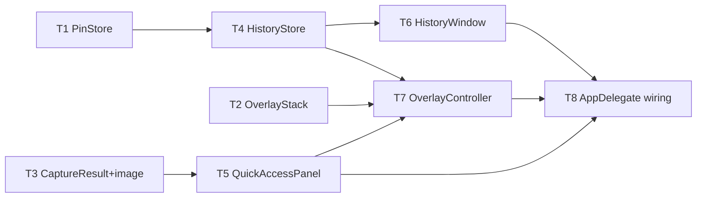

# M2 Quick-Access Overlay & History — Implementation Plan

> **For agentic workers:** REQUIRED SUB-SKILL: Use `executing-plan-time` to run this plan. It handles worktree setup, overlap analysis, parallel-wave dispatch, per-task spec + code-quality review, and branch finishing in one runner. Steps use checkbox `- [ ]` syntax for tracking.

**Goal:** Every capture lands on a floating Quick-Access Panel with instant actions (copy/save/delete/drag/pin); a History window browses the folder of PNGs with pinned shots on top.
**Architecture:** Stacks on M1 branch `exec/m1-capture-core-20260721`. New headless-testable `MacShotCore` models (`OverlayStack`, `PinStore`, `HistoryStore`/`HistoryEntry`) + a `CaptureResult.image` addition; thin `MacShot` shell (`QuickAccessPanel`, `OverlayController`, `HistoryWindow`) wired into the existing `AppDelegate`.
**Tech Stack:** Swift 6, SwiftUI + AppKit (NSPanel, NSDraggingSource), CoreGraphics, XCTest.
**Max wave width:** 3 tasks in parallel at peak (W1).

> **Base branch:** the executor MUST create its worktree from `exec/m1-capture-core-20260721`, NOT from `master` (master has no M1 code; no-merge rule keeps M1 unmerged). New branch stacks on M1.
> **Verification convention:** `MacShotCore` tasks = strict TDD-before-commit. `MacShot` shell tasks (NSPanel/drag/SwiftUI/AppKit) can't run in headless `swift test` → gate on `swift build` + the task's manual-smoke checklist. No fabricated GUI unit tests.
> **Autonomous-mode note:** no graphify graph; manifest grounded in the M1 worktree source (read directly). Planning decisions logged to `.dev/memory/decisions.md` tagged `[auto]`.

---

## File Edit Manifest

| Path | Action | Purpose | First touched in |
|------|--------|---------|------------------|
| `Sources/MacShotCore/PinStore.swift` | Create | pinned-path persistence over KeyValueStore | T1 |
| `Tests/MacShotCoreTests/PinStoreTests.swift` | Create | pin roundtrip tests | T1 |
| `Sources/MacShotCore/OverlayStack.swift` | Create | pure panel-stack model (expiry/cap/order/hover) | T2 |
| `Tests/MacShotCoreTests/OverlayStackTests.swift` | Create | stack model tests | T2 |
| `Sources/MacShotCore/Capture.swift` | Modify | add `image: CGImage` to `CaptureResult`, `@unchecked Sendable` | T3 |
| `Sources/MacShotCore/CaptureEngine.swift` | Modify | populate `image` in the returned result | T3 |
| `Tests/MacShotCoreTests/CaptureEngineTests.swift` | Modify | assert result carries image | T3 |
| `Sources/MacShotCore/Placeholder.swift` | Delete | orphan M1 scaffold, superseded | T3 |
| `Sources/MacShotCore/HistoryEntry.swift` | Create | history value type | T4 |
| `Sources/MacShotCore/HistoryStore.swift` | Create | folder-of-PNGs list/delete/pin | T4 |
| `Tests/MacShotCoreTests/HistoryStoreTests.swift` | Create | history store tests | T4 |
| `Sources/MacShot/QuickAccessPanel.swift` | Create | floating NSPanel + drag-out | T5 |
| `Sources/MacShot/HistoryWindow.swift` | Create | SwiftUI grid browser | T6 |
| `Sources/MacShot/OverlayController.swift` | Create | owns live panels, timers, action routing | T7 |
| `Sources/MacShot/AppDelegate.swift` | Modify | present overlay (not banner) + History menu item | T8 |

**Out of scope (intentionally not touched):** M1 capture path (`SCKScreenCapturer`, `HotkeyManager`, `SelectionOverlay`, `PermissionFlow`), `Preferences.swift`, `Notifier.swift` (kept for errors), `Scripts/*` — no editing/annotation/OCR/beautify code (later milestones).

---

## Execution Waves



| Wave | Tasks | Parallelizable | Rationale |
|------|-------|----------------|-----------|
| W1 | T1, T2, T3 | yes — disjoint files, no interdeps | independent core models + result change |
| W2 | T4 | n/a | HistoryStore needs PinStore (T1) |
| W3 | T5, T6 | yes — disjoint shell files | panel needs T3, history window needs T4 |
| W4 | T7 | n/a | OverlayController merges OverlayStack + panel + store |
| W5 | T8 | n/a | AppDelegate integration point |

---

## Task 1: PinStore

**Depends-on:** none
**Wave:** W1
**Files:**
- Create: `Sources/MacShotCore/PinStore.swift`
- Test: `Tests/MacShotCoreTests/PinStoreTests.swift`

- [ ] **Step 1: Failing test**
```swift
import XCTest
@testable import MacShotCore

final class PinStoreTests: XCTestCase {
    func testAddRemoveRoundtrip() {
        let store = InMemoryKVStore()
        let pins = PinStore(store: store)
        XCTAssertTrue(pins.pins().isEmpty)
        pins.add("/a/x.png"); pins.add("/a/y.png")
        XCTAssertEqual(pins.pins(), ["/a/x.png", "/a/y.png"])
        pins.remove("/a/x.png")
        XCTAssertEqual(pins.pins(), ["/a/y.png"])
        // survives a fresh instance over the same store
        XCTAssertEqual(PinStore(store: store).pins(), ["/a/y.png"])
    }
    func testAddIsIdempotent() {
        let pins = PinStore(store: InMemoryKVStore())
        pins.add("/a/x.png"); pins.add("/a/x.png")
        XCTAssertEqual(pins.pins().count, 1)
    }
}
```
- [ ] **Step 2: Run → FAIL** `swift test --filter PinStoreTests`
- [ ] **Step 3: Implement**
```swift
import Foundation

/// Pinned screenshot paths persisted as a [String] in the KeyValueStore. No DB.
public struct PinStore {
    private let store: KeyValueStore
    private let key = "pinnedPaths"
    public init(store: KeyValueStore) { self.store = store }

    public func pins() -> Set<String> {
        Set((store.object(forKey: key) as? [String]) ?? [])
    }
    public func add(_ path: String) {
        var s = pins(); s.insert(path); store.set(Array(s).sorted(), forKey: key)
    }
    public func remove(_ path: String) {
        var s = pins(); s.remove(path); store.set(Array(s).sorted(), forKey: key)
    }
}
```
- [ ] **Step 4: Run → PASS** `swift test --filter PinStoreTests`
- [ ] **Step 5: Commit**
```bash
git add Sources/MacShotCore/PinStore.swift Tests/MacShotCoreTests/PinStoreTests.swift
git commit -m "feat(core): PinStore — pinned paths over KeyValueStore"
```

---

## Task 2: OverlayStack

**Depends-on:** none
**Wave:** W1
**Files:**
- Create: `Sources/MacShotCore/OverlayStack.swift`
- Test: `Tests/MacShotCoreTests/OverlayStackTests.swift`

- [ ] **Step 1: Failing test**
```swift
import XCTest
@testable import MacShotCore

final class OverlayStackTests: XCTestCase {
    let t0 = Date(timeIntervalSince1970: 0)
    func at(_ s: TimeInterval) -> Date { t0.addingTimeInterval(s) }

    func testNewestAtBottomIndexZero() {
        var st = OverlayStack(expiry: 8, visibleCap: 5)
        st.push(id: 1, at: at(0)); st.push(id: 2, at: at(1))
        let v = st.visible(at: at(2))
        XCTAssertEqual(v.map(\.id), [2, 1])          // newest first
        XCTAssertEqual(v.first?.index, 0)             // newest = bottom slot 0
    }
    func testExpiryDropsOldPanels() {
        var st = OverlayStack(expiry: 8, visibleCap: 5)
        st.push(id: 1, at: at(0))
        XCTAssertEqual(st.visible(at: at(7)).map(\.id), [1])
        XCTAssertEqual(st.visible(at: at(8.1)).map(\.id), [])   // past expiry
    }
    func testHoverKeepAlivePausesExpiry() {
        var st = OverlayStack(expiry: 8, visibleCap: 5)
        st.push(id: 1, at: at(0))
        st.keepAlive(id: 1)
        XCTAssertEqual(st.visible(at: at(100)).map(\.id), [1])  // never expires while held
        st.release(id: 1, at: at(100))
        XCTAssertEqual(st.visible(at: at(107)).map(\.id), [1])  // timer restarts from release
        XCTAssertEqual(st.visible(at: at(108.1)).map(\.id), [])
    }
    func testVisibleCapCollapsesOldest() {
        var st = OverlayStack(expiry: 100, visibleCap: 2)
        for i in 1...4 { st.push(id: i, at: at(Double(i))) }
        XCTAssertEqual(st.visible(at: at(5)).map(\.id), [4, 3])  // only newest 2 visible
    }
    func testDismissRemoves() {
        var st = OverlayStack(expiry: 100, visibleCap: 5)
        st.push(id: 1, at: at(0)); st.dismiss(id: 1)
        XCTAssertEqual(st.visible(at: at(1)).map(\.id), [])
    }
}
```
- [ ] **Step 2: Run → FAIL** `swift test --filter OverlayStackTests`
- [ ] **Step 3: Implement**
```swift
import Foundation

public struct PanelSlot: Equatable, Sendable {
    public let id: Int
    public let index: Int   // 0 = bottom (newest)
}

/// Pure model of the post-capture panel stack. Injected clock (no wall-clock).
/// A panel expires `expiry` seconds after its `expiresAt` unless kept alive by hover.
public struct OverlayStack: Sendable {
    public var expiry: TimeInterval
    public var visibleCap: Int
    private struct Panel { var id: Int; var expiresAt: Date?; var pushedAt: Date }
    private var panels: [Panel] = []

    public init(expiry: TimeInterval = 8, visibleCap: Int = 5) {
        self.expiry = expiry; self.visibleCap = visibleCap
    }

    public mutating func push(id: Int, at now: Date) {
        panels.removeAll { $0.id == id }
        panels.append(Panel(id: id, expiresAt: now.addingTimeInterval(expiry), pushedAt: now))
    }
    public mutating func keepAlive(id: Int) {
        if let i = panels.firstIndex(where: { $0.id == id }) { panels[i].expiresAt = nil }
    }
    public mutating func release(id: Int, at now: Date) {
        if let i = panels.firstIndex(where: { $0.id == id }) {
            panels[i].expiresAt = now.addingTimeInterval(expiry)
        }
    }
    public mutating func dismiss(id: Int) { panels.removeAll { $0.id == id } }

    /// Non-expired panels, newest-first, capped to `visibleCap`.
    public func visible(at now: Date) -> [PanelSlot] {
        let alive = panels.filter { $0.expiresAt == nil || $0.expiresAt! > now }
            .sorted { $0.pushedAt > $1.pushedAt }        // newest first
            .prefix(visibleCap)
        return alive.enumerated().map { PanelSlot(id: $0.element.id, index: $0.offset) }
    }
}
```
- [ ] **Step 4: Run → PASS** `swift test --filter OverlayStackTests`
- [ ] **Step 5: Commit**
```bash
git add Sources/MacShotCore/OverlayStack.swift Tests/MacShotCoreTests/OverlayStackTests.swift
git commit -m "feat(core): OverlayStack — panel expiry, hover keep-alive, visible cap"
```

---

## Task 3: CaptureResult carries the image (+ orphan cleanup)

**Depends-on:** none
**Wave:** W1
**Files:**
- Modify: `Sources/MacShotCore/Capture.swift`
- Modify: `Sources/MacShotCore/CaptureEngine.swift`
- Modify: `Tests/MacShotCoreTests/CaptureEngineTests.swift`
- Delete: `Sources/MacShotCore/Placeholder.swift`

- [ ] **Step 1: Extend the existing `CaptureEngineTests`** — add this test to the file:
```swift
    func testResultCarriesCapturedImage() async throws {
        let (engine, _, _) = makeEngine()
        let result = try await engine.capture(.fullscreen(nil), at: Date(timeIntervalSince1970: 0))
        XCTAssertEqual(result.image.width, 2)   // FakeCapturer returns a 2x2 image
        XCTAssertEqual(result.image.height, 2)
    }
```
- [ ] **Step 2: Run → FAIL** (`CaptureResult` has no `image`)
  Run: `swift test --filter CaptureEngineTests/testResultCarriesCapturedImage`
- [ ] **Step 3: Modify `Capture.swift`** — change the `CaptureResult` struct to:
```swift
public struct CaptureResult: @unchecked Sendable {   // CGImage is immutable/thread-safe, just un-annotated
    public let mode: CaptureMode
    public let image: CGImage
    public let fileURL: URL?
    public let copiedToClipboard: Bool
    public let size: CGSize
}
```
- [ ] **Step 3b: Modify `CaptureEngine.swift`** — the final `return` becomes:
```swift
        return CaptureResult(mode: mode, image: image, fileURL: fileURL,
                             copiedToClipboard: copied,
                             size: CGSize(width: image.width, height: image.height))
```
- [ ] **Step 3c: Delete the orphan**
```bash
git rm Sources/MacShotCore/Placeholder.swift
```
- [ ] **Step 4: Run full core suite → PASS** (all prior tests + the new one)
  Run: `swift test`
  Expected: all green (existing M1 tests unaffected — they don't reference `image`).
- [ ] **Step 5: Commit**
```bash
git add Sources/MacShotCore/Capture.swift Sources/MacShotCore/CaptureEngine.swift Tests/MacShotCoreTests/CaptureEngineTests.swift
git commit -m "feat(core): CaptureResult carries CGImage; drop Placeholder scaffold"
```

---

## Task 4: HistoryStore + HistoryEntry

**Depends-on:** [T1]
**Wave:** W2
**Files:**
- Create: `Sources/MacShotCore/HistoryEntry.swift`
- Create: `Sources/MacShotCore/HistoryStore.swift`
- Test: `Tests/MacShotCoreTests/HistoryStoreTests.swift`

- [ ] **Step 1: Failing test**
```swift
import XCTest
@testable import MacShotCore

final class HistoryStoreTests: XCTestCase {
    var dir: URL!
    override func setUpWithError() throws {
        dir = URL(fileURLWithPath: NSTemporaryDirectory()).appendingPathComponent(UUID().uuidString)
        try FileManager.default.createDirectory(at: dir, withIntermediateDirectories: true)
    }
    override func tearDownWithError() throws { try? FileManager.default.removeItem(at: dir) }

    private func writePNG(_ name: String, modified: Date) throws -> URL {
        let url = dir.appendingPathComponent(name)
        try Data([0x89, 0x50]).write(to: url)   // stub bytes; store lists by name/extension
        try FileManager.default.setAttributes([.modificationDate: modified], ofItemAtPath: url.path)
        return url
    }

    func testListsPNGsNewestFirst() throws {
        _ = try writePNG("old.png", modified: Date(timeIntervalSince1970: 100))
        _ = try writePNG("new.png", modified: Date(timeIntervalSince1970: 200))
        _ = try writePNG("notes.txt", modified: Date(timeIntervalSince1970: 300))  // ignored
        let store = HistoryStore(directory: dir, pins: PinStore(store: InMemoryKVStore()))
        XCTAssertEqual(store.entries().map(\.filename), ["new.png", "old.png"])
    }
    func testPinnedSurfacedToTop() throws {
        _ = try writePNG("a.png", modified: Date(timeIntervalSince1970: 300))
        let b = try writePNG("b.png", modified: Date(timeIntervalSince1970: 100))
        let pins = PinStore(store: InMemoryKVStore())
        let store = HistoryStore(directory: dir, pins: pins)
        store.pin(HistoryEntry(url: b, filename: "b.png",
                               captureDate: Date(timeIntervalSince1970: 100), isPinned: false))
        let e = store.entries()
        XCTAssertEqual(e.map(\.filename), ["b.png", "a.png"])   // pinned b first despite older
        XCTAssertTrue(e.first!.isPinned)
    }
    func testDeleteRemovesFile() throws {
        let a = try writePNG("a.png", modified: Date(timeIntervalSince1970: 1))
        let store = HistoryStore(directory: dir, pins: PinStore(store: InMemoryKVStore()))
        try store.delete(store.entries().first!)
        XCTAssertFalse(FileManager.default.fileExists(atPath: a.path))
        XCTAssertTrue(store.entries().isEmpty)
    }
}
```
- [ ] **Step 2: Run → FAIL** `swift test --filter HistoryStoreTests`
- [ ] **Step 3: Implement `HistoryEntry.swift`**
```swift
import Foundation

public struct HistoryEntry: Equatable, Sendable {
    public let url: URL
    public let filename: String
    public let captureDate: Date
    public let isPinned: Bool
    public init(url: URL, filename: String, captureDate: Date, isPinned: Bool) {
        self.url = url; self.filename = filename; self.captureDate = captureDate; self.isPinned = isPinned
    }
}
```
- [ ] **Step 3b: Implement `HistoryStore.swift`**
```swift
import Foundation

/// History = the save-dir folder of PNGs (no DB). Pinned entries surface first.
public struct HistoryStore {
    private let directory: URL
    private let pins: PinStore
    public init(directory: URL, pins: PinStore) { self.directory = directory; self.pins = pins }

    public func entries() -> [HistoryEntry] {
        let fm = FileManager.default
        let pinned = pins.pins()
        let urls = (try? fm.contentsOfDirectory(at: directory,
            includingPropertiesForKeys: [.contentModificationDateKey], options: [.skipsHiddenFiles])) ?? []
        let items = urls.filter { $0.pathExtension.lowercased() == "png" }.map { url -> HistoryEntry in
            let date = (try? url.resourceValues(forKeys: [.contentModificationDateKey]))?.contentModificationDate ?? .distantPast
            return HistoryEntry(url: url, filename: url.lastPathComponent,
                                captureDate: date, isPinned: pinned.contains(url.path))
        }
        // pinned first, each group newest-first
        return items.sorted {
            if $0.isPinned != $1.isPinned { return $0.isPinned && !$1.isPinned }
            return $0.captureDate > $1.captureDate
        }
    }
    public func delete(_ entry: HistoryEntry) throws {
        try FileManager.default.removeItem(at: entry.url)
        pins.remove(entry.url.path)
    }
    public func pin(_ entry: HistoryEntry) { pins.add(entry.url.path) }
    public func unpin(_ entry: HistoryEntry) { pins.remove(entry.url.path) }
}
```
- [ ] **Step 4: Run → PASS** `swift test --filter HistoryStoreTests`
- [ ] **Step 5: Commit**
```bash
git add Sources/MacShotCore/HistoryEntry.swift Sources/MacShotCore/HistoryStore.swift Tests/MacShotCoreTests/HistoryStoreTests.swift
git commit -m "feat(core): HistoryStore over folder-of-PNGs with pin surfacing + delete"
```

---

## Task 5: QuickAccessPanel

**Depends-on:** [T3]
**Wave:** W3
**Verification:** `swift build` + manual smoke.
**Files:**
- Create: `Sources/MacShot/QuickAccessPanel.swift`

- [ ] **Step 1: Implement** a floating panel:
  - `QuickAccessPanel: NSPanel` — style `[.borderless, .nonactivatingPanel]`, `level = .floating`, `isFloatingPanel = true`, `hidesOnDeactivate = false`, `backgroundColor = .clear`. Constructed with a `CaptureResult` + callbacks.
  - Content view (SwiftUI via `NSHostingView`, or AppKit): a rounded thumbnail from `result.image` (downsampled), plus buttons **Copy**, **Save As…/Reveal**, **Delete**, **Pin** (toggles), each calling an injected closure.
  - Drag-out: make the panel's image view an `NSDraggingSource`; on `mouseDragged`, begin a drag session writing `result.fileURL` (a file-URL `NSPasteboardItem`); if `fileURL == nil`, write the image to a temp PNG (`NSTemporaryDirectory()`) first and drag that.
  - Expose `onHoverChanged: (Bool) -> Void` (tracking area) so the controller can pause/resume expiry, and `onAction: (PanelAction) -> Void` where `enum PanelAction { case copy, saveAs, delete, pin, dragStarted }`.
- [ ] **Step 2: Verify build** `swift build`
- [ ] **Step 3: Commit**
```bash
git add Sources/MacShot/QuickAccessPanel.swift
git commit -m "feat(app): QuickAccessPanel — floating panel with actions + drag-out"
```
- **Manual smoke (T8):** panel shows the thumbnail; Copy pastes; drag drops a PNG into another app; hover pauses dismissal.

---

## Task 6: HistoryWindow

**Depends-on:** [T4]
**Wave:** W3
**Verification:** `swift build` + manual smoke.
**Files:**
- Create: `Sources/MacShot/HistoryWindow.swift`

- [ ] **Step 1: Implement** a browser window:
  - `HistoryWindow` wraps an `NSWindow` hosting a SwiftUI `HistoryGrid` view (`NSHostingController`).
  - `HistoryGrid`: `LazyVGrid` of thumbnails from `HistoryStore.entries()`, newest-first with a pinned row/section on top. Each cell loads its thumbnail lazily and downsampled (`CGImageSourceCreateThumbnailAtIndex` with `kCGImageSourceThumbnailMaxPixelSize`) to bound memory at ~10k entries.
  - Per-cell context menu / hover buttons mirror the panel: Copy, Reveal, Delete (calls `HistoryStore.delete` then refreshes), Pin/Unpin (calls `HistoryStore.pin/unpin` then refreshes).
  - Empty state: if `entries()` is empty or the dir is unreadable, show "No screenshots yet" + a "Choose folder…" button (opens M1 Preferences).
  - Constructed with a `HistoryStore`; a `refresh()` re-reads entries.
- [ ] **Step 2: Verify build** `swift build`
- [ ] **Step 3: Commit**
```bash
git add Sources/MacShot/HistoryWindow.swift
git commit -m "feat(app): HistoryWindow — SwiftUI grid browser with pin/delete"
```
- **Manual smoke (T8):** grid shows saved shots newest-first; pin sticks a shot to the top; delete removes it from disk + grid; thumbnails scroll smoothly.

---

## Task 7: OverlayController

**Depends-on:** [T2, T4, T5]
**Wave:** W4
**Verification:** `swift build` + manual smoke.
**Files:**
- Create: `Sources/MacShot/OverlayController.swift`

- [ ] **Step 1: Implement** the live-panel manager:
  - Holds an `OverlayStack` (from T2), a `[Int: QuickAccessPanel]` map, a monotonically-increasing id counter, a `HistoryStore` (for delete/pin actions), and the target screen corner (default bottom-right).
  - `present(_ result: CaptureResult)`: allocate an id, `stack.push(id, at: Date())`, create a `QuickAccessPanel`, wire its `onHoverChanged` → `stack.keepAlive/release` + `reflow()`, its `onAction` → pasteboard/`HistoryStore`/pin/dismiss, then `reflow()` and order the panel front.
  - `reflow()`: query `stack.visible(at: Date())`; for each `PanelSlot`, position its panel in the corner offset by `slot.index * (panelHeight + gap)`; close panels no longer visible.
  - A repeating timer (e.g. 0.5s) calls `reflow()` so expiry visually removes panels; invalidate when the stack is empty.
  - `enum PanelAction` from T5 handled here: `.copy` → `NSPasteboard` write the image; `.saveAs` → `NSSavePanel`/reveal in Finder; `.delete` → build a `HistoryEntry` from `result.fileURL` and `HistoryStore.delete`, then `stack.dismiss` + `reflow`; `.pin` → `HistoryStore.pin`.
- [ ] **Step 2: Verify build** `swift build`
- [ ] **Step 3: Commit**
```bash
git add Sources/MacShot/OverlayController.swift
git commit -m "feat(app): OverlayController — positions panels, runs expiry, routes actions"
```
- **Manual smoke (T8):** single capture shows one panel bottom-right that auto-dismisses ~8s; rapid captures stack upward, cap at 5; hover holds a panel open; action buttons work.

---

## Task 8: AppDelegate wiring

**Depends-on:** [T6, T7]
**Wave:** W5
**Verification:** `swift build && swift test` (full core suite green) + manual acceptance.
**Files:**
- Modify: `Sources/MacShot/AppDelegate.swift`

- [ ] **Step 1: Modify `AppDelegate`:**
  - Construct an `OverlayController` (with a `HistoryStore(directory: saveDir, pins: PinStore(store: .standard))`) and a `HistoryWindow` (lazily) in `applicationDidFinishLaunching`.
  - In the existing `runCapture(mode:)`: on success, replace the `notifier.notifyCaptured(...)` call with `overlayController.present(result)`. Keep `notifier.notifyError(...)` for the failure path.
  - Add a menu item **"History…"** (before Preferences…) that opens/【brings-to-front】the `HistoryWindow` and calls `refresh()`.
  - Ensure `saveToFile` default stays true so overlay/history have files (already the M1 default).
- [ ] **Step 2: Verify** `swift build && swift test`
  Expected: builds; all MacShotCore tests pass (M1 + M2 suites).
- [ ] **Step 3: Commit**
```bash
git add Sources/MacShot/AppDelegate.swift
git commit -m "feat(app): route captures to overlay; add History menu item"
```
- **Manual acceptance (human DoD):** capture → panel appears; drag into Slack/mail without Finder; History window browses shots, pin + delete work; rapid captures stack and auto-dismiss.

---

## Self-review

- **Spec coverage:** floating panel + actions (T5/T7), stacking/auto-dismiss (T2/T7), History browser (T6/T4), pinning (T1/T4/T6), overlay replaces banner + History menu (T8), `CaptureResult.image` for thumbnails/drag (T3), orphan cleanup (T3). ✓
- **Manifest ↔ tasks:** every manifest file maps to exactly one task; no task touches an unlisted file. Modifies (`Capture.swift`, `CaptureEngine.swift`, `CaptureEngineTests.swift`, `AppDelegate.swift`) each owned by a single task → no cross-wave file races. ✓
- **Placeholder scan:** none. Core tasks (T1–T4) carry full failing-test + impl code; GUI tasks (T5–T8) carry concrete API-level steps + build/manual gates (justified: NSPanel/drag/SwiftUI can't run headless). ✓
- **Type/name consistency:** `PinStore.pins/add/remove`, `OverlayStack.push/keepAlive/release/dismiss/visible` + `PanelSlot.index`, `HistoryStore.entries/delete/pin/unpin`, `HistoryEntry(url:filename:captureDate:isPinned:)`, `CaptureResult.image`, `PanelAction` — referenced consistently across T5/T6/T7/T8. ✓
- **Wave correctness:** W1 {T1,T2,T3} touch disjoint core files, no interdeps. W3 {T5,T6} touch disjoint shell files. No same-wave overlap. Sequential merges (T4/T7/T8) are genuine dependency points. ✓
- **Wave width:** peak 3 (W1). W2/W4/W5 are true single-dependency merges — not artificially narrow. ✓
- **Ponytail first rung:** no DB (folder + UserDefaults), no bulk-select (out of scope), overlay math pushed into `OverlayStack` so the panel is a renderer, reused M1 `KeyValueStore`/`Preferences`/`Notifier` instead of new infra, deleted the orphan. ✓
