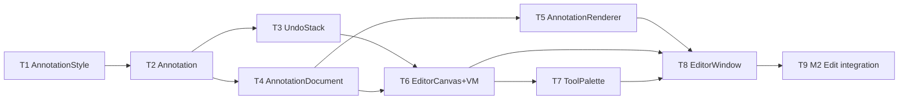

# M3 Annotation Editor — Implementation Plan

> **For agentic workers:** REQUIRED SUB-SKILL: Use `executing-plan-time` to run this plan. It handles worktree setup, overlap analysis, parallel-wave dispatch, per-task spec + code-quality review, and branch finishing in one runner. Steps use checkbox `- [ ]` syntax for tracking.

**Goal:** Mark up any capture in-app (arrows, shapes, text, highlighter, blur/pixelate, numbered steps) with undo/redo over a non-destructive vector document; export flattens to a new PNG + clipboard.
**Architecture:** Stacks on M2 branch `exec/m2-overlay-history-20260721`. All model + flatten logic lives in headless-testable `MacShotCore` (CoreGraphics/CoreImage render without a GUI); the SwiftUI editor canvas + palette are the thin manual shell. Editor opens from the M2 overlay/history Edit action.
**Tech Stack:** Swift 6, MacShotCore (CoreGraphics, CoreImage, CoreText), SwiftUI Canvas, AppKit, XCTest.
**Max wave width:** 2 tasks in parallel at peak (W3, W4).

> **Base branch:** executor MUST create its worktree FROM `exec/m2-overlay-history-20260721` (has M1+M2 source), NOT master. New branch e.g. `exec/m3-annotation-editor-20260721`. Verify `Sources/MacShot/QuickAccessPanel.swift` and `Sources/MacShotCore/HistoryStore.swift` exist before starting.
> **Verification convention:** MacShotCore tasks = strict TDD-before-commit (incl. the flatten renderer — CoreGraphics/CoreImage run headless). GUI-shell tasks gate on `swift build` + the task's manual-smoke checklist; no fabricated GUI unit tests.
> **Autonomous-mode note:** no graphify graph; manifest grounded in the M2 worktree source. Planning decisions logged tagged `[auto]`.

---

## File Edit Manifest

| Path | Action | Purpose | First touched in |
|------|--------|---------|------------------|
| `Sources/MacShotCore/AnnotationStyle.swift` | Create | `RGBAColor` + `AnnotationStyle` (AppKit-free) | T1 |
| `Tests/MacShotCoreTests/AnnotationStyleTests.swift` | Create | color/style tests | T1 |
| `Sources/MacShotCore/Annotation.swift` | Create | `Annotation` + `AnnotationKind` (Codable, bbox, contains) | T2 |
| `Tests/MacShotCoreTests/AnnotationTests.swift` | Create | kind geometry + Codable tests | T2 |
| `Sources/MacShotCore/UndoStack.swift` | Create | snapshot undo/redo over `[Annotation]` | T3 |
| `Tests/MacShotCoreTests/UndoStackTests.swift` | Create | undo/redo tests | T3 |
| `Sources/MacShotCore/AnnotationDocument.swift` | Create | ordered doc: add/remove/update/moveToFront/nextStepNumber/hitTest | T4 |
| `Tests/MacShotCoreTests/AnnotationDocumentTests.swift` | Create | document tests | T4 |
| `Sources/MacShotCore/AnnotationRenderer.swift` | Create | `flatten(base:document:) -> CGImage` (CG + CI) | T5 |
| `Tests/MacShotCoreTests/AnnotationRendererTests.swift` | Create | flatten size + pixel + blur tests | T5 |
| `Sources/MacShot/EditorCanvas.swift` | Create | SwiftUI canvas + `EditorViewModel` + `Tool` enum | T6 |
| `Sources/MacShot/ToolPalette.swift` | Create | toolbar (tools/color/width/undo/redo/export) + shortcuts | T7 |
| `Sources/MacShot/EditorWindow.swift` | Create | hosts canvas+palette; export via SystemSink | T8 |
| `Sources/MacShot/QuickAccessPanel.swift` | Modify | add `.edit` to `PanelAction` + Edit button | T9 |
| `Sources/MacShot/HistoryWindow.swift` | Modify | per-item Edit action | T9 |
| `Sources/MacShot/AppDelegate.swift` | Modify | open `EditorWindow` on `.edit` | T9 |

**Out of scope (intentionally not touched):** M1 capture path, M2 `OverlayController`/`HistoryStore`/`PinStore` internals (only the Edit entry points change), `Preferences`/`Notifier`/`Scripts` — no beautify (M4), OCR (M5), sidecar persistence, batch editing.

---

## Execution Waves



| Wave | Tasks | Parallelizable | Rationale |
|------|-------|----------------|-----------|
| W1 | T1 | n/a | style types underpin everything |
| W2 | T2 | n/a | Annotation needs style |
| W3 | T3, T4 | yes — disjoint core files, both dep T2 | undo stack vs document are independent |
| W4 | T5, T6 | yes — disjoint (core renderer vs GUI canvas), both dep W3 | renderer needs doc; canvas needs doc+undo |
| W5 | T7 | n/a | palette binds to the canvas VM |
| W6 | T8 | n/a | window hosts canvas+palette, exports via renderer |
| W7 | T9 | n/a | M2 entry-point wiring |

---

## Task 1: AnnotationStyle + RGBAColor

**Depends-on:** none
**Wave:** W1
**Files:**
- Create: `Sources/MacShotCore/AnnotationStyle.swift`
- Test: `Tests/MacShotCoreTests/AnnotationStyleTests.swift`

- [ ] **Step 1: Failing test**
```swift
import XCTest
import CoreGraphics
@testable import MacShotCore

final class AnnotationStyleTests: XCTestCase {
    func testRGBAToCGColorComponents() {
        let c = RGBAColor(r: 1, g: 0, b: 0, a: 1)
        let cg = c.cgColor
        XCTAssertEqual(cg.components?[0], 1, accuracy: 0.001)  // red
        XCTAssertEqual(cg.alpha, 1, accuracy: 0.001)
    }
    func testDefaultStyleIsRedStroke3() {
        let s = AnnotationStyle.default
        XCTAssertEqual(s.strokeColor, RGBAColor(r: 1, g: 0.231, b: 0.188, a: 1))  // #FF3B30
        XCTAssertEqual(s.lineWidth, 3)
    }
    func testCodableRoundtrip() throws {
        let s = AnnotationStyle(strokeColor: .init(r: 0, g: 1, b: 0, a: 0.5),
                                fillColor: nil, lineWidth: 5, fontSize: 20)
        let back = try JSONDecoder().decode(AnnotationStyle.self, from: JSONEncoder().encode(s))
        XCTAssertEqual(back, s)
    }
}
```
- [ ] **Step 2: Run → FAIL** `swift test --filter AnnotationStyleTests`
- [ ] **Step 3: Implement**
```swift
import CoreGraphics

/// AppKit-free color; converted to CGColor at render time (MacShotCore stays headless).
public struct RGBAColor: Equatable, Codable, Sendable {
    public var r, g, b, a: Double
    public init(r: Double, g: Double, b: Double, a: Double) { self.r = r; self.g = g; self.b = b; self.a = a }
    public var cgColor: CGColor {
        CGColor(colorSpace: CGColorSpaceCreateDeviceRGB(), components: [r, g, b, a])
            ?? CGColor(gray: 0, alpha: a)
    }
    public static let red = RGBAColor(r: 1, g: 0.231, b: 0.188, a: 1)     // #FF3B30
    public static let yellow40 = RGBAColor(r: 1, g: 0.8, b: 0, a: 0.4)
    public static let white = RGBAColor(r: 1, g: 1, b: 1, a: 1)
}

public struct AnnotationStyle: Equatable, Codable, Sendable {
    public var strokeColor: RGBAColor
    public var fillColor: RGBAColor?
    public var lineWidth: Double
    public var fontSize: Double
    public init(strokeColor: RGBAColor, fillColor: RGBAColor?, lineWidth: Double, fontSize: Double) {
        self.strokeColor = strokeColor; self.fillColor = fillColor
        self.lineWidth = lineWidth; self.fontSize = fontSize
    }
    public static let `default` = AnnotationStyle(strokeColor: .red, fillColor: nil, lineWidth: 3, fontSize: 17)
}
```
- [ ] **Step 4: Run → PASS** `swift test --filter AnnotationStyleTests`
- [ ] **Step 5: Commit**
```bash
git add Sources/MacShotCore/AnnotationStyle.swift Tests/MacShotCoreTests/AnnotationStyleTests.swift
git commit -m "feat(core): RGBAColor + AnnotationStyle (AppKit-free)"
```

---

## Task 2: Annotation + AnnotationKind

**Depends-on:** [T1]
**Wave:** W2
**Files:**
- Create: `Sources/MacShotCore/Annotation.swift`
- Test: `Tests/MacShotCoreTests/AnnotationTests.swift`

- [ ] **Step 1: Failing test**
```swift
import XCTest
import CoreGraphics
@testable import MacShotCore

final class AnnotationTests: XCTestCase {
    func testRectBoundingBox() {
        let a = Annotation(kind: .rectangle(CGRect(x: 10, y: 20, width: 30, height: 40)), style: .default)
        XCTAssertEqual(a.boundingBox, CGRect(x: 10, y: 20, width: 30, height: 40))
    }
    func testArrowBoundingBoxSpansEndpoints() {
        let a = Annotation(kind: .arrow(from: CGPoint(x: 0, y: 0), to: CGPoint(x: 10, y: 5)), style: .default)
        XCTAssertEqual(a.boundingBox, CGRect(x: 0, y: 0, width: 10, height: 5))
    }
    func testContainsUsesBoundingBox() {
        let a = Annotation(kind: .ellipse(CGRect(x: 0, y: 0, width: 100, height: 100)), style: .default)
        XCTAssertTrue(a.contains(CGPoint(x: 50, y: 50)))
        XCTAssertFalse(a.contains(CGPoint(x: 200, y: 200)))
    }
    func testCodableRoundtripAllKinds() throws {
        let kinds: [AnnotationKind] = [
            .arrow(from: .zero, to: CGPoint(x: 1, y: 1)),
            .rectangle(CGRect(x: 1, y: 2, width: 3, height: 4)),
            .ellipse(CGRect(x: 0, y: 0, width: 5, height: 5)),
            .text(CGRect(x: 0, y: 0, width: 50, height: 20), "hi"),
            .highlighter(CGRect(x: 0, y: 0, width: 9, height: 9)),
            .blur(CGRect(x: 0, y: 0, width: 8, height: 8), radius: 12, pixelate: true),
            .stepNumber(center: CGPoint(x: 5, y: 5), number: 3),
        ]
        for k in kinds {
            let a = Annotation(kind: k, style: .default)
            let back = try JSONDecoder().decode(Annotation.self, from: JSONEncoder().encode(a))
            XCTAssertEqual(back, a)
        }
    }
}
```
- [ ] **Step 2: Run → FAIL** `swift test --filter AnnotationTests`
- [ ] **Step 3: Implement**
```swift
import CoreGraphics
import Foundation

public enum AnnotationKind: Equatable, Codable, Sendable {
    case arrow(from: CGPoint, to: CGPoint)
    case rectangle(CGRect)
    case ellipse(CGRect)
    case text(CGRect, String)
    case highlighter(CGRect)
    case blur(CGRect, radius: Double, pixelate: Bool)
    case stepNumber(center: CGPoint, number: Int)
}

public struct Annotation: Identifiable, Equatable, Codable, Sendable {
    public let id: UUID
    public var kind: AnnotationKind
    public var style: AnnotationStyle
    public init(id: UUID = UUID(), kind: AnnotationKind, style: AnnotationStyle) {
        self.id = id; self.kind = kind; self.style = style
    }
    public var boundingBox: CGRect {
        switch kind {
        case let .arrow(from, to):
            return CGRect(x: min(from.x, to.x), y: min(from.y, to.y),
                          width: abs(from.x - to.x), height: abs(from.y - to.y))
        case let .rectangle(r), let .ellipse(r), let .highlighter(r): return r
        case let .text(r, _): return r
        case let .blur(r, _, _): return r
        case let .stepNumber(c, _):
            return CGRect(x: c.x - 16, y: c.y - 16, width: 32, height: 32)
        }
    }
    public func contains(_ p: CGPoint) -> Bool { boundingBox.insetBy(dx: -4, dy: -4).contains(p) }
}
```
  (`CGPoint`/`CGRect`/`CGSize` are `Codable` via CoreGraphics+Foundation; `UUID` is Codable.)
- [ ] **Step 4: Run → PASS** `swift test --filter AnnotationTests`
- [ ] **Step 5: Commit**
```bash
git add Sources/MacShotCore/Annotation.swift Tests/MacShotCoreTests/AnnotationTests.swift
git commit -m "feat(core): Annotation + AnnotationKind (Codable, bbox, hit-test)"
```

---

## Task 3: UndoStack

**Depends-on:** [T2]
**Wave:** W3
**Files:**
- Create: `Sources/MacShotCore/UndoStack.swift`
- Test: `Tests/MacShotCoreTests/UndoStackTests.swift`

- [ ] **Step 1: Failing test**
```swift
import XCTest
@testable import MacShotCore

final class UndoStackTests: XCTestCase {
    func ann(_ n: Int) -> [Annotation] {
        [Annotation(kind: .stepNumber(center: .zero, number: n), style: .default)]
    }
    func testUndoRestoresPriorSnapshot() {
        var u = UndoStack(initial: ann(1))
        u.record(current: ann(1)); let s2 = ann(2)          // record before mutating to s2
        XCTAssertTrue(u.canUndo)
        XCTAssertEqual(u.undo(current: s2), ann(1))
    }
    func testRedoReapplies() {
        var u = UndoStack(initial: ann(1))
        u.record(current: ann(1)); let s2 = ann(2)
        let undone = u.undo(current: s2)                     // -> ann(1)
        XCTAssertEqual(undone, ann(1))
        XCTAssertTrue(u.canRedo)
        XCTAssertEqual(u.redo(current: ann(1)), s2)
    }
    func testNewActionClearsRedo() {
        var u = UndoStack(initial: ann(1))
        u.record(current: ann(1)); _ = u.undo(current: ann(2))
        XCTAssertTrue(u.canRedo)
        u.record(current: ann(1))                            // new action
        XCTAssertFalse(u.canRedo)
    }
}
```
- [ ] **Step 2: Run → FAIL** `swift test --filter UndoStackTests`
- [ ] **Step 3: Implement** (snapshot model — caller passes the current state)
```swift
/// Snapshot undo/redo over the annotation array. `record` is called *before* a
/// mutation with the state as-is; `undo`/`redo` take the current state to seed
/// the opposite stack.
public struct UndoStack {
    private var past: [[Annotation]] = []
    private var future: [[Annotation]] = []
    public init(initial: [Annotation]) { _ = initial }   // initial kept for symmetry; past starts empty

    public var canUndo: Bool { !past.isEmpty }
    public var canRedo: Bool { !future.isEmpty }

    public mutating func record(current: [Annotation]) {
        past.append(current)
        future.removeAll()          // a new action invalidates the redo branch
    }
    public mutating func undo(current: [Annotation]) -> [Annotation] {
        guard let prev = past.popLast() else { return current }
        future.append(current)
        return prev
    }
    public mutating func redo(current: [Annotation]) -> [Annotation] {
        guard let next = future.popLast() else { return current }
        past.append(current)
        return next
    }
}
```
- [ ] **Step 4: Run → PASS** `swift test --filter UndoStackTests`
- [ ] **Step 5: Commit**
```bash
git add Sources/MacShotCore/UndoStack.swift Tests/MacShotCoreTests/UndoStackTests.swift
git commit -m "feat(core): UndoStack — snapshot undo/redo with redo-branch clearing"
```

---

## Task 4: AnnotationDocument

**Depends-on:** [T2]
**Wave:** W3
**Files:**
- Create: `Sources/MacShotCore/AnnotationDocument.swift`
- Test: `Tests/MacShotCoreTests/AnnotationDocumentTests.swift`

- [ ] **Step 1: Failing test**
```swift
import XCTest
import CoreGraphics
@testable import MacShotCore

final class AnnotationDocumentTests: XCTestCase {
    func testAddAndRemove() {
        var doc = AnnotationDocument(baseSize: CGSize(width: 100, height: 100))
        let a = Annotation(kind: .rectangle(CGRect(x: 0, y: 0, width: 10, height: 10)), style: .default)
        doc.add(a)
        XCTAssertEqual(doc.annotations.count, 1)
        doc.remove(id: a.id)
        XCTAssertTrue(doc.annotations.isEmpty)
    }
    func testHitTestReturnsTopMost() {
        var doc = AnnotationDocument(baseSize: CGSize(width: 100, height: 100))
        let bottom = Annotation(kind: .rectangle(CGRect(x: 0, y: 0, width: 50, height: 50)), style: .default)
        let top = Annotation(kind: .rectangle(CGRect(x: 0, y: 0, width: 50, height: 50)), style: .default)
        doc.add(bottom); doc.add(top)
        XCTAssertEqual(doc.hitTest(CGPoint(x: 10, y: 10)), top.id)   // last added = top
        XCTAssertNil(doc.hitTest(CGPoint(x: 90, y: 90)))
    }
    func testMoveToFront() {
        var doc = AnnotationDocument(baseSize: .zero)
        let a = Annotation(kind: .rectangle(.zero), style: .default)
        let b = Annotation(kind: .rectangle(.zero), style: .default)
        doc.add(a); doc.add(b); doc.moveToFront(id: a.id)
        XCTAssertEqual(doc.annotations.last?.id, a.id)
    }
    func testNextStepNumberIncrements() {
        var doc = AnnotationDocument(baseSize: .zero)
        XCTAssertEqual(doc.nextStepNumber, 1)
        doc.add(Annotation(kind: .stepNumber(center: .zero, number: doc.nextStepNumber), style: .default))
        XCTAssertEqual(doc.nextStepNumber, 2)
    }
    func testUpdateMutatesInPlace() {
        var doc = AnnotationDocument(baseSize: .zero)
        let a = Annotation(kind: .rectangle(.zero), style: .default)
        doc.add(a)
        doc.update(id: a.id) { $0.kind = .rectangle(CGRect(x: 5, y: 5, width: 5, height: 5)) }
        XCTAssertEqual(doc.annotations.first?.boundingBox, CGRect(x: 5, y: 5, width: 5, height: 5))
    }
}
```
- [ ] **Step 2: Run → FAIL** `swift test --filter AnnotationDocumentTests`
- [ ] **Step 3: Implement**
```swift
import CoreGraphics

/// Ordered vector document over a base image (index order == z-order, last = front).
public struct AnnotationDocument: Codable, Equatable, Sendable {
    public var baseSize: CGSize
    public private(set) var annotations: [Annotation]
    public init(baseSize: CGSize, annotations: [Annotation] = []) {
        self.baseSize = baseSize; self.annotations = annotations
    }
    public mutating func add(_ a: Annotation) { annotations.append(a) }
    public mutating func remove(id: UUID) { annotations.removeAll { $0.id == id } }
    public mutating func update(id: UUID, _ transform: (inout Annotation) -> Void) {
        if let i = annotations.firstIndex(where: { $0.id == id }) { transform(&annotations[i]) }
    }
    public mutating func moveToFront(id: UUID) {
        guard let i = annotations.firstIndex(where: { $0.id == id }) else { return }
        annotations.append(annotations.remove(at: i))
    }
    public mutating func setAll(_ a: [Annotation]) { annotations = a }   // for undo/redo restore
    public func hitTest(_ p: CGPoint) -> UUID? {
        annotations.last(where: { $0.contains(p) })?.id
    }
    public var nextStepNumber: Int {
        annotations.reduce(0) { n, a in
            if case .stepNumber = a.kind { return n + 1 }; return n
        } + 1
    }
}
```
- [ ] **Step 4: Run → PASS** `swift test --filter AnnotationDocumentTests`
- [ ] **Step 5: Commit**
```bash
git add Sources/MacShotCore/AnnotationDocument.swift Tests/MacShotCoreTests/AnnotationDocumentTests.swift
git commit -m "feat(core): AnnotationDocument — z-order, hit-test, step numbers, update"
```

---

## Task 5: AnnotationRenderer (flatten)

**Depends-on:** [T4]
**Wave:** W4
**Files:**
- Create: `Sources/MacShotCore/AnnotationRenderer.swift`
- Test: `Tests/MacShotCoreTests/AnnotationRendererTests.swift`

- [ ] **Step 1: Failing test** (headless — CGContext + CoreImage run without a GUI)
```swift
import XCTest
import CoreGraphics
@testable import MacShotCore

final class AnnotationRendererTests: XCTestCase {
    /// A solid-white base image.
    func whiteBase(_ w: Int, _ h: Int) -> CGImage {
        let ctx = CGContext(data: nil, width: w, height: h, bitsPerComponent: 8, bytesPerRow: 0,
            space: CGColorSpaceCreateDeviceRGB(), bitmapInfo: CGImageAlphaInfo.premultipliedLast.rawValue)!
        ctx.setFillColor(gray: 1, alpha: 1); ctx.fill(CGRect(x: 0, y: 0, width: w, height: h))
        return ctx.makeImage()!
    }
    /// Read a single pixel's RGBA (0–255) by redrawing into a 1x1 context.
    func pixel(_ img: CGImage, x: Int, y: Int) -> (UInt8, UInt8, UInt8, UInt8) {
        var px: [UInt8] = [0, 0, 0, 0]
        let ctx = CGContext(data: &px, width: 1, height: 1, bitsPerComponent: 8, bytesPerRow: 4,
            space: CGColorSpaceCreateDeviceRGB(), bitmapInfo: CGImageAlphaInfo.premultipliedLast.rawValue)!
        ctx.draw(img, in: CGRect(x: -x, y: -(img.height - 1 - y), width: img.width, height: img.height))
        return (px[0], px[1], px[2], px[3])
    }

    func testEmptyDocKeepsBaseSize() {
        let base = whiteBase(20, 10)
        let out = AnnotationRenderer.flatten(base: base, document: AnnotationDocument(baseSize: CGSize(width: 20, height: 10)))
        XCTAssertEqual(out.width, 20); XCTAssertEqual(out.height, 10)
    }
    func testFilledRectPaintsPixels() {
        let base = whiteBase(20, 20)
        var doc = AnnotationDocument(baseSize: CGSize(width: 20, height: 20))
        var style = AnnotationStyle.default; style.fillColor = .red
        doc.add(Annotation(kind: .rectangle(CGRect(x: 4, y: 4, width: 12, height: 12)), style: style))
        let out = AnnotationRenderer.flatten(base: base, document: doc)
        let (r, g, b, _) = pixel(out, x: 10, y: 10)   // inside the rect
        XCTAssertGreaterThan(r, 180); XCTAssertLessThan(g, 120); XCTAssertLessThan(b, 120)  // red-dominant
    }
    func testBlurChangesRegion() {
        // Base: left half black, right half white -> a sharp edge; blur should gray the seam.
        let ctx = CGContext(data: nil, width: 20, height: 20, bitsPerComponent: 8, bytesPerRow: 0,
            space: CGColorSpaceCreateDeviceRGB(), bitmapInfo: CGImageAlphaInfo.premultipliedLast.rawValue)!
        ctx.setFillColor(gray: 0, alpha: 1); ctx.fill(CGRect(x: 0, y: 0, width: 10, height: 20))
        ctx.setFillColor(gray: 1, alpha: 1); ctx.fill(CGRect(x: 10, y: 0, width: 10, height: 20))
        let base = ctx.makeImage()!
        var doc = AnnotationDocument(baseSize: CGSize(width: 20, height: 20))
        doc.add(Annotation(kind: .blur(CGRect(x: 5, y: 5, width: 10, height: 10), radius: 8, pixelate: false), style: .default))
        let out = AnnotationRenderer.flatten(base: base, document: doc)
        let (r, _, _, _) = pixel(out, x: 10, y: 10)    // at the seam, inside the blur region
        XCTAssertTrue(r > 20 && r < 235, "blurred seam should be mid-gray, got \(r)")
    }
}
```
- [ ] **Step 2: Run → FAIL** `swift test --filter AnnotationRendererTests`
- [ ] **Step 3: Implement**
```swift
import CoreGraphics
import CoreImage
import CoreText
import Foundation

public enum AnnotationRenderer {
    public static func flatten(base: CGImage, document: AnnotationDocument) -> CGImage {
        let w = base.width, h = base.height
        let ctx = CGContext(data: nil, width: w, height: h, bitsPerComponent: 8, bytesPerRow: 0,
            space: CGColorSpaceCreateDeviceRGB(), bitmapInfo: CGImageAlphaInfo.premultipliedLast.rawValue)!
        ctx.draw(base, in: CGRect(x: 0, y: 0, width: w, height: h))
        for a in document.annotations { draw(a, in: ctx, base: base) }
        return ctx.makeImage() ?? base
    }

    private static func draw(_ a: Annotation, in ctx: CGContext, base: CGImage) {
        ctx.saveGState(); defer { ctx.restoreGState() }
        ctx.setStrokeColor(a.style.strokeColor.cgColor)
        ctx.setLineWidth(a.style.lineWidth)
        switch a.kind {
        case let .rectangle(r):
            if let f = a.style.fillColor { ctx.setFillColor(f.cgColor); ctx.fill(r) }
            ctx.stroke(r)
        case let .ellipse(r):
            if let f = a.style.fillColor { ctx.setFillColor(f.cgColor); ctx.fillEllipse(in: r) }
            ctx.strokeEllipse(in: r)
        case let .arrow(from, to):
            drawArrow(from: from, to: to, in: ctx, width: a.style.lineWidth)
        case let .highlighter(r):
            ctx.setFillColor(a.style.strokeColor.cgColor)  // translucent color carries the alpha
            ctx.setBlendMode(.multiply); ctx.fill(r)
        case let .text(r, s):
            drawText(s, in: r, ctx: ctx, style: a.style)
        case let .blur(r, radius, pixelate):
            drawBlur(region: r, radius: radius, pixelate: pixelate, in: ctx, base: base)
        case let .stepNumber(c, n):
            drawStep(center: c, number: n, in: ctx, style: a.style)
        }
    }

    private static func drawArrow(from: CGPoint, to: CGPoint, in ctx: CGContext, width: Double) {
        ctx.move(to: from); ctx.addLine(to: to); ctx.strokePath()
        let angle = atan2(to.y - from.y, to.x - from.x); let head = max(10, width * 4)
        ctx.move(to: to)
        ctx.addLine(to: CGPoint(x: to.x - head * cos(angle - .pi/6), y: to.y - head * sin(angle - .pi/6)))
        ctx.move(to: to)
        ctx.addLine(to: CGPoint(x: to.x - head * cos(angle + .pi/6), y: to.y - head * sin(angle + .pi/6)))
        ctx.strokePath()
    }

    private static func drawText(_ s: String, in r: CGRect, ctx: CGContext, style: AnnotationStyle) {
        let font = CTFontCreateWithName("Helvetica" as CFString, style.fontSize, nil)
        let attr = NSAttributedString(string: s, attributes: [
            .font: font, .foregroundColor: style.strokeColor.cgColor,
        ])
        let line = CTLineCreateWithAttributedString(attr)
        ctx.textPosition = CGPoint(x: r.minX, y: r.minY + style.fontSize)
        CTLineDraw(line, ctx)
    }

    private static func drawStep(center c: CGPoint, number n: Int, in ctx: CGContext, style: AnnotationStyle) {
        let d = 32.0; let rect = CGRect(x: c.x - d/2, y: c.y - d/2, width: d, height: d)
        ctx.setFillColor(style.strokeColor.cgColor); ctx.fillEllipse(in: rect)
        drawText("\(n)", in: CGRect(x: rect.minX + 9, y: rect.minY + 4, width: d, height: d),
                 ctx: ctx, style: AnnotationStyle(strokeColor: .white, fillColor: nil, lineWidth: 1, fontSize: 18))
    }

    private static func drawBlur(region: CGRect, radius: Double, pixelate: Bool, in ctx: CGContext, base: CGImage) {
        let clamped = region.intersection(CGRect(x: 0, y: 0, width: base.width, height: base.height))
        guard !clamped.isNull, clamped.width > 0, clamped.height > 0 else { return }
        let ci = CIImage(cgImage: base)
        let filter: CIFilter? = pixelate
            ? CIFilter(name: "CIPixellate", parameters: [kCIInputImageKey: ci, kCIInputScaleKey: max(2, radius)])
            : CIFilter(name: "CIGaussianBlur", parameters: [kCIInputImageKey: ci, kCIInputRadiusKey: radius])
        guard let out = filter?.outputImage else { return }
        let cictx = CIContext()
        guard let blurred = cictx.createCGImage(out, from: ci.extent) else { return }
        ctx.saveGState()
        ctx.clip(to: clamped)
        ctx.draw(blurred, in: CGRect(x: 0, y: 0, width: base.width, height: base.height))
        ctx.restoreGState()
    }
}
```
  Note on coordinates: annotations are authored in the base image's pixel space (origin bottom-left, matching CGContext). The editor converts view points → image pixels before storing (T6).
- [ ] **Step 4: Run → PASS** `swift test --filter AnnotationRendererTests`
- [ ] **Step 5: Commit**
```bash
git add Sources/MacShotCore/AnnotationRenderer.swift Tests/MacShotCoreTests/AnnotationRendererTests.swift
git commit -m "feat(core): AnnotationRenderer.flatten — CG draw + CoreImage blur/pixelate"
```

---

## Task 6: EditorCanvas + EditorViewModel

**Depends-on:** [T3, T4]
**Wave:** W4
**Verification:** `swift build` + manual smoke.
**Files:**
- Create: `Sources/MacShot/EditorCanvas.swift`

- [ ] **Step 1: Implement** the live editor state + canvas:
  - `enum Tool { case select, arrow, rectangle, ellipse, text, highlighter, blur, step }`.
  - `@Observable final class EditorViewModel`: holds `document: AnnotationDocument`, `undo: UndoStack`, `activeTool: Tool = .select`, `style: AnnotationStyle = .default`, `selection: UUID?`. Methods: `beginStroke(at:)`/`updateStroke(to:)`/`endStroke()` that (record undo, then) add/update the tool's element; `commitText(_:in:)`; `delete(id:)`; `undoAction()`/`redoAction()` calling `document.setAll(undo.undo/redo(current:))`; `nextStep()`.
  - `EditorCanvas: View`: a SwiftUI `Canvas` drawing the base `CGImage` scaled to fit + each annotation live (mirror `AnnotationRenderer`'s per-kind drawing using SwiftUI `GraphicsContext`; blur may render as a simple frosted rect placeholder in the live view — the true blur is applied by the renderer at export). A `DragGesture` maps view points → image-pixel coords (accounting for fit-scale + flipped y) and drives `beginStroke/updateStroke/endStroke`. Text tool overlays a `TextField` at the click point. Selection tool uses `document.hitTest` to set `selection` and drag to move.
- [ ] **Step 2: Verify build** `swift build`
- [ ] **Step 3: Commit**
```bash
git add Sources/MacShot/EditorCanvas.swift
git commit -m "feat(app): EditorCanvas + EditorViewModel (live SwiftUI Canvas + gestures)"
```
- **Manual smoke (T9):** each tool draws on the canvas; select+move works; undo/redo reflect; text entry commits.

---

## Task 7: ToolPalette

**Depends-on:** [T6]
**Wave:** W5
**Verification:** `swift build` + manual smoke.
**Files:**
- Create: `Sources/MacShot/ToolPalette.swift`

- [ ] **Step 1: Implement** `ToolPalette: View` bound to an `EditorViewModel`:
  - A horizontal toolbar: one button per `Tool` (SF Symbols: `cursorarrow`, `arrow.up.right`, `rectangle`, `circle`, `textformat`, `highlighter`, `drop`, `number.circle`), a color well (`ColorPicker` → updates `vm.style.strokeColor` via RGBA), a line-width `Stepper`, Undo/Redo buttons (disabled when `!vm.undo.canUndo/canRedo`), and a **Done/Export** button.
  - Keyboard shortcuts via `.keyboardShortcut`: ⌘Z undo, ⌘⇧Z redo, ⌫ delete selection, `v/a/r/o/t/h/b/s` select each tool, ⎋ deselect, ⌘E export (invokes an injected `onExport` closure).
- [ ] **Step 2: Verify build** `swift build`
- [ ] **Step 3: Commit**
```bash
git add Sources/MacShot/ToolPalette.swift
git commit -m "feat(app): ToolPalette — tools, color/width, undo/redo, shortcuts"
```
- **Manual smoke (T9):** clicking/keying tools switches the active tool; color/width apply to new elements; undo/redo buttons enable correctly; ⌘E exports.

---

## Task 8: EditorWindow

**Depends-on:** [T5, T6, T7]
**Wave:** W6
**Verification:** `swift build` + manual smoke.
**Files:**
- Create: `Sources/MacShot/EditorWindow.swift`

- [ ] **Step 1: Implement** `EditorWindow`:
  - Constructed with `base: CGImage`, a `SystemSink`, and `Preferences`. Creates an `EditorViewModel(document: AnnotationDocument(baseSize: base.size))`, hosts `VStack { ToolPalette(vm:onExport:) ; EditorCanvas(vm:base:) }` in an `NSWindow` via `NSHostingController`.
  - `onExport`: `let flat = AnnotationRenderer.flatten(base: base, document: vm.document)`; `sink.copyToClipboard(flat)`; write a new PNG via `FilenameFormatter(format: prefs.filenameFormat).uniqueFilename(for: Date(), mode: "annotated", isTaken:)` into `prefs.saveDirectoryPath` using `sink.writePNG`; then close the window (or show a saved confirmation). Original file untouched (non-destructive).
- [ ] **Step 2: Verify** `swift build`
- [ ] **Step 3: Commit**
```bash
git add Sources/MacShot/EditorWindow.swift
git commit -m "feat(app): EditorWindow — hosts editor, exports flattened PNG + clipboard"
```
- **Manual smoke (T9):** window opens with the capture; annotate; Export writes an `...annotated...png` in the save dir and copies to clipboard; original preserved.

---

## Task 9: M2 Edit integration

**Depends-on:** [T8]
**Wave:** W7
**Verification:** `swift build && swift test` (all core suites green) + manual acceptance.
**Files:**
- Modify: `Sources/MacShot/QuickAccessPanel.swift`
- Modify: `Sources/MacShot/HistoryWindow.swift`
- Modify: `Sources/MacShot/AppDelegate.swift`

- [ ] **Step 1: Modify `QuickAccessPanel.swift`** — add `case edit` to `PanelAction`; add an Edit button (SF Symbol `pencil.tip.crop.circle`) that fires `onAction(.edit)`.
- [ ] **Step 2: Modify `HistoryWindow.swift`** — add an "Edit" item to each cell's context menu / hover actions that invokes an injected `onEdit: (HistoryEntry) -> Void`.
- [ ] **Step 3: Modify `AppDelegate.swift`**:
  - Add `openEditor(for image: CGImage)` that constructs and shows an `EditorWindow(base: image, sink: systemSink, preferences: prefs)`, retaining it.
  - In the `OverlayController` action routing, handle `.edit` → `openEditor(for: result.image)`.
  - Set `HistoryWindow.onEdit` → load the entry's `CGImage` from `entry.url` (via `CGImageSourceCreateImageAtIndex`) and `openEditor(for:)`.
- [ ] **Step 4: Verify** `swift build && swift test`
  Expected: builds; all MacShotCore tests (M1+M2+M3) pass.
- [ ] **Step 5: Commit**
```bash
git add Sources/MacShot/QuickAccessPanel.swift Sources/MacShot/HistoryWindow.swift Sources/MacShot/AppDelegate.swift
git commit -m "feat(app): open annotation editor from overlay + history Edit action"
```
- **Manual acceptance (human DoD):** capture → panel Edit opens the editor; annotate with each tool; undo/redo; blur a region; numbered steps; Export → annotated PNG + clipboard; also Edit an older shot from History. Produce a real annotated bug report end-to-end. Note the SwiftUI Canvas perf verdict (R2).

---

## Self-review

- **Spec coverage:** 7 tools (T2 kinds, T5 render, T6 canvas), undo/redo (T3/T6/T7), z-order + hit-test + step numbers (T4), non-destructive flatten export (T5/T8), editor from overlay/history (T9), palette + shortcuts (T7). ✓
- **Manifest ↔ tasks:** every manifest file mapped to one task; each modified M2 file (`QuickAccessPanel`, `HistoryWindow`, `AppDelegate`) owned solely by T9 → no cross-wave races. ✓
- **Placeholder scan:** none. Core T1–T5 carry full failing-test + impl (renderer included — headless). GUI T6–T9 carry concrete API steps + build/manual gates (justified: SwiftUI/AppKit not headless). ✓
- **Type/name consistency:** `RGBAColor.cgColor`, `AnnotationStyle.default`, `AnnotationKind` cases, `Annotation.boundingBox/contains`, `AnnotationDocument.add/remove/update/moveToFront/hitTest/nextStepNumber/setAll`, `UndoStack.record/undo/redo/canUndo/canRedo`, `AnnotationRenderer.flatten`, `Tool`, `EditorViewModel`, `PanelAction.edit` — consistent across T5–T9. ✓
- **Wave correctness:** W3 {T3,T4} disjoint core files, both dep T2. W4 {T5,T6} disjoint (core vs GUI), both dep W3. No same-wave file overlap. ✓
- **Wave width:** peak 2 (W3, W4). GUI tail (T7→T8→T9) is genuinely sequential (shared EditorViewModel + single integration point). ✓
- **Ponytail first rung:** no sidecar persistence (YAGNI for DoD; Codable kept free), reused M1 `SystemSink`/`FilenameFormatter`/`Preferences` for export, live-canvas blur is a cheap placeholder (true blur only at export where it's tested), colors as `RGBAColor` keep core AppKit-free (no NSColor infra). ✓
