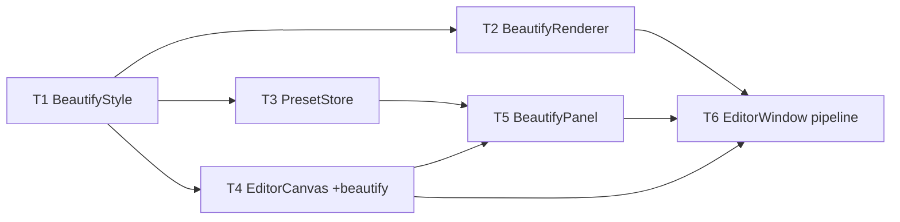

# M4 Beautify — Implementation Plan

> **For agentic workers:** REQUIRED SUB-SKILL: Use `executing-plan-time` to run this plan. It handles worktree setup, overlap analysis, parallel-wave dispatch, per-task spec + code-quality review, and branch finishing in one runner. Steps use checkbox `- [ ]` syntax for tracking.

**Goal:** Share-ready styled exports — a padded, rounded, shadowed screenshot on a color/gradient/image background, with saved presets and export-size options; applied only at export (non-destructive).
**Architecture:** Stacks on M3 branch `exec/m3-annotation-editor-20260721`. New headless-testable `MacShotCore` `BeautifyStyle` + `BeautifyRenderer` + `PresetStore`; the export pipeline becomes `BeautifyRenderer.render(AnnotationRenderer.flatten(base, doc), style)`. Thin `BeautifyPanel` + a live preview in the existing editor are the manual shell.
**Tech Stack:** Swift 6, MacShotCore (CoreGraphics, CGGradient, CGContext shadow), SwiftUI, AppKit, XCTest.
**Max wave width:** 3 tasks in parallel at peak (W2).

> **Base branch:** executor MUST create its worktree FROM `exec/m3-annotation-editor-20260721` (has M1+M2+M3), NOT master. New branch e.g. `exec/m4-beautify-20260721`. Verify `Sources/MacShotCore/AnnotationRenderer.swift` and `Sources/MacShot/EditorWindow.swift` exist before starting.
> **Verification convention:** MacShotCore tasks = strict TDD-before-commit (renderer + presets are headless). GUI-shell tasks gate on `swift build` + manual-smoke; no fabricated GUI unit tests.
> **Autonomous-mode note:** no graphify graph; manifest grounded in the M3 worktree source. Planning decisions logged tagged `[auto]`.

---

## File Edit Manifest

| Path | Action | Purpose | First touched in |
|------|--------|---------|------------------|
| `Sources/MacShotCore/BeautifyStyle.swift` | Create | `BeautifyBackground`/`BeautifyShadow`/`BeautifyStyle` + builtins | T1 |
| `Tests/MacShotCoreTests/BeautifyStyleTests.swift` | Create | style Codable + `.none` + builtins tests | T1 |
| `Sources/MacShotCore/BeautifyRenderer.swift` | Create | composite render (bg + padding + corner + shadow) | T2 |
| `Tests/MacShotCoreTests/BeautifyRendererTests.swift` | Create | size + corner-pixel + shadow + passthrough tests | T2 |
| `Sources/MacShotCore/PresetStore.swift` | Create | preset persistence over KeyValueStore + builtins merge | T3 |
| `Tests/MacShotCoreTests/PresetStoreTests.swift` | Create | preset roundtrip tests | T3 |
| `Sources/MacShot/EditorCanvas.swift` | Modify | add `beautifyStyle` to `EditorViewModel` + live frame preview | T4 |
| `Sources/MacShot/BeautifyPanel.swift` | Create | beautify controls + preset dropdown + scale picker | T5 |
| `Sources/MacShot/EditorWindow.swift` | Modify | host `BeautifyPanel`; beautify in export pipeline | T6 |

**Out of scope (intentionally not touched):** M1 capture path, M2 overlay/history, M3 `AnnotationRenderer`/`AnnotationDocument`/`UndoStack`/`ToolPalette` (only `EditorCanvas`/`EditorWindow` change), `Preferences`/`SystemSink` internals — no device frames, watermarks, OCR (M5).

---

## Execution Waves



| Wave | Tasks | Parallelizable | Rationale |
|------|-------|----------------|-----------|
| W1 | T1 | n/a | style types underpin renderer, presets, VM |
| W2 | T2, T3, T4 | yes — disjoint files (core renderer / core presets / GUI canvas), all dep T1 | independent consumers of the style |
| W3 | T5 | n/a | panel binds to the VM field (T4) + PresetStore (T3) |
| W4 | T6 | n/a | window hosts panel + wires renderer into export |

---

## Task 1: BeautifyStyle

**Depends-on:** none
**Wave:** W1
**Files:**
- Create: `Sources/MacShotCore/BeautifyStyle.swift`
- Test: `Tests/MacShotCoreTests/BeautifyStyleTests.swift`

- [ ] **Step 1: Failing test**
```swift
import XCTest
import CoreGraphics
@testable import MacShotCore

final class BeautifyStyleTests: XCTestCase {
    func testNoneIsPassthrough() {
        let s = BeautifyStyle.none
        XCTAssertEqual(s.padding, 0)
        XCTAssertEqual(s.scale, 1)
        XCTAssertNil(s.shadow)
    }
    func testBuiltinsCoverExpectedSet() {
        let names = BeautifyStyle.builtins.map(\.name)
        XCTAssertTrue(names.contains("None"))
        XCTAssertTrue(names.contains("White"))
        XCTAssertTrue(names.contains("Dark"))
        XCTAssertTrue(names.contains("Blue"))
        XCTAssertGreaterThanOrEqual(BeautifyStyle.builtins.count, 6)
    }
    func testCodableRoundtripGradientWithShadow() throws {
        let style = BeautifyStyle(
            background: .linearGradient(colors: [.init(r:0,g:0,b:1,a:1), .init(r:1,g:0,b:1,a:1)], angle: 45),
            padding: 40, cornerRadius: 12,
            shadow: BeautifyShadow(color: .init(r:0,g:0,b:0,a:0.5), radius: 20, opacity: 0.5, offset: CGSize(width: 0, height: 8)),
            scale: 2)
        let back = try JSONDecoder().decode(BeautifyStyle.self, from: JSONEncoder().encode(style))
        XCTAssertEqual(back, style)
    }
}
```
- [ ] **Step 2: Run → FAIL** `swift test --filter BeautifyStyleTests`
- [ ] **Step 3: Implement**
```swift
import CoreGraphics

public enum BeautifyBackground: Equatable, Codable, Sendable {
    case solid(RGBAColor)
    case linearGradient(colors: [RGBAColor], angle: Double)   // degrees
    case image(path: String)
}

public struct BeautifyShadow: Equatable, Codable, Sendable {
    public var color: RGBAColor
    public var radius: Double
    public var opacity: Double
    public var offset: CGSize
    public init(color: RGBAColor, radius: Double, opacity: Double, offset: CGSize) {
        self.color = color; self.radius = radius; self.opacity = opacity; self.offset = offset
    }
}

public struct BeautifyStyle: Equatable, Codable, Sendable {
    public var background: BeautifyBackground
    public var padding: Double
    public var cornerRadius: Double
    public var shadow: BeautifyShadow?
    public var scale: Double
    public init(background: BeautifyBackground, padding: Double, cornerRadius: Double,
                shadow: BeautifyShadow?, scale: Double) {
        self.background = background; self.padding = padding
        self.cornerRadius = cornerRadius; self.shadow = shadow; self.scale = scale
    }
    /// Export-passthrough: no frame at all.
    public static let none = BeautifyStyle(background: .solid(RGBAColor(r: 0, g: 0, b: 0, a: 0)),
                                           padding: 0, cornerRadius: 0, shadow: nil, scale: 1)

    public static let builtins: [BeautifyPreset] = {
        func grad(_ a: RGBAColor, _ b: RGBAColor) -> BeautifyBackground { .linearGradient(colors: [a, b], angle: 45) }
        let sh = BeautifyShadow(color: RGBAColor(r: 0, g: 0, b: 0, a: 0.35), radius: 24, opacity: 0.35, offset: CGSize(width: 0, height: 10))
        func style(_ bg: BeautifyBackground) -> BeautifyStyle {
            BeautifyStyle(background: bg, padding: 48, cornerRadius: 14, shadow: sh, scale: 2)
        }
        return [
            BeautifyPreset(name: "None", style: .none),
            BeautifyPreset(name: "White", style: style(.solid(.white))),
            BeautifyPreset(name: "Dark", style: style(.solid(RGBAColor(r: 0.11, g: 0.11, b: 0.12, a: 1)))),
            BeautifyPreset(name: "Blue", style: style(grad(RGBAColor(r: 0.2, g: 0.5, b: 1, a: 1), RGBAColor(r: 0.1, g: 0.2, b: 0.7, a: 1)))),
            BeautifyPreset(name: "Purple", style: style(grad(RGBAColor(r: 0.6, g: 0.3, b: 1, a: 1), RGBAColor(r: 0.9, g: 0.4, b: 0.8, a: 1)))),
            BeautifyPreset(name: "Sunset", style: style(grad(RGBAColor(r: 1, g: 0.5, b: 0.2, a: 1), RGBAColor(r: 1, g: 0.2, b: 0.4, a: 1)))),
        ]
    }()
}
```
  (`BeautifyPreset` is defined in T3's file; T1 references it only inside `builtins`. To avoid a cross-file forward-reference at compile time in the same target, `BeautifyPreset` is a trivial struct — T3 creates it, T1's `builtins` compiles once both files are in the target. Since both land on the same branch before the suite runs, order the commits T1→T3 or fold the tiny `BeautifyPreset` struct into T1. **Decision: define the 3-line `BeautifyPreset` struct in T1's BeautifyStyle.swift**; T3 only adds `PresetStore`.)
- [ ] **Step 3b: Add `BeautifyPreset` to `BeautifyStyle.swift`**
```swift
public struct BeautifyPreset: Equatable, Codable, Sendable, Identifiable {
    public var id: String { name }
    public var name: String
    public var style: BeautifyStyle
    public init(name: String, style: BeautifyStyle) { self.name = name; self.style = style }
}
```
- [ ] **Step 4: Run → PASS** `swift test --filter BeautifyStyleTests`
- [ ] **Step 5: Commit**
```bash
git add Sources/MacShotCore/BeautifyStyle.swift Tests/MacShotCoreTests/BeautifyStyleTests.swift
git commit -m "feat(core): BeautifyStyle + Background/Shadow/Preset + builtins"
```

---

## Task 2: BeautifyRenderer

**Depends-on:** [T1]
**Wave:** W2
**Files:**
- Create: `Sources/MacShotCore/BeautifyRenderer.swift`
- Test: `Tests/MacShotCoreTests/BeautifyRendererTests.swift`

- [ ] **Step 1: Failing test** (headless CGContext; reuse pixel-sampling pattern from the M3 renderer tests)
```swift
import XCTest
import CoreGraphics
@testable import MacShotCore

final class BeautifyRendererTests: XCTestCase {
    func whiteBase(_ w: Int, _ h: Int) -> CGImage {
        let ctx = CGContext(data: nil, width: w, height: h, bitsPerComponent: 8, bytesPerRow: 0,
            space: CGColorSpaceCreateDeviceRGB(), bitmapInfo: CGImageAlphaInfo.premultipliedLast.rawValue)!
        ctx.setFillColor(gray: 1, alpha: 1); ctx.fill(CGRect(x: 0, y: 0, width: w, height: h))
        return ctx.makeImage()!
    }
    func pixel(_ img: CGImage, x: Int, y: Int) -> (UInt8, UInt8, UInt8, UInt8) {
        var px: [UInt8] = [0, 0, 0, 0]
        let ctx = CGContext(data: &px, width: 1, height: 1, bitsPerComponent: 8, bytesPerRow: 4,
            space: CGColorSpaceCreateDeviceRGB(), bitmapInfo: CGImageAlphaInfo.premultipliedLast.rawValue)!
        ctx.draw(img, in: CGRect(x: -x, y: -(img.height - 1 - y), width: img.width, height: img.height))
        return (px[0], px[1], px[2], px[3])
    }

    func testOutputSizeIsBasePlusPaddingTimesScale() {
        let base = whiteBase(20, 10)
        let style = BeautifyStyle(background: .solid(RGBAColor(r: 0, g: 0, b: 1, a: 1)),
                                  padding: 10, cornerRadius: 0, shadow: nil, scale: 2)
        let out = BeautifyRenderer.render(image: base, style: style)
        XCTAssertEqual(out.width, (20 + 20) * 2)   // (w + 2*padding) * scale
        XCTAssertEqual(out.height, (10 + 20) * 2)
    }
    func testCornerPixelIsBackgroundColor() {
        let base = whiteBase(20, 20)
        let style = BeautifyStyle(background: .solid(RGBAColor(r: 0, g: 0, b: 1, a: 1)),
                                  padding: 10, cornerRadius: 0, shadow: nil, scale: 1)
        let out = BeautifyRenderer.render(image: base, style: style)
        let (r, g, b, _) = pixel(out, x: 1, y: 1)   // in the padding band, away from the image
        XCTAssertLessThan(r, 60); XCTAssertLessThan(g, 60); XCTAssertGreaterThan(b, 180)  // blue bg
    }
    func testNonePassthroughKeepsSize() {
        let base = whiteBase(15, 9)
        let out = BeautifyRenderer.render(image: base, style: .none)
        XCTAssertEqual(out.width, 15); XCTAssertEqual(out.height, 9)
    }
    func testShadowDarkensPaddingNearImage() {
        let base = whiteBase(20, 20)
        let noShadow = BeautifyStyle(background: .solid(.white), padding: 12, cornerRadius: 0, shadow: nil, scale: 1)
        let withShadow = BeautifyStyle(background: .solid(.white), padding: 12, cornerRadius: 0,
            shadow: BeautifyShadow(color: RGBAColor(r: 0, g: 0, b: 0, a: 0.8), radius: 6, opacity: 0.8, offset: .zero), scale: 1)
        // sample just outside the image edge (image occupies x in [12, 32); sample x=10, y=22 center band)
        let a = pixel(BeautifyRenderer.render(image: base, style: noShadow), x: 10, y: 22)
        let b = pixel(BeautifyRenderer.render(image: base, style: withShadow), x: 10, y: 22)
        XCTAssertLessThan(Int(b.0), Int(a.0), "shadow should darken the padding near the image edge")
    }
}
```
- [ ] **Step 2: Run → FAIL** `swift test --filter BeautifyRendererTests`
- [ ] **Step 3: Implement**
```swift
import CoreGraphics
import Foundation

public enum BeautifyRenderer {
    static let maxSide = 8192

    public static func render(image: CGImage, style: BeautifyStyle) -> CGImage {
        let pad = style.padding
        if pad == 0, style.scale == 1, case let .solid(c) = style.background, c.a == 0, style.shadow == nil {
            return image   // .none passthrough
        }
        let baseW = Double(image.width), baseH = Double(image.height)
        var scale = style.scale
        let unscaledW = baseW + 2 * pad, unscaledH = baseH + 2 * pad
        // clamp longest side
        let longest = max(unscaledW, unscaledH) * scale
        if longest > Double(maxSide) { scale *= Double(maxSide) / longest }
        let w = Int((unscaledW * scale).rounded()), h = Int((unscaledH * scale).rounded())

        let ctx = CGContext(data: nil, width: w, height: h, bitsPerComponent: 8, bytesPerRow: 0,
            space: CGColorSpaceCreateDeviceRGB(), bitmapInfo: CGImageAlphaInfo.premultipliedLast.rawValue)!
        ctx.scaleBy(x: scale, y: scale)

        drawBackground(style.background, in: ctx, size: CGSize(width: unscaledW, height: unscaledH))

        let imageRect = CGRect(x: pad, y: pad, width: baseW, height: baseH)
        ctx.saveGState()
        if let s = style.shadow {
            ctx.setShadow(offset: s.offset, blur: s.radius,
                          color: RGBAColor(r: s.color.r, g: s.color.g, b: s.color.b, a: s.color.a * s.opacity).cgColor)
        }
        let clip = CGPath(roundedRect: imageRect, cornerWidth: style.cornerRadius, cornerHeight: style.cornerRadius, transform: nil)
        ctx.addPath(clip); ctx.clip()
        ctx.draw(image, in: imageRect)
        ctx.restoreGState()

        return ctx.makeImage() ?? image
    }

    private static func drawBackground(_ bg: BeautifyBackground, in ctx: CGContext, size: CGSize) {
        let rect = CGRect(origin: .zero, size: size)
        switch bg {
        case let .solid(c):
            ctx.setFillColor(c.cgColor); ctx.fill(rect)
        case let .linearGradient(colors, angle):
            guard colors.count >= 2 else {
                ctx.setFillColor((colors.first ?? RGBAColor(r: 0, g: 0, b: 0, a: 0)).cgColor); ctx.fill(rect); return
            }
            let cgColors = colors.map(\.cgColor) as CFArray
            guard let grad = CGGradient(colorsSpace: CGColorSpaceCreateDeviceRGB(), colors: cgColors, locations: nil) else { return }
            let rad = angle * .pi / 180
            let start = CGPoint(x: rect.midX - cos(rad) * rect.width/2, y: rect.midY - sin(rad) * rect.height/2)
            let end = CGPoint(x: rect.midX + cos(rad) * rect.width/2, y: rect.midY + sin(rad) * rect.height/2)
            ctx.drawLinearGradient(grad, start: start, end: end, options: [.drawsBeforeStartLocation, .drawsAfterEndLocation])
        case let .image(path):
            if let src = CGImageSourceForPath(path), let img = CGImageSourceCreateImageAtIndex(src, 0, nil) {
                ctx.draw(img, in: aspectFill(imageSize: CGSize(width: img.width, height: img.height), in: rect))
            } else {
                ctx.setFillColor(RGBAColor(r: 0.5, g: 0.5, b: 0.5, a: 1).cgColor); ctx.fill(rect)  // fallback
            }
        }
    }

    private static func aspectFill(imageSize: CGSize, in rect: CGRect) -> CGRect {
        let s = max(rect.width / imageSize.width, rect.height / imageSize.height)
        let w = imageSize.width * s, h = imageSize.height * s
        return CGRect(x: rect.midX - w/2, y: rect.midY - h/2, width: w, height: h)
    }
    private static func CGImageSourceForPath(_ path: String) -> CGImageSource? {
        CGImageSourceCreateWithURL(URL(fileURLWithPath: path) as CFURL, nil)
    }
}
```
- [ ] **Step 4: Run → PASS** `swift test --filter BeautifyRendererTests`
- [ ] **Step 5: Commit**
```bash
git add Sources/MacShotCore/BeautifyRenderer.swift Tests/MacShotCoreTests/BeautifyRendererTests.swift
git commit -m "feat(core): BeautifyRenderer — background + padding + corners + shadow"
```

---

## Task 3: PresetStore

**Depends-on:** [T1]
**Wave:** W2
**Files:**
- Create: `Sources/MacShotCore/PresetStore.swift`
- Test: `Tests/MacShotCoreTests/PresetStoreTests.swift`

- [ ] **Step 1: Failing test**
```swift
import XCTest
@testable import MacShotCore

final class PresetStoreTests: XCTestCase {
    func testBuiltinsPresentByDefault() {
        let store = PresetStore(store: InMemoryKVStore())
        XCTAssertTrue(store.presets().contains { $0.name == "Blue" })
    }
    func testSaveAndDeleteUserPreset() {
        let kv = InMemoryKVStore()
        let store = PresetStore(store: kv)
        let mine = BeautifyPreset(name: "Mine", style: .none)
        store.save(mine)
        XCTAssertTrue(store.presets().contains { $0.name == "Mine" })
        XCTAssertTrue(PresetStore(store: kv).presets().contains { $0.name == "Mine" })  // persisted
        store.delete(name: "Mine")
        XCTAssertFalse(store.presets().contains { $0.name == "Mine" })
    }
    func testSavedNameShadowsBuiltin() {
        let store = PresetStore(store: InMemoryKVStore())
        store.save(BeautifyPreset(name: "Dark", style: .none))   // override builtin
        let dark = store.presets().first { $0.name == "Dark" }
        XCTAssertEqual(dark?.style, .none)
    }
}
```
- [ ] **Step 2: Run → FAIL** `swift test --filter PresetStoreTests`
- [ ] **Step 3: Implement**
```swift
import Foundation

/// Beautify presets: built-ins merged with user presets persisted as JSON in the KeyValueStore.
public struct PresetStore {
    private let store: KeyValueStore
    private let key = "beautifyPresets"
    public init(store: KeyValueStore) { self.store = store }

    private func userPresets() -> [BeautifyPreset] {
        guard let raw = store.string(forKey: key), let data = raw.data(using: .utf8),
              let list = try? JSONDecoder().decode([BeautifyPreset].self, from: data) else { return [] }
        return list
    }
    private func persist(_ list: [BeautifyPreset]) {
        if let data = try? JSONEncoder().encode(list), let s = String(data: data, encoding: .utf8) {
            store.set(s, forKey: key)
        }
    }
    /// User presets override built-ins of the same name; built-ins fill the rest.
    public func presets() -> [BeautifyPreset] {
        let user = userPresets()
        let userNames = Set(user.map(\.name))
        let builtins = BeautifyStyle.builtins.filter { !userNames.contains($0.name) }
        return builtins + user
    }
    public func save(_ preset: BeautifyPreset) {
        var list = userPresets(); list.removeAll { $0.name == preset.name }; list.append(preset); persist(list)
    }
    public func delete(name: String) {
        persist(userPresets().filter { $0.name != name })
    }
}
```
- [ ] **Step 4: Run → PASS** `swift test --filter PresetStoreTests`
- [ ] **Step 5: Commit**
```bash
git add Sources/MacShotCore/PresetStore.swift Tests/MacShotCoreTests/PresetStoreTests.swift
git commit -m "feat(core): PresetStore — builtins + user presets over KeyValueStore"
```

---

## Task 4: EditorCanvas beautify field + live frame

**Depends-on:** [T1]
**Wave:** W2
**Verification:** `swift build` + manual smoke.
**Files:**
- Modify: `Sources/MacShot/EditorCanvas.swift`

- [ ] **Step 1: Modify** `EditorViewModel` + `EditorCanvas`:
  - Add `var beautifyStyle: BeautifyStyle = .none` to `EditorViewModel`.
  - In `EditorCanvas`, wrap the annotated-image drawing with a live beautify frame when `vm.beautifyStyle != .none`: render a background rect (solid/gradient — reuse SwiftUI `LinearGradient`/`Color` from the RGBA components), inset the image by `padding` (in view units scaled to fit), apply `cornerRadius` (`.clipShape(RoundedRectangle)`) and a `.shadow(...)` matching `vm.beautifyStyle.shadow`. This is a *preview*; the exact export pixels come from `BeautifyRenderer` (T2).
- [ ] **Step 2: Verify build** `swift build`
- [ ] **Step 3: Commit**
```bash
git add Sources/MacShot/EditorCanvas.swift
git commit -m "feat(app): EditorViewModel.beautifyStyle + live beautify frame preview"
```
- **Manual smoke (T6):** toggling beautify shows the framed preview live; padding/corner/shadow reflect.

---

## Task 5: BeautifyPanel

**Depends-on:** [T3, T4]
**Wave:** W3
**Verification:** `swift build` + manual smoke.
**Files:**
- Create: `Sources/MacShot/BeautifyPanel.swift`

- [ ] **Step 1: Implement** `BeautifyPanel: View` bound to an `EditorViewModel` + a `PresetStore`:
  - Background section: a segmented control (Solid / Gradient / Image); Solid → `ColorPicker` (→ `RGBAColor`); Gradient → two `ColorPicker`s + an angle slider; Image → "Choose…" (`NSOpenPanel`, stores the path).
  - Sliders: padding (0–200), corner radius (0–80).
  - Shadow: a toggle; when on, radius/opacity/offset controls; writes `vm.beautifyStyle.shadow`.
  - Preset row: a `Picker` listing `presetStore.presets()` (loads `beautifyStyle`), a "Save current as…" button (prompts a name, `presetStore.save`), and a "Delete" button for the selected user preset.
  - Export-scale `Picker`: 1× / 2× / 3× → `vm.beautifyStyle.scale`.
  - All controls two-way-bind to `vm.beautifyStyle`.
- [ ] **Step 2: Verify build** `swift build`
- [ ] **Step 3: Commit**
```bash
git add Sources/MacShot/BeautifyPanel.swift
git commit -m "feat(app): BeautifyPanel — background/padding/shadow/presets/scale controls"
```
- **Manual smoke (T6):** each control updates the live preview; presets load/save/delete; scale changes export size.

---

## Task 6: EditorWindow — host panel + beautify export

**Depends-on:** [T2, T4, T5]
**Wave:** W4
**Verification:** `swift build && swift test` (all core suites green) + manual acceptance.
**Files:**
- Modify: `Sources/MacShot/EditorWindow.swift`

- [ ] **Step 1: Modify `EditorWindow`:**
  - Add a `BeautifyPanel(vm:presetStore:)` to the editor layout (e.g. a trailing side panel or a segmented "Annotate / Beautify" inspector), constructing a `PresetStore(store: .standard)`.
  - Change `onExport` to insert beautify between flatten and write:
```swift
let flat = AnnotationRenderer.flatten(base: base, document: vm.document)
let styled = BeautifyRenderer.render(image: flat, style: vm.beautifyStyle)
sink.copyToClipboard(styled)
// write PNG via FilenameFormatter mode "beautified" into prefs.saveDirectoryPath
```
  - The original file + annotation document remain untouched (non-destructive; `.none` style keeps the current M3 behavior since render() passes through).
- [ ] **Step 2: Verify** `swift build && swift test`
  Expected: builds; all MacShotCore tests (M1+M2+M3+M4) pass.
- [ ] **Step 3: Commit**
```bash
git add Sources/MacShot/EditorWindow.swift
git commit -m "feat(app): host BeautifyPanel; beautify in export pipeline (non-destructive)"
```
- **Manual acceptance (human DoD):** open editor → Beautify; pick a preset / tweak background+padding+corner+shadow; choose scale; Export → a beautified PNG in the save dir + clipboard; post it publicly. Verify base + annotations unchanged, and `.none` still exports the plain (annotated) image.

---

## Self-review

- **Spec coverage:** backgrounds solid/gradient/image (T1/T2), padding+corners+shadow (T1/T2), presets + builtins (T1/T3), export scale + clamp (T2), panel controls (T5), live preview (T4), non-destructive export pipeline (T6). ✓
- **Manifest ↔ tasks:** every manifest file mapped to one task; each modified M3 file (`EditorCanvas`, `EditorWindow`) owned by a single task (T4, T6) → no cross-wave races. ✓
- **Placeholder scan:** none. Core T1–T3 carry full failing-test + impl (renderer/presets headless). GUI T4–T6 carry concrete API steps + build/manual gates. ✓
- **Type/name consistency:** `BeautifyBackground` cases, `BeautifyShadow`, `BeautifyStyle.none/.builtins`, `BeautifyPreset`, `BeautifyRenderer.render(image:style:)`, `PresetStore.presets/save/delete`, `EditorViewModel.beautifyStyle` — consistent across T2/T4/T5/T6. `BeautifyPreset` defined once in T1 (referenced by T3). ✓
- **Wave correctness:** W2 {T2,T3,T4} touch disjoint files (2 new core, 1 modified GUI), all dep T1. No same-wave overlap. ✓
- **Wave width:** peak 3 (W2). W3/W4 are genuine single-integration points (panel binds VM; window merges renderer+panel). ✓
- **Ponytail first rung:** reused `KeyValueStore` (no new persistence infra), reused M3 `AnnotationRenderer` + M1 `SystemSink`/`FilenameFormatter` for the pipeline, live preview reuses SwiftUI primitives (real pixels only in the tested renderer), `.none` passthrough avoids a special-case export branch, 8192px clamp instead of unbounded scale. ✓
