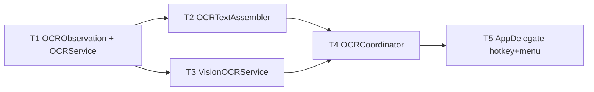

# M5 OCR — Implementation Plan

> **For agentic workers:** REQUIRED SUB-SKILL: Use `executing-plan-time` to run this plan. It handles worktree setup, overlap analysis, parallel-wave dispatch, per-task spec + code-quality review, and branch finishing in one runner. Steps use checkbox `- [ ]` syntax for tracking.

**Goal:** Capture-to-text as a first-class mode — OCR hotkey → select area → recognized text on the clipboard + a notification preview, 100% on-device via Vision.
**Architecture:** Depends on M1, stacked on M4 branch `exec/m4-beautify-20260721`. Pure reading-order assembly lives in headless-testable `MacShotCore` (`OCRObservation`, `OCRService`, `OCRTextAssembler`); `VisionOCRService` + `OCRCoordinator` are the thin Vision/wiring shell. OCR is a **sibling flow** — it does not touch `CaptureEngine`.
**Tech Stack:** Swift 6, MacShotCore (CoreGraphics values), Vision, AppKit (NSPasteboard), XCTest.
**Max wave width:** 2 tasks in parallel at peak (W2).

> **Base branch:** executor MUST create its worktree FROM `exec/m4-beautify-20260721` (has M1..M4), NOT master. New branch e.g. `exec/m5-ocr-20260721`. Verify `Sources/MacShot/SelectionOverlay.swift`, `Sources/MacShot/SCKScreenCapturer.swift`, `Sources/MacShot/Notifier.swift`, `Sources/MacShot/PermissionFlow.swift` exist before starting. (M5 only depends on M1 code; M2–M4 ride along on the stack, untouched.)
> **Verification convention:** MacShotCore tasks = strict TDD-before-commit (the assembler is deterministic + fully testable). GUI/Vision-shell tasks gate on `swift build` + manual-smoke; no fabricated GUI unit tests, and NO flaky Vision-on-synthetic-pixels test.
> **Autonomous-mode note:** no graphify graph; manifest grounded in the M4 worktree source. Planning decisions logged tagged `[auto]`.

---

## File Edit Manifest

| Path | Action | Purpose | First touched in |
|------|--------|---------|------------------|
| `Sources/MacShotCore/OCR.swift` | Create | `OCRObservation` value + `OCRService` protocol | T1 |
| `Tests/MacShotCoreTests/OCRTests.swift` | Create | observation/protocol tests | T1 |
| `Sources/MacShotCore/OCRTextAssembler.swift` | Create | reading-order assembly (columns/lines) | T2 |
| `Tests/MacShotCoreTests/OCRTextAssemblerTests.swift` | Create | assembly tests | T2 |
| `Sources/MacShot/VisionOCRService.swift` | Create | Vision impl of `OCRService` | T3 |
| `Sources/MacShot/OCRCoordinator.swift` | Create | area→capture→recognize→assemble→clipboard→notify | T4 |
| `Sources/MacShot/AppDelegate.swift` | Modify | OCR hotkey + menu item → `OCRCoordinator.run()` | T5 |

**Out of scope (intentionally not touched):** `CaptureEngine` (OCR bypasses it), M2 overlay/history, M3 editor, M4 beautify, `Preferences`/`SystemSink` — no result-review window, no text-searchable history, no translation.

---

## Execution Waves



| Wave | Tasks | Parallelizable | Rationale |
|------|-------|----------------|-----------|
| W1 | T1 | n/a | model + protocol underpin assembler and Vision impl |
| W2 | T2, T3 | yes — disjoint files (core assembler / exe Vision), both dep T1 | independent consumers of the protocol |
| W3 | T4 | n/a | coordinator merges assembler + Vision + M1 overlay/capturer |
| W4 | T5 | n/a | AppDelegate wiring |

---

## Task 1: OCRObservation + OCRService

**Depends-on:** none
**Wave:** W1
**Files:**
- Create: `Sources/MacShotCore/OCR.swift`
- Test: `Tests/MacShotCoreTests/OCRTests.swift`

- [ ] **Step 1: Failing test**
```swift
import XCTest
import CoreGraphics
@testable import MacShotCore

private struct FakeOCR: OCRService {
    let out: [OCRObservation]
    func recognize(_ image: CGImage) async throws -> [OCRObservation] { out }
}

final class OCRTests: XCTestCase {
    func testObservationEquatable() {
        let a = OCRObservation(text: "hi", boundingBox: CGRect(x: 0, y: 0, width: 1, height: 1), confidence: 0.9)
        let b = OCRObservation(text: "hi", boundingBox: CGRect(x: 0, y: 0, width: 1, height: 1), confidence: 0.9)
        XCTAssertEqual(a, b)
    }
    func testServiceProtocolReturnsObservations() async throws {
        let obs = [OCRObservation(text: "x", boundingBox: .zero, confidence: 1)]
        let img = CGContext(data: nil, width: 1, height: 1, bitsPerComponent: 8, bytesPerRow: 0,
            space: CGColorSpaceCreateDeviceRGB(), bitmapInfo: CGImageAlphaInfo.premultipliedLast.rawValue)!.makeImage()!
        let result = try await FakeOCR(out: obs).recognize(img)
        XCTAssertEqual(result, obs)
    }
}
```
- [ ] **Step 2: Run → FAIL** `swift test --filter OCRTests`
- [ ] **Step 3: Implement**
```swift
import CoreGraphics

/// One recognized text fragment. boundingBox is in image pixel space (origin bottom-left).
public struct OCRObservation: Equatable, Sendable {
    public var text: String
    public var boundingBox: CGRect
    public var confidence: Double
    public init(text: String, boundingBox: CGRect, confidence: Double) {
        self.text = text; self.boundingBox = boundingBox; self.confidence = confidence
    }
}

public protocol OCRService: Sendable {
    func recognize(_ image: CGImage) async throws -> [OCRObservation]
}
```
- [ ] **Step 4: Run → PASS** `swift test --filter OCRTests`
- [ ] **Step 5: Commit**
```bash
git add Sources/MacShotCore/OCR.swift Tests/MacShotCoreTests/OCRTests.swift
git commit -m "feat(core): OCRObservation value + OCRService protocol"
```

---

## Task 2: OCRTextAssembler

**Depends-on:** [T1]
**Wave:** W2
**Files:**
- Create: `Sources/MacShotCore/OCRTextAssembler.swift`
- Test: `Tests/MacShotCoreTests/OCRTextAssemblerTests.swift`

- [ ] **Step 1: Failing test** (boundingBox origin is bottom-left, so higher y = higher on screen = earlier in reading order)
```swift
import XCTest
import CoreGraphics
@testable import MacShotCore

final class OCRTextAssemblerTests: XCTestCase {
    func obs(_ t: String, x: CGFloat, y: CGFloat, w: CGFloat = 40, h: CGFloat = 10) -> OCRObservation {
        OCRObservation(text: t, boundingBox: CGRect(x: x, y: y, width: w, height: h), confidence: 1)
    }
    func testEmptyIsEmptyString() {
        XCTAssertEqual(OCRTextAssembler.assemble([]), "")
    }
    func testSingleObservation() {
        XCTAssertEqual(OCRTextAssembler.assemble([obs("hello", x: 0, y: 0)]), "hello")
    }
    func testMultiLineTopToBottom() {
        // y is bottom-left origin: top line has the LARGER y
        let input = [obs("second", x: 0, y: 0), obs("first", x: 0, y: 100)]
        XCTAssertEqual(OCRTextAssembler.assemble(input), "first\nsecond")
    }
    func testTwoColumnsLeftThenRight() {
        // Left column x≈0, right column x≈500; each has two lines.
        let input = [
            obs("L1", x: 0,   y: 100), obs("L2", x: 0,   y: 0),
            obs("R1", x: 500, y: 100), obs("R2", x: 500, y: 0),
        ]
        XCTAssertEqual(OCRTextAssembler.assemble(input), "L1\nL2\nR1\nR2")
    }
}
```
- [ ] **Step 2: Run → FAIL** `swift test --filter OCRTextAssemblerTests`
- [ ] **Step 3: Implement**
```swift
import CoreGraphics

/// Orders recognized fragments into readable text: split into columns by large
/// horizontal gaps, columns left→right, lines within a column top→bottom.
/// boundingBox origin is bottom-left (Vision convention), so larger y = higher.
public enum OCRTextAssembler {
    public static func assemble(_ observations: [OCRObservation]) -> String {
        let items = observations.filter { !$0.text.isEmpty }
        guard !items.isEmpty else { return "" }
        let columns = clusterColumns(items)
        return columns
            .map { col in col.sorted { $0.boundingBox.midY > $1.boundingBox.midY }.map(\.text).joined(separator: "\n") }
            .joined(separator: "\n")
    }

    /// Group by x using a gap threshold relative to typical fragment width.
    private static func clusterColumns(_ items: [OCRObservation]) -> [[OCRObservation]] {
        let sorted = items.sorted { $0.boundingBox.minX < $1.boundingBox.minX }
        let avgWidth = items.reduce(0) { $0 + $1.boundingBox.width } / CGFloat(items.count)
        let gap = max(avgWidth * 1.5, 30)     // a new column starts after a wide horizontal gap
        var columns: [[OCRObservation]] = []
        var current: [OCRObservation] = []
        var lastMaxX: CGFloat = -.greatestFiniteMagnitude
        for o in sorted {
            if !current.isEmpty, o.boundingBox.minX - lastMaxX > gap {
                columns.append(current); current = []
            }
            current.append(o)
            lastMaxX = max(lastMaxX, o.boundingBox.maxX)
        }
        if !current.isEmpty { columns.append(current) }
        return columns
    }
}
```
- [ ] **Step 4: Run → PASS** `swift test --filter OCRTextAssemblerTests`
- [ ] **Step 5: Commit**
```bash
git add Sources/MacShotCore/OCRTextAssembler.swift Tests/MacShotCoreTests/OCRTextAssemblerTests.swift
git commit -m "feat(core): OCRTextAssembler — column/line reading-order assembly"
```

---

## Task 3: VisionOCRService

**Depends-on:** [T1]
**Wave:** W2
**Verification:** `swift build` + manual smoke.
**Files:**
- Create: `Sources/MacShot/VisionOCRService.swift`

- [ ] **Step 1: Implement** `VisionOCRService: OCRService`:
  - `recognize(_ image: CGImage)`: build a `VNRecognizeTextRequest` with `recognitionLevel = .accurate`, `usesLanguageCorrection = true`, `automaticallyDetectsLanguage = true`; run via `VNImageRequestHandler(cgImage: image)`. For each `VNRecognizedTextObservation`, take `topCandidates(1).first` for `text`+`confidence`, and convert the normalized `boundingBox` (0–1, bottom-left) to pixel space: `CGRect(x: bb.minX*W, y: bb.minY*H, width: bb.width*W, height: bb.height*H)` with `W=image.width, H=image.height`. Skip zero-size boxes. Return `[OCRObservation]`.
  - Bridge Vision's completion-handler API to `async` via `withCheckedThrowingContinuation`.
- [ ] **Step 2: Verify build** `swift build`
- [ ] **Step 3: Commit**
```bash
git add Sources/MacShot/VisionOCRService.swift
git commit -m "feat(app): VisionOCRService — VNRecognizeTextRequest impl of OCRService"
```
- **Manual smoke (T5):** a screenshot of text recognizes correctly; boxes map to pixel space; language auto-detects.

---

## Task 4: OCRCoordinator

**Depends-on:** [T2, T3]
**Wave:** W3
**Verification:** `swift build` + manual smoke.
**Files:**
- Create: `Sources/MacShot/OCRCoordinator.swift`

- [ ] **Step 1: Implement** `OCRCoordinator` — the sibling flow, constructed with a `SelectionOverlay`, `SCKScreenCapturer`, `VisionOCRService`, `Notifier`, and `PermissionFlow`:
  - `run()`: if `!permission.hasScreenAccess()` → request + guide (reuse M1 `PermissionFlow`), return. Else present `selectionOverlay.present(mode: .area(nil))`; on completion:
    - nil / cancel → no-op.
    - `.area(rect)` → `let image = try await capturer.capture(.area(rect))` → `let obs = try await visionOCR.recognize(image)` → `let text = OCRTextAssembler.assemble(obs)`.
    - if `text.isEmpty` → `notifier.notifyError("No text recognized")`.
    - else → write `text` to `NSPasteboard.general` (`clearContents()`, `setString(text, forType: .string)`) → `notifier.notify(...)` preview banner (first ~80 chars, "…" if truncated).
  - Wrap the capture/recognize in do/catch → `notifier.notifyError(error message)`.
- [ ] **Step 2: Verify build** `swift build`
- [ ] **Step 3: Commit**
```bash
git add Sources/MacShot/OCRCoordinator.swift
git commit -m "feat(app): OCRCoordinator — area→capture→recognize→assemble→clipboard→notify"
```
- **Manual smoke (T5):** select a text region → text on clipboard + preview banner; empty region → no-op; no-text region → "No text recognized".

---

## Task 5: AppDelegate — OCR hotkey + menu

**Depends-on:** [T4]
**Wave:** W4
**Verification:** `swift build && swift test` (all core suites green) + manual acceptance.
**Files:**
- Modify: `Sources/MacShot/AppDelegate.swift`

- [ ] **Step 1: Modify `AppDelegate`:**
  - Construct an `OCRCoordinator` in `applicationDidFinishLaunching` (reusing the existing `SelectionOverlay`, `SCKScreenCapturer`, `Notifier`, `PermissionFlow` instances).
  - Register the OCR hotkey (default `⌃⌘⇧O`, from prefs if present) via the existing `HotkeyManager` → `Task { await ocrCoordinator.run() }`.
  - Add a "Capture Text (OCR)" menu item (after the three capture items) → same action.
- [ ] **Step 2: Verify** `swift build && swift test`
  Expected: builds; all MacShotCore tests (M1+M2+M3+M4+M5) pass.
- [ ] **Step 3: Commit**
```bash
git add Sources/MacShot/AppDelegate.swift
git commit -m "feat(app): OCR hotkey + menu item wired to OCRCoordinator"
```
- **Manual acceptance (human DoD):** OCR hotkey → select a terminal-error screenshot region → recognized text pasted clean elsewhere; notification preview shows; try a multi-language and a two-column snippet.

---

## Self-review

- **Spec coverage:** OCR mode via hotkey+menu (T5), area selection reuse (T4), Vision recognition + language auto-detect (T3), reading-order assembly incl. columns (T2), clipboard text + notification preview (T4), sibling flow bypassing CaptureEngine (T4). ✓
- **Manifest ↔ tasks:** every manifest file mapped to one task; `AppDelegate.swift` modified only by T5. ✓
- **Placeholder scan:** none. Core T1/T2 carry full failing-test + impl (assembler deterministic). GUI T3–T5 carry concrete API steps + build/manual gates; deliberately no flaky Vision unit test. ✓
- **Type/name consistency:** `OCRObservation(text:boundingBox:confidence:)`, `OCRService.recognize(_:)`, `OCRTextAssembler.assemble(_:)`, `OCRCoordinator.run()`, M1 `SelectionOverlay.present(mode:)` / `SCKScreenCapturer.capture(_:)` / `PermissionFlow.hasScreenAccess()` / `Notifier` — consistent across T3/T4/T5. ✓
- **Wave correctness:** W2 {T2,T3} touch disjoint files (core assembler vs exe Vision), both dep T1. No same-wave overlap. ✓
- **Wave width:** peak 2 (W2). W1 (foundational model), W3 (coordinator merge), W4 (wiring) are genuine single points. ✓
- **Ponytail first rung:** OCR reuses M1 `SelectionOverlay`/`SCKScreenCapturer`/`Notifier`/`PermissionFlow` (zero new capture/permission infra), stays out of `CaptureEngine` (no image-sink contortion), silent-copy + preview instead of a review window (YAGNI), pure assembler carries the tests instead of a flaky Vision integration test. ✓
