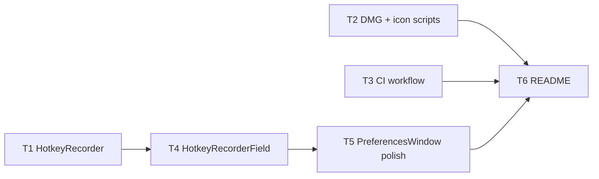

# M6 Ship — Implementation Plan

> **For agentic workers:** REQUIRED SUB-SKILL: Use `executing-plan-time` to run this plan. It handles worktree setup, overlap analysis, parallel-wave dispatch, per-task spec + code-quality review, and branch finishing in one runner. Steps use checkbox `- [ ]` syntax for tracking.

**Goal:** Make MacShot installable, signed, and distributable — hotkey-recorder settings, a notarized-DMG build script, GitHub Actions CI, and a README.
**Architecture:** Stacks on M5 branch `exec/m5-ocr-20260721`. One new headless-testable `MacShotCore` type (`HotkeyRecorder`); a `HotkeyRecorderField` + `PreferencesWindow` polish shell; and authored deliverables (`make_dmg.sh`, `make_icon.sh`, CI workflow, README). Notarization credentials are a **human** runtime input for the DoD — not produced here.
**Tech Stack:** Swift 6, MacShotCore, AppKit/SwiftUI (NSEvent), codesign/notarytool/stapler, GitHub Actions, XCTest.
**Max wave width:** 3 tasks in parallel at peak (W1).

> **Base branch:** executor MUST create its worktree FROM `exec/m5-ocr-20260721` (has M1..M5), NOT master. New branch e.g. `exec/m6-ship-20260721`. Verify `Sources/MacShotCore/HotkeySpec.swift`, `Sources/MacShot/PreferencesWindow.swift`, `Scripts/make_app.sh`, `Scripts/Info.plist` exist before starting.
> **Verification convention:** `HotkeyRecorder` (core) = strict TDD-before-commit. Scripts gate on `bash -n` (parse-clean); the CI workflow on valid YAML; GUI (`HotkeyRecorderField`, `PreferencesWindow`) on `swift build` + manual-smoke. Notarization is NOT run here (no Developer ID) — the script is authored + syntax-checked; a human runs it for the DoD.
> **Autonomous-mode note:** no graphify graph; manifest grounded in the M5 worktree source. `[auto]` logged. NO escalation — see spec header.

---

## File Edit Manifest

| Path | Action | Purpose | First touched in |
|------|--------|---------|------------------|
| `Sources/MacShotCore/HotkeyRecorder.swift` | Create | keyCode+mods → HotkeySpec + reserved-combo check | T1 |
| `Tests/MacShotCoreTests/HotkeyRecorderTests.swift` | Create | recorder mapping + reserved tests | T1 |
| `Scripts/make_dmg.sh` | Create | codesign Developer ID → DMG → notarize → staple | T2 |
| `Scripts/make_icon.sh` | Create | placeholder `AppIcon.icns` via iconutil | T2 |
| `Scripts/make_app.sh` | Modify | copy AppIcon into the bundle | T2 |
| `Scripts/Info.plist` | Modify | add `CFBundleIconFile` | T2 |
| `.github/workflows/ci.yml` | Create | macOS CI: `swift build` + `swift test` | T3 |
| `Sources/MacShot/HotkeyRecorderField.swift` | Create | captures a keypress → `HotkeyRecorder` → prefs | T4 |
| `Sources/MacShot/PreferencesWindow.swift` | Modify | recorder fields + all prefs incl. OCR hotkey | T5 |
| `README.md` | Create | what/features/build/install/Developer-ID note | T6 |

**Out of scope (intentionally not touched):** M1 capture path, M2 overlay/history, M3 editor, M4 beautify, M5 OCR core — no Sparkle, website, licensing, or App Store config. `make_dmg.sh` is authored, not executed (no credentials in this environment).

---

## Execution Waves



| Wave | Tasks | Parallelizable | Rationale |
|------|-------|----------------|-----------|
| W1 | T1, T2, T3 | yes — disjoint (core / Scripts / .github) | independent deliverables |
| W2 | T4 | n/a | field needs the recorder (T1) |
| W3 | T5 | n/a | prefs window hosts the recorder field |
| W4 | T6 | n/a | README describes the finished state |

---

## Task 1: HotkeyRecorder

**Depends-on:** none
**Wave:** W1
**Files:**
- Create: `Sources/MacShotCore/HotkeyRecorder.swift`
- Test: `Tests/MacShotCoreTests/HotkeyRecorderTests.swift`

- [ ] **Step 1: Failing test** (Cocoa modifier bits passed as raw UInt so core tests stay AppKit-free)
```swift
import XCTest
@testable import MacShotCore

// NSEvent.ModifierFlags device-independent bits (kept as literals — no AppKit import in core tests).
private let CMD: UInt = 1 << 20, SHIFT: UInt = 1 << 17, OPT: UInt = 1 << 19, CTRL: UInt = 1 << 18

final class HotkeyRecorderTests: XCTestCase {
    func testMapsDigitWithCommandShift() {
        let spec = HotkeyRecorder.spec(fromKeyCode: 19, cocoaModifierRawValue: CMD | SHIFT)  // 19 = "2"
        XCTAssertEqual(spec?.description, "⌘⇧2")
    }
    func testMapsLetterWithControlCommandShift() {
        let spec = HotkeyRecorder.spec(fromKeyCode: 31, cocoaModifierRawValue: CTRL | CMD | SHIFT)  // 31 = "O"
        XCTAssertEqual(spec?.modifiers, [.control, .command, .shift])
        XCTAssertEqual(spec?.keyLabel, "O")
    }
    func testUnmappedKeyCodeReturnsNil() {
        XCTAssertNil(HotkeyRecorder.spec(fromKeyCode: 56, cocoaModifierRawValue: SHIFT))  // 56 = shift key itself
    }
    func testReservedBlocksSystemCombos() {
        let cmd3 = HotkeyRecorder.spec(fromKeyCode: 20, cocoaModifierRawValue: CMD | SHIFT)!  // 20 = "3"
        XCTAssertTrue(HotkeyRecorder.isReserved(cmd3))                                        // ⌘⇧3 = system
        let ctrlCmdShift2 = HotkeyRecorder.spec(fromKeyCode: 19, cocoaModifierRawValue: CTRL | CMD | SHIFT)!
        XCTAssertFalse(HotkeyRecorder.isReserved(ctrlCmdShift2))                              // ⌃⌘⇧2 = app default
    }
}
```
- [ ] **Step 2: Run → FAIL** `swift test --filter HotkeyRecorderTests`
- [ ] **Step 3: Implement** (reuses M1 `HotkeySpec.keyCodes` — same module)
```swift
import Foundation

/// Converts a recorded key event (Carbon keyCode + Cocoa modifier bits) into a
/// HotkeySpec, and flags macOS-reserved screenshot combos. Pure → headless-testable.
public enum HotkeyRecorder {
    // NSEvent.ModifierFlags device-independent bits
    private static let cmdBit: UInt = 1 << 20
    private static let shiftBit: UInt = 1 << 17
    private static let optBit: UInt = 1 << 19
    private static let ctrlBit: UInt = 1 << 18

    public static func spec(fromKeyCode keyCode: UInt32, cocoaModifierRawValue raw: UInt) -> HotkeySpec? {
        guard let label = HotkeySpec.keyCodes.first(where: { $0.value == keyCode })?.key else { return nil }
        var mods: HotkeyModifiers = []
        if raw & cmdBit != 0 { mods.insert(.command) }
        if raw & shiftBit != 0 { mods.insert(.shift) }
        if raw & optBit != 0 { mods.insert(.option) }
        if raw & ctrlBit != 0 { mods.insert(.control) }
        return HotkeySpec(modifiers: mods, keyLabel: label, keyCode: keyCode)
    }

    /// macOS system screenshot shortcuts: ⌘⇧3/4/5/6.
    public static func isReserved(_ spec: HotkeySpec) -> Bool {
        spec.modifiers == [.command, .shift] && ["3", "4", "5", "6"].contains(spec.keyLabel)
    }
}
```
- [ ] **Step 4: Run → PASS** `swift test --filter HotkeyRecorderTests`
- [ ] **Step 5: Commit**
```bash
git add Sources/MacShotCore/HotkeyRecorder.swift Tests/MacShotCoreTests/HotkeyRecorderTests.swift
git commit -m "feat(core): HotkeyRecorder — keyCode+mods → HotkeySpec + reserved guard"
```

---

## Task 2: DMG + icon scripts

**Depends-on:** none
**Wave:** W1
**Verification:** `bash -n` on both scripts; `make_app.sh` still parses.
**Files:**
- Create: `Scripts/make_dmg.sh`
- Create: `Scripts/make_icon.sh`
- Modify: `Scripts/make_app.sh`
- Modify: `Scripts/Info.plist`

- [ ] **Step 1: `Scripts/make_icon.sh`** (`set -euo pipefail`):
  - Render a 1024×1024 placeholder PNG (a solid rounded-rect with the letter "M" via `sips`/a bundled base PNG, or a here-doc Swift snippet using CoreGraphics run with `swift -`), build an `AppIcon.iconset` at the standard sizes with `sips -z`, then `iconutil -c icns AppIcon.iconset -o Scripts/AppIcon.icns`. Echo the output path.
- [ ] **Step 2: Modify `Scripts/make_app.sh`** — after assembling `Contents/Resources`, `cp Scripts/AppIcon.icns "$APP/Contents/Resources/AppIcon.icns"` (generate it via `make_icon.sh` if absent).
- [ ] **Step 3: Modify `Scripts/Info.plist`** — add `<key>CFBundleIconFile</key><string>AppIcon</string>`.
- [ ] **Step 4: `Scripts/make_dmg.sh`** (`set -euo pipefail`):
  - Require `DEVELOPER_ID_APP` and `AC_NOTARY_PROFILE` env vars; if unset, print a clear message and exit 1 (never emit an unsigned DMG silently).
  - `bash Scripts/make_app.sh` to (re)build `MacShot.app`.
  - `codesign --force --deep --options runtime --timestamp --sign "$DEVELOPER_ID_APP" MacShot.app`.
  - `hdiutil create -volname MacShot -srcfolder MacShot.app -ov -format UDZO MacShot.dmg`.
  - `xcrun notarytool submit MacShot.dmg --keychain-profile "$AC_NOTARY_PROFILE" --wait`.
  - `xcrun stapler staple MacShot.dmg`.
  - Echo the DMG path + a one-line "ready to distribute" note.
- [ ] **Step 5: Static-check**
  Run: `bash -n Scripts/make_dmg.sh && bash -n Scripts/make_icon.sh && bash -n Scripts/make_app.sh`
  Expected: all parse clean (exit 0). (Not executed — no Developer ID here.)
- [ ] **Step 6: Commit**
```bash
git add Scripts/make_dmg.sh Scripts/make_icon.sh Scripts/make_app.sh Scripts/Info.plist
git commit -m "build: notarized-DMG + placeholder-icon scripts; wire icon into bundle"
```

---

## Task 3: GitHub Actions CI

**Depends-on:** none
**Wave:** W1
**Verification:** valid YAML.
**Files:**
- Create: `.github/workflows/ci.yml`

- [ ] **Step 1: Author `.github/workflows/ci.yml`**:
```yaml
name: CI
on:
  push:
    branches: ["**"]
  pull_request:
jobs:
  build-test:
    runs-on: macos-14
    steps:
      - uses: actions/checkout@v4
      - name: Select Xcode
        run: sudo xcode-select -s /Applications/Xcode_16.app || true
      - name: Swift version
        run: swift --version
      - name: Build
        run: swift build
      - name: Test
        run: swift test
```
- [ ] **Step 2: Verify YAML** (parse it — e.g. `python3 -c "import yaml,sys; yaml.safe_load(open('.github/workflows/ci.yml'))"`, or `ruby -ryaml -e 'YAML.load_file(".github/workflows/ci.yml")'`)
  Expected: parses without error.
- [ ] **Step 3: Commit**
```bash
git add .github/workflows/ci.yml
git commit -m "ci: GitHub Actions macOS build + test workflow"
```

---

## Task 4: HotkeyRecorderField

**Depends-on:** [T1]
**Wave:** W2
**Verification:** `swift build` + manual smoke.
**Files:**
- Create: `Sources/MacShot/HotkeyRecorderField.swift`

- [ ] **Step 1: Implement** a recorder control:
  - `HotkeyRecorderField` — an AppKit `NSView` (wrapped for SwiftUI via `NSViewRepresentable`, or a SwiftUI view backed by a first-responder capture) that shows the current `HotkeySpec.description`. When clicked/focused it enters "recording": overrides `keyDown(_:)`, reads `event.keyCode` (UInt16→UInt32) + `event.modifierFlags.rawValue`, calls `HotkeyRecorder.spec(fromKeyCode:cocoaModifierRawValue:)`.
  - On `nil` (modifier-only/unmapped) or `HotkeyRecorder.isReserved(spec)` → reject: `NSSound.beep()`, stay in recording, no change.
  - On a valid non-reserved spec → invoke an injected `onRecorded: (HotkeySpec) -> Void` (writes `spec.description` to the bound pref) and exit recording.
  - `Esc` cancels recording without change.
- [ ] **Step 2: Verify build** `swift build`
- [ ] **Step 3: Commit**
```bash
git add Sources/MacShot/HotkeyRecorderField.swift
git commit -m "feat(app): HotkeyRecorderField — live key capture with reserved-combo reject"
```
- **Manual smoke (T5):** clicking the field records a pressed combo; ⌘⇧4 (reserved) beeps + rejected; Esc cancels.

---

## Task 5: PreferencesWindow polish

**Depends-on:** [T4]
**Wave:** W3
**Verification:** `swift build` + manual smoke.
**Files:**
- Modify: `Sources/MacShot/PreferencesWindow.swift`

- [ ] **Step 1: Modify `PreferencesWindow`:**
  - Replace the plain hotkey `TextField`s (area/window/fullscreen) with `HotkeyRecorderField`s, each bound to its `Preferences` hotkey string via `onRecorded { prefs.areaHotkey = $0.description }` (etc.), and add a fourth for the **M5 OCR hotkey** (`prefs.ocrHotkey` if present, else the `⌃⌘⇧O` default key).
  - Ensure every preference is surfaced: save dir (Choose…), filename format (+ live preview via `FilenameFormatter`), after-capture toggles (`copyToClipboard`, `saveToFile`), and the four hotkeys.
  - Keep the existing change-notification hook so `HotkeyManager` re-registers after a recording.
- [ ] **Step 2: Verify** `swift build && swift test`
  Expected: builds; all MacShotCore tests (M1..M6) pass.
- [ ] **Step 3: Commit**
```bash
git add Sources/MacShot/PreferencesWindow.swift
git commit -m "feat(app): Preferences — hotkey recorder fields + full prefs surface"
```
- **Manual smoke (T6):** all four hotkeys recordable + persist; changing one re-registers; all prefs visible + working.

---

## Task 6: README

**Depends-on:** [T2, T3, T5]
**Wave:** W4
**Verification:** renders as valid Markdown (visual read).
**Files:**
- Create: `README.md`

- [ ] **Step 1: Author `README.md`** with:
  - **What** — MacShot: a free, native, on-device macOS screenshot tool (menu-bar resident).
  - **Features** — capture (area/window/fullscreen + hotkeys), quick-access overlay + history + pins, annotation editor, beautify export, OCR (M1–M5).
  - **Requirements** — macOS 14+, Apple Silicon or Intel.
  - **Build from source** — `swift build`; run tests `swift test`; make the app bundle `bash Scripts/make_app.sh`.
  - **Install (signed)** — `DEVELOPER_ID_APP` + `AC_NOTARY_PROFILE` then `bash Scripts/make_dmg.sh` → notarized `MacShot.dmg`; drag to /Applications. **Note the Apple Developer ID ($99/yr) prerequisite for a distributable signed build.**
  - **Permissions** — grant Screen Recording (TCC) on first capture.
  - **CI** — GitHub Actions builds + tests on macOS.
  - **Status / license** — v0.1 working title; out-of-scope list (no cloud/video/AI/Sparkle per roadmap).
- [ ] **Step 2: Commit**
```bash
git add README.md
git commit -m "docs: README — features, build, notarized install, permissions, CI"
```

---

## Self-review

- **Spec coverage:** hotkey recorder + reserved guard (T1), recorder UI (T4), prefs polish incl. OCR hotkey (T5), notarized-DMG script (T2), icon (T2), CI workflow (T3), README (T6). ✓
- **Manifest ↔ tasks:** every manifest file mapped to one task; `make_app.sh`/`Info.plist` modified only by T2, `PreferencesWindow.swift` only by T5. ✓
- **Placeholder scan:** none. T1 carries full failing-test + impl. Deliverables (T2/T3) carry concrete script/YAML content + `bash -n`/YAML-parse gates. GUI (T4/T5) build+manual. README (T6) has an explicit section list, not "etc." ✓
- **Type/name consistency:** `HotkeyRecorder.spec(fromKeyCode:cocoaModifierRawValue:)` / `.isReserved(_:)`, M1 `HotkeySpec.keyCodes`/`HotkeyModifiers`/`HotkeySpec(modifiers:keyLabel:keyCode:)`, `HotkeyRecorderField.onRecorded` — consistent across T1/T4/T5. ✓
- **Wave correctness:** W1 {T1,T2,T3} touch fully disjoint trees (`Sources/MacShotCore` / `Scripts` / `.github`). No same-wave overlap. ✓
- **Wave width:** peak 3 (W1). W2/W3/W4 are genuine sequential points (field needs recorder; window hosts field; README describes the finished state). ✓
- **Ponytail first rung:** recorder reuses M1 `HotkeySpec.keyCodes` (no new keymap), `make_dmg.sh` extends `make_app.sh` (no duplicate bundling), CI is the minimal build+test (no matrix/lint sprawl), placeholder icon (final art deferred), notarization parameterized on env (no secrets committed, no unsigned-DMG fallback). ✓
