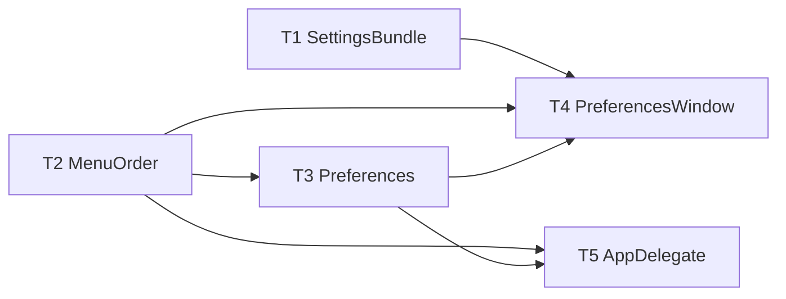

# M10 Settings & Menu-Bar Polish — Implementation Plan

> **For agentic workers:** REQUIRED SUB-SKILL: Use `executing-plan-time` to run this plan. It handles worktree setup, overlap analysis, parallel-wave dispatch, per-task spec + code-quality review, and branch finishing in one runner. Steps use checkbox `- [ ]` syntax for tracking.

**Goal:** Settings export/import, configurable menu-bar action order, custom/hideable menu-bar icon; keep the hand-rolled updater (Sparkle declined).
**Architecture:** `SettingsBundle` + `MenuOrder` in headless-tested `MacShotCore` (strict TDD) + new `Preferences` fields; export/import UI, reorder list, icon picker, and status-menu build in the shell. Builds on M1 + M6.
**Tech Stack:** Swift 6, MacShotCore (Foundation), SwiftUI/AppKit (NSStatusItem, NSSave/OpenPanel), XCTest.
**Max wave width:** 2 tasks in parallel at peak (W1, W3).

> **Base branch:** stacks on M9 — executor creates its worktree FROM `exec/m9-qr-barcode-20260723`, new branch e.g. `exec/m10-settings-menubar-20260723`. Verify `Sources/MacShotCore/Preferences.swift`, `Sources/MacShot/AppDelegate.swift`, `PreferencesWindow.swift`, `HotkeyRecorderField.swift` exist first.
> **Verification:** MacShotCore tasks = strict TDD. Shell tasks gate on `swift build` + manual-smoke. **Sparkle NOT added** (decided). `Preferences.swift` is modified by ONE task (T3) only.
> **Autonomous-mode note:** no graphify graph; manifest grounded in the M9-branch source. Decisions `[auto]`.

---

## File Edit Manifest

| Path | Action | Purpose | First touched in |
|------|--------|---------|------------------|
| `Sources/MacShotCore/SettingsBundle.swift` | Create | export/import prefs as flat JSON over KeyValueStore | T1 |
| `Tests/MacShotCoreTests/SettingsBundleTests.swift` | Create | roundtrip + foreign-key tests | T1 |
| `Sources/MacShotCore/MenuOrder.swift` | Create | `CaptureAction` + `MenuOrder` (default/move/normalize) | T2 |
| `Tests/MacShotCoreTests/MenuOrderTests.swift` | Create | order tests | T2 |
| `Sources/MacShotCore/Preferences.swift` | Modify | add icon/hide/prefsHotkey/menuOrder; make `store` accessible | T3 |
| `Tests/MacShotCoreTests/PreferencesM10Tests.swift` | Create | new-field roundtrip | T3 |
| `Sources/MacShot/PreferencesWindow.swift` | Modify | General section: export/import + menu/icon controls | T4 |
| `Sources/MacShot/AppDelegate.swift` | Modify | build menu per order; icon/hide + prefs hotkey | T5 |

**Out of scope (intentionally not touched):** cloud/upload, capture/editor/OCR internals, `UpdateService` (kept as-is — no Sparkle), history storage.

---

## Execution Waves



| Wave | Tasks | Parallelizable | Rationale |
|------|-------|----------------|-----------|
| W1 | T1, T2 | yes — disjoint core files | settings serialize vs menu-order model |
| W2 | T3 | n/a | Preferences.menuOrder uses `MenuOrder` (T2) |
| W3 | T4, T5 | yes — disjoint shell files, both dep T3 | prefs UI vs status-menu build |

---

## Task 1: SettingsBundle

**Depends-on:** none
**Wave:** W1
**Files:**
- Create: `Sources/MacShotCore/SettingsBundle.swift`
- Test: `Tests/MacShotCoreTests/SettingsBundleTests.swift`

- [ ] **Step 1: Failing test**
```swift
import XCTest
@testable import MacShotCore

final class SettingsBundleTests: XCTestCase {
    func testExportImportRoundtrip() {
        let a = InMemoryKVStore()
        let p = Preferences(store: a)
        p.filenameFormat = "X {date}"; p.captureDelaySeconds = 5; p.copyToClipboard = false
        let data = SettingsBundle.export(from: a)
        let b = InMemoryKVStore()
        SettingsBundle.load(data, into: b)
        let q = Preferences(store: b)
        XCTAssertEqual(q.filenameFormat, "X {date}")
        XCTAssertEqual(q.captureDelaySeconds, 5)
        XCTAssertFalse(q.copyToClipboard)
    }
    func testForeignKeysIgnoredKnownApplied() {
        let store = InMemoryKVStore()
        let json = #"{"totallyUnknownKey":"zzz","filenameFormat":"Y"}"#.data(using: .utf8)!
        SettingsBundle.load(json, into: store)
        XCTAssertEqual(Preferences(store: store).filenameFormat, "Y")
        XCTAssertNil(store.object(forKey: "totallyUnknownKey"))
    }
    func testMissingKeysLeaveDefaults() {
        let store = InMemoryKVStore()
        SettingsBundle.load("{}".data(using: .utf8)!, into: store)
        XCTAssertEqual(Preferences(store: store).filenameFormat, "Screenshot {date} at {time}")
    }
}
```
- [ ] **Step 2: Run → FAIL** `swift test --filter SettingsBundleTests`
- [ ] **Step 3: Implement** (own key list; excludes history/secret keys)
```swift
import Foundation

/// Export/import of user settings as flat JSON. Operates over the KeyValueStore for a fixed
/// allow-list of keys; excludes screenshot history and any secret keys.
public enum SettingsBundle {
    public static let exportableKeys: [String] = [
        "filenameFormat", "saveDirectoryPath", "copyToClipboard", "saveToFile",
        "hotkey.area", "hotkey.window", "hotkey.fullscreen", "hotkey.ocr", "hotkey.lastArea",
        "captureDelaySeconds", "captureCursor", "downscaleRetina",
        "loupeSize", "loupeMagnification", "loupeOutlineEnabled", "loupeOutlineColor",
        "menuBarIconSymbol", "hideMenuBarIcon", "preferencesHotkey", "menuOrder",
    ]
    public static func export(from store: KeyValueStore) -> Data {
        var dict: [String: Any] = [:]
        for k in exportableKeys where store.object(forKey: k) != nil { dict[k] = store.object(forKey: k) }
        return (try? JSONSerialization.data(withJSONObject: dict, options: [.prettyPrinted, .sortedKeys])) ?? Data("{}".utf8)
    }
    public static func load(_ data: Data, into store: KeyValueStore) {
        guard let dict = (try? JSONSerialization.jsonObject(with: data)) as? [String: Any] else { return }
        for k in exportableKeys { if let v = dict[k] { store.set(v, forKey: k) } }
    }
}
```
  (Needs `Preferences.store` accessible to callers — made `internal` in T3; here the tests use the store directly.)
- [ ] **Step 4: Run → PASS** `swift test --filter SettingsBundleTests`
- [ ] **Step 5: Commit**
```bash
git add Sources/MacShotCore/SettingsBundle.swift Tests/MacShotCoreTests/SettingsBundleTests.swift
git commit -m "feat(core): SettingsBundle — export/import prefs as flat JSON (allow-list)"
```

---

## Task 2: MenuOrder

**Depends-on:** none
**Wave:** W1
**Files:**
- Create: `Sources/MacShotCore/MenuOrder.swift`
- Test: `Tests/MacShotCoreTests/MenuOrderTests.swift`

- [ ] **Step 1: Failing test**
```swift
import XCTest
@testable import MacShotCore

final class MenuOrderTests: XCTestCase {
    func testDefaultHasEveryActionOnce() {
        let d = MenuOrder.default
        XCTAssertEqual(Set(d.items), Set(CaptureAction.allCases))
        XCTAssertEqual(d.items.count, CaptureAction.allCases.count)
    }
    func testMoveReorders() {
        var o = MenuOrder(items: [.area, .window, .fullscreen])
        o.move(from: 0, to: 2)
        XCTAssertEqual(o.items, [.window, .fullscreen, .area])
    }
    func testCodableRoundtrip() throws {
        let o = MenuOrder(items: [.ocr, .area, .lastArea, .window, .fullscreen])
        XCTAssertEqual(try JSONDecoder().decode(MenuOrder.self, from: JSONEncoder().encode(o)), o)
    }
    func testNormalizeFillsMissingAndDropsDupes() {
        let o = MenuOrder(items: [.area, .area]).normalized()
        XCTAssertEqual(Set(o.items), Set(CaptureAction.allCases))   // all present, no dupes
        XCTAssertEqual(o.items.first, .area)                         // preserves given order first
    }
}
```
- [ ] **Step 2: Run → FAIL** `swift test --filter MenuOrderTests`
- [ ] **Step 3: Implement**
```swift
public enum CaptureAction: String, Codable, CaseIterable, Sendable {
    case area, window, fullscreen, ocr, lastArea
}

public struct MenuOrder: Equatable, Codable, Sendable {
    public var items: [CaptureAction]
    public init(items: [CaptureAction]) { self.items = items }
    public static let `default` = MenuOrder(items: CaptureAction.allCases)

    public mutating func move(from: Int, to: Int) {
        guard items.indices.contains(from) else { return }
        let x = items.remove(at: from)
        items.insert(x, at: min(max(0, to), items.count))
    }
    /// Every action once, dedup preserving first occurrence, missing appended in canonical order.
    public func normalized() -> MenuOrder {
        var seen = Set<CaptureAction>(); var out: [CaptureAction] = []
        for a in items where !seen.contains(a) { seen.insert(a); out.append(a) }
        for a in CaptureAction.allCases where !seen.contains(a) { out.append(a) }
        return MenuOrder(items: out)
    }
}
```
- [ ] **Step 4: Run → PASS** `swift test --filter MenuOrderTests`
- [ ] **Step 5: Commit**
```bash
git add Sources/MacShotCore/MenuOrder.swift Tests/MacShotCoreTests/MenuOrderTests.swift
git commit -m "feat(core): MenuOrder + CaptureAction — configurable menu order"
```

---

## Task 3: Preferences (M10 fields)

**Depends-on:** [T2]
**Wave:** W2
**Files:**
- Modify: `Sources/MacShotCore/Preferences.swift`
- Test: `Tests/MacShotCoreTests/PreferencesM10Tests.swift`

- [ ] **Step 1: Failing test**
```swift
import XCTest
@testable import MacShotCore

final class PreferencesM10Tests: XCTestCase {
    func testDefaults() {
        let p = Preferences(store: InMemoryKVStore())
        XCTAssertEqual(p.menuBarIconSymbol, "camera.viewfinder")
        XCTAssertFalse(p.hideMenuBarIcon)
        XCTAssertEqual(p.preferencesHotkey, "⌃⌘⇧,")
        XCTAssertEqual(p.menuOrder, .default)
    }
    func testRoundtrip() {
        let store = InMemoryKVStore()
        let p = Preferences(store: store)
        p.menuBarIconSymbol = "bolt.fill"; p.hideMenuBarIcon = true
        p.menuOrder = MenuOrder(items: [.ocr, .area, .window, .fullscreen, .lastArea])
        let q = Preferences(store: store)
        XCTAssertEqual(q.menuBarIconSymbol, "bolt.fill")
        XCTAssertTrue(q.hideMenuBarIcon)
        XCTAssertEqual(q.menuOrder.items.first, .ocr)
    }
}
```
- [ ] **Step 2: Run → FAIL** `swift test --filter PreferencesM10Tests`
- [ ] **Step 3: Implement** — make the stored `store` `internal` (was private) so `SettingsBundle`/UI can reach it, and add:
```swift
    public var menuBarIconSymbol: String { get { s("menuBarIconSymbol", "camera.viewfinder") } nonmutating set { store.set(newValue, forKey: "menuBarIconSymbol") } }
    public var hideMenuBarIcon: Bool { get { b("hideMenuBarIcon", false) } nonmutating set { store.set(newValue, forKey: "hideMenuBarIcon") } }
    public var preferencesHotkey: String { get { s("preferencesHotkey", "⌃⌘⇧,") } nonmutating set { store.set(newValue, forKey: "preferencesHotkey") } }
    public var menuOrder: MenuOrder {
        get {
            guard let raw = store.string(forKey: "menuOrder"), let d = raw.data(using: .utf8),
                  let o = try? JSONDecoder().decode(MenuOrder.self, from: d) else { return .default }
            return o.normalized()
        }
        nonmutating set {
            if let d = try? JSONEncoder().encode(newValue.normalized()), let s = String(data: d, encoding: .utf8) {
                store.set(s, forKey: "menuOrder")
            }
        }
    }
    // expose the store so SettingsBundle/UI can serialize it:
    // change `private let store: KeyValueStore` → `let store: KeyValueStore`
```
- [ ] **Step 4: Run → PASS** `swift test --filter PreferencesM10Tests` (+ full `swift test` green)
- [ ] **Step 5: Commit**
```bash
git add Sources/MacShotCore/Preferences.swift Tests/MacShotCoreTests/PreferencesM10Tests.swift
git commit -m "feat(core): Preferences — menu-bar icon/hide/prefs-hotkey/menuOrder"
```

---

## Task 4: PreferencesWindow — General section

**Depends-on:** [T1, T2, T3]
**Wave:** W3
**Verification:** `swift build` + manual smoke.
**Files:**
- Modify: `Sources/MacShot/PreferencesWindow.swift`

- [ ] **Step 1: Modify** the prefs UI + model:
  - A "General" `Section`: "Export Settings…" (`NSSavePanel` → write `SettingsBundle.export(from: UserDefaults.standard)`), "Import Settings…" (`NSOpenPanel` → `SettingsBundle.load(data, into: UserDefaults.standard)` then reload the model + fire a settings-changed hook so hotkeys/menu re-apply).
  - A "Menu Bar" `Section`: a reorderable `List` of `CaptureAction` (`.onMove` → `vm.menuOrder.move(from:to:)` → persist `Preferences.menuOrder`), an SF-Symbol name `TextField` bound to `menuBarIconSymbol` with a live `Image(systemName:)` preview, a "Hide menu-bar icon" `Toggle` (→ `hideMenuBarIcon`), and a `HotkeyRecorderField` for `preferencesHotkey`.
  - Extend the prefs model with `@Published` mirrors + commit-on-change (following the existing pattern).
- [ ] **Step 2: Verify build** `swift build`
- [ ] **Step 3: Commit**
```bash
git add Sources/MacShot/PreferencesWindow.swift
git commit -m "feat(app): Preferences — settings export/import + menu-bar order/icon controls"
```
- **Manual smoke (T5):** export/import restores settings; reorder + icon + hide reflect.

---

## Task 5: AppDelegate — menu build + icon + hide guard

**Depends-on:** [T2, T3]
**Wave:** W3
**Verification:** `swift build && swift test` (all core suites green) + manual acceptance.
**Files:**
- Modify: `Sources/MacShot/AppDelegate.swift`

- [ ] **Step 1: Modify `AppDelegate`:**
  - Build the status-menu capture items in `prefs.menuOrder.items` order (map each `CaptureAction` to its existing selector/title).
  - Set the `NSStatusItem` button image via `NSImage(systemSymbolName: prefs.menuBarIconSymbol, accessibilityDescription: "MacShot")`, falling back to `"camera.viewfinder"` if nil.
  - If `prefs.hideMenuBarIcon`: remove the status item, but register the global `preferencesHotkey` (id 6) → open the Preferences window (so the user is never locked out). If not hidden, keep the status item (still register the prefs hotkey — harmless).
  - Re-apply menu/icon/hotkeys on the settings-changed hook (from T4's import + reorder).
- [ ] **Step 2: Verify** `swift build && swift test`
  Expected: builds; all MacShotCore tests (M1–M9 + M10) pass.
- [ ] **Step 3: Commit**
```bash
git add Sources/MacShot/AppDelegate.swift
git commit -m "feat(app): menu built per order; custom/hideable icon with prefs-hotkey guard"
```
- **Manual acceptance (human DoD):** reorder menu items and see the menu change; set a custom icon; hide the icon and confirm ⌃⌘⇧, still opens Preferences; import a settings file and see it take effect live.

---

## Self-review

- **Spec coverage:** export/import (T1/T4), menu order (T2/T3/T4/T5), icon + hide (T3/T4/T5), prefs-hotkey lockout guard (T3/T5), Sparkle declined (no task — intentional). ✓
- **Manifest ↔ tasks:** each file one task; `Preferences.swift` only T3; `AppDelegate.swift` only T5; `PreferencesWindow.swift` only T4. ✓
- **Placeholder scan:** none. Core T1–T3 full failing-test + impl; GUI T4/T5 concrete API steps + build/manual gates. ✓
- **Type/name consistency:** `SettingsBundle.export(from:)/load(_:into:)/exportableKeys`, `CaptureAction`, `MenuOrder.default/move/normalized`, `Preferences.menuBarIconSymbol/hideMenuBarIcon/preferencesHotkey/menuOrder` — consistent across T4/T5. ✓
- **Wave correctness:** W1 {T1,T2} disjoint core files; W3 {T4,T5} disjoint shell files, both dep T3. T3 alone in W2 (Preferences edit; single-owner file). ✓
- **Wave width:** peak 2. W2 single because only one file (Preferences) carries the new fields and it depends on `MenuOrder`. ✓
- **Ponytail first rung:** Sparkle skipped (reuse working updater); `SettingsBundle` is an allow-list over the existing store (no new persistence); `MenuOrder.normalized()` guards corrupt imports; hide-icon lockout prevented by the always-registered prefs hotkey (no new escape-hatch infra). ✓
