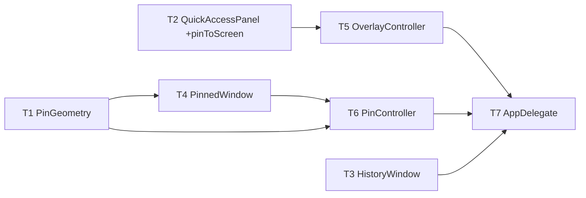

# M11 Pin-to-Screen — Implementation Plan

> **For agentic workers:** REQUIRED SUB-SKILL: Use `executing-plan-time` to run this plan. It handles worktree setup, overlap analysis, parallel-wave dispatch, per-task spec + code-quality review, and branch finishing in one runner. Steps use checkbox `- [ ]` syntax for tracking.

**Goal:** Pin a screenshot as a floating always-on-top window — drag/resize/opacity/copy/close, multiple pins.
**Architecture:** One tiny headless-tested `PinGeometry` helper in `MacShotCore` (strict TDD); a `PinnedWindow` (floating NSPanel) + `PinController` in the shell, wired from the M2 overlay/history via a new `PanelAction.pinToScreen`.
**Tech Stack:** Swift 6, MacShotCore (CoreGraphics), AppKit (NSPanel/NSMenu), XCTest.
**Max wave width:** 3 tasks in parallel at peak (W1).

> **Base branch:** stacks on M10 — executor creates its worktree FROM `exec/m10-settings-menubar-20260723`, new branch e.g. `exec/m11-pin-to-screen-20260723`. Verify `Sources/MacShot/QuickAccessPanel.swift`, `OverlayController.swift`, `HistoryWindow.swift`, `AppDelegate.swift` exist first.
> **Verification:** `PinGeometry` = strict TDD. Shell tasks gate on `swift build` + manual-smoke. `PanelAction.pinToScreen` is DISTINCT from M2's `.pin` (history pin) — the `OverlayController.handle` switch must stay exhaustive.
> **Autonomous-mode note:** no graphify graph; manifest grounded in the M10-branch source. Decisions `[auto]`.

---

## File Edit Manifest

| Path | Action | Purpose | First touched in |
|------|--------|---------|------------------|
| `Sources/MacShotCore/PinGeometry.swift` | Create | clampOpacity + initialFrame | T1 |
| `Tests/MacShotCoreTests/PinGeometryTests.swift` | Create | geometry tests | T1 |
| `Sources/MacShot/QuickAccessPanel.swift` | Modify | `PanelAction.pinToScreen` + Pin-to-Screen button | T2 |
| `Sources/MacShot/HistoryWindow.swift` | Modify | per-item Pin-to-Screen action | T3 |
| `Sources/MacShot/PinnedWindow.swift` | Create | floating panel: drag/resize/opacity/menu | T4 |
| `Sources/MacShot/OverlayController.swift` | Modify | `onPinToScreen` + handle `.pinToScreen` | T5 |
| `Sources/MacShot/PinController.swift` | Create | manages multiple pins | T6 |
| `Sources/MacShot/AppDelegate.swift` | Modify | construct PinController + wire overlay/history | T7 |

**Out of scope (intentionally not touched):** capture/editor/OCR, M2 history storage / M2 `.pin` (history pin) behavior, persistence of pins across relaunch (ephemeral).

---

## Execution Waves



| Wave | Tasks | Parallelizable | Rationale |
|------|-------|----------------|-----------|
| W1 | T1, T2, T3 | yes — disjoint files (core / QuickAccessPanel / HistoryWindow), all dep-free | geometry + two additive entry points |
| W2 | T4, T5 | yes — disjoint (PinnedWindow new vs OverlayController), dep T1 / T2 | window vs action routing |
| W3 | T6 | n/a | PinController needs PinnedWindow + PinGeometry |
| W4 | T7 | n/a | AppDelegate wires controller + overlay + history |

---

## Task 1: PinGeometry

**Depends-on:** none
**Wave:** W1
**Files:**
- Create: `Sources/MacShotCore/PinGeometry.swift`
- Test: `Tests/MacShotCoreTests/PinGeometryTests.swift`

- [ ] **Step 1: Failing test**
```swift
import XCTest
import CoreGraphics
@testable import MacShotCore

final class PinGeometryTests: XCTestCase {
    func testClampOpacityBounds() {
        XCTAssertEqual(PinGeometry.clampOpacity(0.0), 0.2, accuracy: 0.001)
        XCTAssertEqual(PinGeometry.clampOpacity(0.5), 0.5, accuracy: 0.001)
        XCTAssertEqual(PinGeometry.clampOpacity(2.0), 1.0, accuracy: 0.001)
    }
    func testInitialFrameAspectFitAndCentered() {
        let screen = CGRect(x: 0, y: 0, width: 1440, height: 900)
        let f = PinGeometry.initialFrame(imageSize: CGSize(width: 4000, height: 2000), screen: screen, maxFraction: 0.5)
        XCTAssertEqual(f.width, 720, accuracy: 0.5)     // capped at 0.5 * 1440
        XCTAssertEqual(f.height, 360, accuracy: 0.5)    // 2:1 aspect preserved
        XCTAssertEqual(f.midX, screen.midX, accuracy: 0.5)
        XCTAssertEqual(f.midY, screen.midY, accuracy: 0.5)
    }
    func testInitialFrameDoesNotUpscaleSmallImage() {
        let screen = CGRect(x: 0, y: 0, width: 1440, height: 900)
        let f = PinGeometry.initialFrame(imageSize: CGSize(width: 100, height: 50), screen: screen, maxFraction: 0.5)
        XCTAssertEqual(f.size, CGSize(width: 100, height: 50))
    }
}
```
- [ ] **Step 2: Run → FAIL** `swift test --filter PinGeometryTests`
- [ ] **Step 3: Implement**
```swift
import CoreGraphics

/// Geometry for pinned floating windows.
public enum PinGeometry {
    public static func clampOpacity(_ v: Double) -> Double { min(1.0, max(0.2, v)) }

    /// Aspect-fit the image into a box `maxFraction` of the screen (never upscaling), centered.
    public static func initialFrame(imageSize: CGSize, screen: CGRect, maxFraction: CGFloat = 0.5) -> CGRect {
        let maxW = screen.width * maxFraction, maxH = screen.height * maxFraction
        let scale = min(maxW / imageSize.width, maxH / imageSize.height, 1)
        let w = imageSize.width * scale, h = imageSize.height * scale
        return CGRect(x: screen.minX + (screen.width - w) / 2,
                      y: screen.minY + (screen.height - h) / 2, width: w, height: h)
    }
}
```
- [ ] **Step 4: Run → PASS** `swift test --filter PinGeometryTests`
- [ ] **Step 5: Commit**
```bash
git add Sources/MacShotCore/PinGeometry.swift Tests/MacShotCoreTests/PinGeometryTests.swift
git commit -m "feat(core): PinGeometry — opacity clamp + aspect-fit initial frame"
```

---

## Task 2: QuickAccessPanel — pinToScreen action

**Depends-on:** none
**Wave:** W1
**Verification:** `swift build` + manual smoke.
**Files:**
- Modify: `Sources/MacShot/QuickAccessPanel.swift`

- [ ] **Step 1: Modify** — add `case pinToScreen` to `PanelAction`; add a "Pin to Screen" button (SF Symbol `pin`) to the panel button row that fires `onAction(.pinToScreen)`.
- [ ] **Step 2: Verify build** `swift build` (note: `OverlayController.handle` will need the new case — handled in T5; if T2 lands first the switch is temporarily non-exhaustive, so T5 must land before the final `swift build` gate; the executor sequences W1→W2 so this is fine).
- [ ] **Step 3: Commit**
```bash
git add Sources/MacShot/QuickAccessPanel.swift
git commit -m "feat(app): QuickAccessPanel — Pin to Screen action"
```
- **Manual smoke (T7):** the panel shows a Pin button.

---

## Task 3: HistoryWindow — per-item Pin to Screen

**Depends-on:** none
**Wave:** W1
**Verification:** `swift build` + manual smoke.
**Files:**
- Modify: `Sources/MacShot/HistoryWindow.swift`

- [ ] **Step 1: Modify** — add an "Pin to Screen" item to each history cell's actions and an injected `onPin: (HistoryEntry) -> Void` callback (mirrors the existing `onEdit`).
- [ ] **Step 2: Verify build** `swift build`
- [ ] **Step 3: Commit**
```bash
git add Sources/MacShot/HistoryWindow.swift
git commit -m "feat(app): HistoryWindow — per-item Pin to Screen"
```
- **Manual smoke (T7):** a history item can be pinned.

---

## Task 4: PinnedWindow

**Depends-on:** [T1]
**Wave:** W2
**Verification:** `swift build` + manual smoke.
**Files:**
- Create: `Sources/MacShot/PinnedWindow.swift`

- [ ] **Step 1: Implement** `PinnedWindow: NSPanel`:
  - Borderless-ish but `styleMask: [.titled, .resizable, .fullSizeContentView]` with the title bar hidden (`titlebarAppearsTransparent`, `titleVisibility = .hidden`) so it's draggable + corner-resizable; `level = .floating`; `collectionBehavior = [.canJoinAllSpaces, .fullScreenAuxiliary]`; `isMovableByWindowBackground = true`; `hasShadow = true`.
  - Content: an `NSImageView` (aspect-fit) of the pinned `CGImage`, filling the window.
  - `setOpacity(_ v: Double)` → `alphaValue = PinGeometry.clampOpacity(v)`.
  - A right-click `NSMenu` (view `menu(for:)`): Opacity ▸ 25/50/75/100 %, Copy (image → `NSPasteboard`), Close.
  - `init(image: CGImage, frame: CGRect, onClose: @escaping () -> Void)`.
- [ ] **Step 2: Verify build** `swift build`
- [ ] **Step 3: Commit**
```bash
git add Sources/MacShot/PinnedWindow.swift
git commit -m "feat(app): PinnedWindow — floating draggable/resizable pin with opacity menu"
```
- **Manual smoke (T7):** drag/resize/opacity/copy/close all work.

---

## Task 5: OverlayController — route pinToScreen

**Depends-on:** [T2]
**Wave:** W2
**Verification:** `swift build` + manual smoke.
**Files:**
- Modify: `Sources/MacShot/OverlayController.swift`

- [ ] **Step 1: Modify** — add `public var onPinToScreen: ((CGImage) -> Void)?`; in `handle(action:id:result:)`, add `case .pinToScreen: onPinToScreen?(result.image)` (keeps the switch exhaustive over the new `PanelAction` case).
- [ ] **Step 2: Verify build** `swift build` (now the `PanelAction` switch is exhaustive with T2's new case)
- [ ] **Step 3: Commit**
```bash
git add Sources/MacShot/OverlayController.swift
git commit -m "feat(app): OverlayController routes Pin to Screen"
```
- **Manual smoke (T7):** panel Pin action reaches the controller.

---

## Task 6: PinController

**Depends-on:** [T1, T4]
**Wave:** W3
**Verification:** `swift build` + manual smoke.
**Files:**
- Create: `Sources/MacShot/PinController.swift`

- [ ] **Step 1: Implement** `PinController` (`@MainActor`):
  - Holds `[PinnedWindow]`; `func pin(_ image: CGImage)`: compute `let screen = NSScreen.main?.visibleFrame ?? .zero`; `let frame = PinGeometry.initialFrame(imageSize: CGSize(width: image.width, height: image.height), screen: screen)`; create a `PinnedWindow(image:frame:onClose:)` that removes itself from the array; `orderFront`. Supports many simultaneous pins.
- [ ] **Step 2: Verify build** `swift build`
- [ ] **Step 3: Commit**
```bash
git add Sources/MacShot/PinController.swift
git commit -m "feat(app): PinController — manage multiple pinned windows"
```
- **Manual smoke (T7):** multiple pins coexist; each closes independently.

---

## Task 7: AppDelegate — wire pins

**Depends-on:** [T3, T5, T6]
**Wave:** W4
**Verification:** `swift build && swift test` (all core suites green) + manual acceptance.
**Files:**
- Modify: `Sources/MacShot/AppDelegate.swift`

- [ ] **Step 1: Modify `AppDelegate`:**
  - Construct a `PinController` in `applicationDidFinishLaunching`.
  - Set `overlayController?.onPinToScreen = { [weak self] image in self?.pinController.pin(image) }`.
  - Set `HistoryWindow.onPin = { [weak self] entry in guard let img = <load CGImage from entry.url> else { return }; self?.pinController.pin(img) }` (reuse the same `CGImageSource` load path as `onEdit`).
- [ ] **Step 2: Verify** `swift build && swift test`
  Expected: builds; all MacShotCore tests (M1–M10 + M11) pass.
- [ ] **Step 3: Commit**
```bash
git add Sources/MacShot/AppDelegate.swift
git commit -m "feat(app): wire Pin to Screen from overlay + history"
```
- **Manual acceptance (human DoD):** pin from the overlay and from history; float above other apps; drag/resize/opacity/copy/close; multiple pins; gone after relaunch (ephemeral).

---

## Self-review

- **Spec coverage:** geometry (T1), pin action from overlay (T2/T5) + history (T3), floating window w/ drag/resize/opacity/copy/close (T4), multiple pins (T6), wiring (T7). ✓
- **Manifest ↔ tasks:** each file one task; `AppDelegate.swift` only T7; `OverlayController.swift` only T5. ✓
- **Placeholder scan:** none. T1 full failing-test + impl; GUI tasks concrete API steps + build/manual gates. ✓
- **Type/name consistency:** `PinGeometry.clampOpacity/initialFrame`, `PanelAction.pinToScreen`, `OverlayController.onPinToScreen`, `PinnedWindow(image:frame:onClose:)`, `PinController.pin(_:)`, `HistoryWindow.onPin` — consistent across T4–T7. ✓
- **Wave correctness:** W1 {T1,T2,T3} disjoint files, dep-free; W2 {T4,T5} disjoint (new PinnedWindow vs OverlayController). No same-wave overlap. Exhaustiveness note: T2 adds the enum case, T5 (next wave) adds the switch arm — sequenced W1→W2 so the whole-package build gate is only after both. ✓
- **Wave width:** peak 3 (W1). W3/W4 genuine merge points. ✓
- **Ponytail first rung:** reuses the M2 panel/overlay/history entry points + `PanelAction`; ephemeral pins (no store/bookmark plumbing); one tiny geometry helper is the only new testable surface; window is standard AppKit (no custom drag/resize code). ✓
