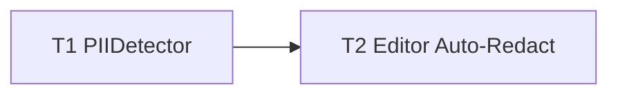

# M16 AI Auto-Redact — Implementation Plan

> **For agentic workers:** REQUIRED SUB-SKILL: Use `executing-plan-time` to run this plan. It handles worktree setup, overlap analysis, parallel-wave dispatch, per-task spec + code-quality review, and branch finishing in one runner. Steps use checkbox `- [ ]` syntax for tracking.

**Goal:** One-click auto-censor of PII — OCR the image, detect emails/phones/cards/long-digits/keys, drop solid-censor bars over each as editable annotations.
**Architecture:** Pure regex `PIIDetector` in headless-tested `MacShotCore` (strict TDD) + an editor "Auto-Redact" action that OCRs the base image (M5) and adds `.solidCensor` annotations (M8). Reuses OCR + censor as-is.
**Tech Stack:** Swift 6, MacShotCore (Foundation/NSRegularExpression), Vision (M5), SwiftUI, XCTest.
**Max wave width:** 1 (small, inherently sequential: detector → editor wiring).

> **Base branch:** stacks on M11 — executor creates its worktree FROM `exec/m11-pin-to-screen-20260723`, new branch e.g. `exec/m16-auto-redact-20260723`. Verify `Sources/MacShotCore/OCR.swift`, `Annotation.swift` (`.solidCensor`), `Sources/MacShot/VisionOCRService.swift`, `EditorCanvas.swift`, `ToolPalette.swift` exist first.
> **Verification:** `PIIDetector` = strict TDD (deterministic regex → real assertions). GUI gates on `swift build` + manual-smoke. **Coordinate check:** OCR boxes (pixel space, bottom-left per M5) must align with the M3/M8 annotation/renderer space — verify in the manual smoke; apply a y-flip only if they differ.
> **Autonomous-mode note:** no graphify graph; manifest grounded in the M11-branch source. Decisions `[auto]`.

---

## File Edit Manifest

| Path | Action | Purpose | First touched in |
|------|--------|---------|------------------|
| `Sources/MacShotCore/PIIDetector.swift` | Create | regex PII classification → redaction boxes | T1 |
| `Tests/MacShotCoreTests/PIIDetectorTests.swift` | Create | match/no-match + detect/dedupe tests | T1 |
| `Sources/MacShot/EditorCanvas.swift` | Modify | `autoRedact()` — OCR → detect → add `.solidCensor` | T2 |
| `Sources/MacShot/ToolPalette.swift` | Modify | Auto-Redact button | T2 |

**Out of scope (intentionally not touched):** OCR (`VisionOCRService`/`OCRObservation`) and censor (`AnnotationRenderer`/`.solidCensor`) reused unchanged; capture/beautify/history/pin.

---

## Execution Waves



| Wave | Tasks | Parallelizable | Rationale |
|------|-------|----------------|-----------|
| W1 | T1 | n/a | pure detector, the testable core |
| W2 | T2 | n/a | editor button + method (both edit the coupled editor pair; genuinely sequential on T1) |

---

## Task 1: PIIDetector

**Depends-on:** none
**Wave:** W1
**Files:**
- Create: `Sources/MacShotCore/PIIDetector.swift`
- Test: `Tests/MacShotCoreTests/PIIDetectorTests.swift`

- [ ] **Step 1: Failing test**
```swift
import XCTest
import CoreGraphics
@testable import MacShotCore

final class PIIDetectorTests: XCTestCase {
    func testMatchesPII() {
        XCTAssertTrue(PIIDetector.matches("john@example.com"))
        XCTAssertTrue(PIIDetector.matches("(555) 123-4567"))
        XCTAssertTrue(PIIDetector.matches("4111 1111 1111 1111"))
        XCTAssertTrue(PIIDetector.matches("sk_live_abc123XYZ456def789ghi"))
    }
    func testNonPIINotMatched() {
        XCTAssertFalse(PIIDetector.matches("hello world"))
        XCTAssertFalse(PIIDetector.matches("42"))
        XCTAssertFalse(PIIDetector.matches("just some text here"))
    }
    func testDetectReturnsBoxPerMatchDeduped() {
        let obs = [
            OCRObservation(text: "john@example.com", boundingBox: CGRect(x: 0, y: 0, width: 10, height: 5), confidence: 1),
            OCRObservation(text: "hello", boundingBox: CGRect(x: 0, y: 10, width: 10, height: 5), confidence: 1),
            OCRObservation(text: "555-123-4567", boundingBox: CGRect(x: 0, y: 20, width: 10, height: 5), confidence: 1),
            OCRObservation(text: "555-123-4567", boundingBox: CGRect(x: 0, y: 20, width: 10, height: 5), confidence: 1),
        ]
        let boxes = PIIDetector.detect(obs)
        XCTAssertEqual(boxes.count, 2)   // email + phone; duplicate phone box deduped; "hello" excluded
        XCTAssertTrue(boxes.contains(CGRect(x: 0, y: 0, width: 10, height: 5)))
        XCTAssertTrue(boxes.contains(CGRect(x: 0, y: 20, width: 10, height: 5)))
    }
}
```
- [ ] **Step 2: Run → FAIL** `swift test --filter PIIDetectorTests`
- [ ] **Step 3: Implement**
```swift
import CoreGraphics
import Foundation

/// Detects likely PII in OCR text (regex-based → deterministic/testable) and returns the
/// bounding boxes to censor. Over-redaction is acceptable; recall isn't guaranteed.
public enum PIIDetector {
    private static let patterns: [NSRegularExpression] = {
        [
            #"[\w.%+-]+@[\w.-]+\.[A-Za-z]{2,}"#,   // email
            #"\+?\d[\d ()\-.]{6,}\d"#,             // phone: 8+ digits with separators
            #"\b(?:\d[ -]?){13,19}\b"#,            // credit card 13–19 digits
            #"\b\d{9,}\b"#,                        // long digit run (SSN/account-like)
        ].compactMap { try? NSRegularExpression(pattern: $0) }
    }()

    public static func matches(_ text: String) -> Bool {
        let range = NSRange(text.startIndex..., in: text)
        if patterns.contains(where: { $0.firstMatch(in: text, range: range) != nil }) { return true }
        return isApiKeyLike(text)
    }

    /// 20+ contiguous [A-Za-z0-9_-] containing at least one letter AND one digit.
    private static func isApiKeyLike(_ text: String) -> Bool {
        guard let re = try? NSRegularExpression(pattern: #"[A-Za-z0-9_\-]{20,}"#) else { return false }
        let ns = text as NSString
        for m in re.matches(in: text, range: NSRange(location: 0, length: ns.length)) {
            let t = ns.substring(with: m.range)
            if t.contains(where: \.isLetter) && t.contains(where: \.isNumber) { return true }
        }
        return false
    }

    public static func detect(_ observations: [OCRObservation]) -> [CGRect] {
        var seen = Set<String>(); var out: [CGRect] = []
        for o in observations where matches(o.text) {
            if seen.insert("\(o.boundingBox)").inserted { out.append(o.boundingBox) }
        }
        return out
    }
}
```
- [ ] **Step 4: Run → PASS** `swift test --filter PIIDetectorTests`
- [ ] **Step 5: Commit**
```bash
git add Sources/MacShotCore/PIIDetector.swift Tests/MacShotCoreTests/PIIDetectorTests.swift
git commit -m "feat(core): PIIDetector — regex PII classification → redaction boxes"
```

---

## Task 2: Editor Auto-Redact

**Depends-on:** [T1]
**Wave:** W2
**Verification:** `swift build && swift test` (all core suites green) + manual acceptance.
**Files:**
- Modify: `Sources/MacShot/EditorCanvas.swift`
- Modify: `Sources/MacShot/ToolPalette.swift`

- [ ] **Step 1: Modify `EditorCanvas.swift`** — add to `EditorViewModel`:
  - `func autoRedact(base: CGImage)` (async, `@MainActor`): `let obs = (try? await VisionOCRService().recognize(base)) ?? []`; `let boxes = PIIDetector.detect(obs)`; if `boxes.isEmpty` set a transient `redactNote = "No sensitive data found"`; else record undo and `for b in boxes { document.add(Annotation(kind: .solidCensor(b), style: <black-fill solid>)) }`. Use the black solid style (`fillColor = RGBAColor(r:0,g:0,b:0,a:1)`). Convert `b` to the annotation/renderer coordinate space (same base-image pixel space; apply the M5→M3 origin flip only if the manual smoke shows misalignment).
- [ ] **Step 2: Modify `ToolPalette.swift`** — add an "Auto-Redact" button (SF Symbol `eye.slash`) that calls `Task { await vm.autoRedact(base: base) }` (pass the editor's base image); show the `redactNote` briefly if set.
- [ ] **Step 3: Verify** `swift build && swift test`
  Expected: builds; all MacShotCore tests (M1–M11 + M16) pass.
- [ ] **Step 4: Commit**
```bash
git add Sources/MacShot/EditorCanvas.swift Sources/MacShot/ToolPalette.swift
git commit -m "feat(app): editor Auto-Redact — OCR + PIIDetector → solid censors"
```
- **Manual acceptance (human DoD):** open a form screenshot (email/phone/card visible) → Auto-Redact → opaque bars cover each; remove one, add one manually; export → sensitive text fully gone (covered, not blurred); a clean image shows "No sensitive data found".

---

## Self-review

- **Spec coverage:** PII detection (T1), Auto-Redact action adding solid censors + review-in-editor + empty note (T2). ✓
- **Manifest ↔ tasks:** each file one task; the coupled editor pair (`EditorCanvas`+`ToolPalette`) is one task (T2) since the button+method are inseparable and both depend on T1. ✓
- **Placeholder scan:** none. T1 full failing-test + impl; T2 concrete API steps + build/manual gates. ✓
- **Type/name consistency:** `PIIDetector.matches/detect`, `OCRObservation`, `VisionOCRService().recognize`, `AnnotationKind.solidCensor`, `EditorViewModel.autoRedact` — consistent across T1/T2. ✓
- **Wave correctness:** T2 depends on T1; single file-group per wave — no same-wave overlap. ✓
- **Wave width:** peak 1 — genuinely sequential (a 2-task milestone: pure detector → its only consumer). Not artificially narrow; splitting the button from the method would just add a cross-file dependency within the same coupled view pair. ✓
- **Ponytail first rung:** reuses OCR + `.solidCensor` unchanged (no new render/censor code); regex over an ML model (deterministic, testable, zero-dep); redactions are ordinary annotations (no separate review UI); one detector + one button. ✓
