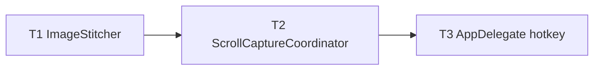

# M17 Scrolling Capture — Implementation Plan

> **For agentic workers:** REQUIRED SUB-SKILL: Use `executing-plan-time` to run this plan. It handles worktree setup, overlap analysis, parallel-wave dispatch, per-task spec + code-quality review, and branch finishing in one runner. Steps use checkbox `- [ ]` syntax for tracking.

**Goal:** Capture content taller than the screen — auto-scroll a window while capturing frames, then stitch them into one tall image.
**Architecture:** The correctness-critical stitching (`ImageStitcher`: per-row signatures, overlap, stitch) lives in headless-tested `MacShotCore` (strict TDD); the scroll+capture loop (`ScrollCaptureCoordinator`) + a hotkey are the shell, reusing M1 capture and the M2 overlay/save.
**Tech Stack:** Swift 6, MacShotCore (CoreGraphics), ScreenCaptureKit, CoreGraphics CGEvent, AppKit, XCTest.
**Max wave width:** 1 (small, inherently sequential: stitcher → coordinator → wiring).

> **Base branch:** stacks on M16 — executor creates its worktree FROM `exec/m16-auto-redact-20260723`, new branch e.g. `exec/m17-scrolling-capture-20260723`. Verify `Sources/MacShot/SCKScreenCapturer.swift`, `SelectionOverlay.swift`, `AppDelegate.swift`, `OverlayController.swift` exist first.
> **Verification:** `ImageStitcher` = strict TDD (overlap/rowSignatures/stitch on synthetic images — real assertions). GUI gates on `swift build` + manual-smoke (synthetic scroll + real windows can't run headless).
> **Autonomous-mode note:** no graphify graph; manifest grounded in the M16-branch source. Decisions `[auto]`.

---

## File Edit Manifest

| Path | Action | Purpose | First touched in |
|------|--------|---------|------------------|
| `Sources/MacShotCore/ImageStitcher.swift` | Create | rowSignatures + overlap + stitch | T1 |
| `Tests/MacShotCoreTests/ImageStitcherTests.swift` | Create | overlap/signature/stitch tests | T1 |
| `Sources/MacShot/ScrollCaptureCoordinator.swift` | Create | scroll+capture loop → stitch → present | T2 |
| `Sources/MacShot/AppDelegate.swift` | Modify | Scrolling Capture hotkey + menu | T3 |

**Out of scope (intentionally not touched):** `SCKScreenCapturer`/`SelectionOverlay`/`OverlayController` internals (reused), editor/beautify/OCR, horizontal scroll, manual mode.

---

## Execution Waves



| Wave | Tasks | Parallelizable | Rationale |
|------|-------|----------------|-----------|
| W1 | T1 | n/a | pure stitcher — the testable core |
| W2 | T2 | n/a | coordinator needs the stitcher |
| W3 | T3 | n/a | wiring needs the coordinator |

---

## Task 1: ImageStitcher

**Depends-on:** none
**Wave:** W1
**Files:**
- Create: `Sources/MacShotCore/ImageStitcher.swift`
- Test: `Tests/MacShotCoreTests/ImageStitcherTests.swift`

- [ ] **Step 1: Failing test**
```swift
import XCTest
import CoreGraphics
@testable import MacShotCore

final class ImageStitcherTests: XCTestCase {
    /// A width×(rows.count) image where row i is filled with gray = the absolute row index
    /// `rows.lowerBound + i` (so distinct rows → distinct signatures, and a scrolled frame
    /// shares signatures for the overlapping band).
    func gradient(rows: Range<Int>, width: Int = 4) -> CGImage {
        let h = rows.count
        let ctx = CGContext(data: nil, width: width, height: h, bitsPerComponent: 8, bytesPerRow: 0,
            space: CGColorSpaceCreateDeviceRGB(), bitmapInfo: CGImageAlphaInfo.premultipliedLast.rawValue)!
        for (i, v) in rows.enumerated() {
            let g = CGFloat(v % 256) / 255.0
            ctx.setFillColor(red: g, green: g, blue: g, alpha: 1)
            // CGContext is bottom-left origin; row index i from the top → y = h-1-i
            ctx.fill(CGRect(x: 0, y: h - 1 - i, width: width, height: 1))
        }
        return ctx.makeImage()!
    }

    func testOverlapSuffixPrefix() {
        XCTAssertEqual(ImageStitcher.overlap([1, 2, 3, 4], [3, 4, 5, 6]), 2)
        XCTAssertEqual(ImageStitcher.overlap([1, 2, 3], [4, 5, 6]), 0)
        XCTAssertEqual(ImageStitcher.overlap([1, 2, 3], [1, 2, 3]), 3)
        XCTAssertEqual(ImageStitcher.overlap([], [1, 2]), 0)
    }
    func testRowSignaturesDistinct() {
        let sigs = ImageStitcher.rowSignatures(gradient(rows: 0..<8))
        XCTAssertEqual(sigs.count, 8)
        XCTAssertEqual(Set(sigs).count, 8)
    }
    func testStitchRemovesOverlap() {
        let a = gradient(rows: 0..<100)     // rows 0..99
        let b = gradient(rows: 50..<150)    // a scrolled down 50 → rows 50..149
        let out = ImageStitcher.stitch([a, b])
        XCTAssertEqual(out?.height, 150)    // 100 + (150-50 overlap) new rows
        XCTAssertEqual(out?.width, 4)
    }
    func testStitchSingleAndEmpty() {
        XCTAssertEqual(ImageStitcher.stitch([gradient(rows: 0..<10)])?.height, 10)
        XCTAssertNil(ImageStitcher.stitch([]))
    }
}
```
- [ ] **Step 2: Run → FAIL** `swift test --filter ImageStitcherTests`
- [ ] **Step 3: Implement**
```swift
import CoreGraphics

/// Stitches overlapping scroll frames into one tall image via per-row signature overlap.
public enum ImageStitcher {
    /// FNV-1a hash per pixel row (top→bottom), so identical rows share a signature.
    public static func rowSignatures(_ image: CGImage) -> [UInt64] {
        let w = image.width, h = image.height
        var buf = [UInt8](repeating: 0, count: w * h * 4)
        guard let ctx = CGContext(data: &buf, width: w, height: h, bitsPerComponent: 8, bytesPerRow: w * 4,
            space: CGColorSpaceCreateDeviceRGB(), bitmapInfo: CGImageAlphaInfo.premultipliedLast.rawValue)
        else { return [] }
        ctx.draw(image, in: CGRect(x: 0, y: 0, width: w, height: h))
        var sigs = [UInt64](); sigs.reserveCapacity(h)
        for topRow in 0..<h {
            let y = h - 1 - topRow                     // buf is bottom-left origin
            var hash: UInt64 = 0xcbf29ce484222325
            for x in 0..<(w * 4) { hash = (hash ^ UInt64(buf[y * w * 4 + x])) &* 0x100000001b3 }
            sigs.append(hash)
        }
        return sigs   // index 0 = top row
    }

    /// Largest k where a.suffix(k) == b.prefix(k).
    public static func overlap(_ a: [UInt64], _ b: [UInt64]) -> Int {
        var k = min(a.count, b.count)
        while k > 0 {
            if Array(a.suffix(k)) == Array(b.prefix(k)) { return k }
            k -= 1
        }
        return 0
    }

    /// Composite frames top→bottom, appending only each next frame's non-overlapping rows.
    public static func stitch(_ frames: [CGImage]) -> CGImage? {
        guard let first = frames.first else { return nil }
        if frames.count == 1 { return first }
        let width = first.width
        var sigs = rowSignatures(first)
        // total height after removing overlaps
        var totalRows = first.height
        var newRowsPerFrame: [Int] = []
        for next in frames.dropFirst() {
            let nSig = rowSignatures(next)
            let ov = overlap(sigs, nSig)
            let newRows = next.height - ov
            newRowsPerFrame.append(newRows)
            totalRows += newRows
            sigs = nSig
        }
        guard let ctx = CGContext(data: nil, width: width, height: totalRows, bitsPerComponent: 8, bytesPerRow: 0,
            space: CGColorSpaceCreateDeviceRGB(), bitmapInfo: CGImageAlphaInfo.premultipliedLast.rawValue)
        else { return nil }
        // draw top→bottom into a bottom-left context: place frame 0 at the top, each next below
        var topOffset = 0
        ctx.draw(first, in: CGRect(x: 0, y: totalRows - first.height, width: width, height: first.height))
        topOffset += first.height
        for (i, next) in frames.dropFirst().enumerated() {
            let newRows = newRowsPerFrame[i]
            // draw only the bottom `newRows` of `next`, placed below what we've drawn
            let cropped = next.cropping(to: CGRect(x: 0, y: 0, width: width, height: newRows)) ?? next
            ctx.draw(cropped, in: CGRect(x: 0, y: totalRows - topOffset - newRows, width: width, height: newRows))
            topOffset += newRows
        }
        return ctx.makeImage()
    }
}
```
  (The executor may adjust the crop/offset math so the pixel test passes — the *contract* is: output height == sum of first + per-frame new rows, overlap removed. Fix the y-arithmetic until `testStitchRemovesOverlap` is green.)
- [ ] **Step 4: Run → PASS** `swift test --filter ImageStitcherTests`
- [ ] **Step 5: Commit**
```bash
git add Sources/MacShotCore/ImageStitcher.swift Tests/MacShotCoreTests/ImageStitcherTests.swift
git commit -m "feat(core): ImageStitcher — row-signature overlap + vertical stitch"
```

---

## Task 2: ScrollCaptureCoordinator

**Depends-on:** [T1]
**Wave:** W2
**Verification:** `swift build` + manual smoke.
**Files:**
- Create: `Sources/MacShot/ScrollCaptureCoordinator.swift`

- [ ] **Step 1: Implement** `ScrollCaptureCoordinator` (`@MainActor`), constructed with an `SCKScreenCapturer`, the window-selection source, a `PermissionFlow`, and the present callback:
  - `run()`: ensure screen access (reuse `PermissionFlow`); pick the window under the cursor (reuse the M1 `SCShareableContent` window list + hit-test used by window capture); then loop up to **30** iterations:
    - capture the window frame (`SCKScreenCapturer.capture(.window(id))`), append to `frames`;
    - if the newest frame's `ImageStitcher.rowSignatures` equal the previous frame's → **stop** (bottom reached);
    - post a synthetic scroll-down event: `CGEvent(scrollWheelEvent2Source: nil, units: .line, wheelCount: 1, wheel1: -lines, ...)` with `lines ≈ frameHeightInPoints/2`, `post(tap: .cghidEventTap)`; `try? await Task.sleep(for: .milliseconds(150))` settle.
  - `let tall = ImageStitcher.stitch(frames)`; present `tall` through the existing pipeline (build a `CaptureResult` and call the overlay/save path, or the `OverlayController.present`).
- [ ] **Step 2: Verify build** `swift build`
- [ ] **Step 3: Commit**
```bash
git add Sources/MacShot/ScrollCaptureCoordinator.swift
git commit -m "feat(app): ScrollCaptureCoordinator — auto-scroll + capture + stitch"
```
- **Manual smoke (T3):** scroll a long page → one tall stitched image, no duplicated bands.

---

## Task 3: AppDelegate — hotkey + menu

**Depends-on:** [T2]
**Wave:** W3
**Verification:** `swift build && swift test` (all core suites green) + manual acceptance.
**Files:**
- Modify: `Sources/MacShot/AppDelegate.swift`

- [ ] **Step 1: Modify `AppDelegate`:**
  - Construct a `ScrollCaptureCoordinator` in `applicationDidFinishLaunching` (reuse the existing capturer / permission flow / overlay controller).
  - Register a "Scrolling Capture" hotkey (default `⌃⌘⇧S`, from `prefs` if you add `scrollHotkey`, else the literal default; id 7) → `Task { await scrollCoordinator.run() }`.
  - Add a "Scrolling Capture" menu item (respect the M10 `menuOrder` only for the core capture actions — this new item can sit after them) → same action.
- [ ] **Step 2: Verify** `swift build && swift test`
  Expected: builds; all MacShotCore tests (M1–M11, M16 + M17) pass.
- [ ] **Step 3: Commit**
```bash
git add Sources/MacShot/AppDelegate.swift
git commit -m "feat(app): Scrolling Capture hotkey + menu item"
```
- **Manual acceptance (human DoD):** ⌃⌘⇧S over a long web page → auto-scrolls to the bottom → one tall screenshot of the whole page in the overlay/saved.

---

## Self-review

- **Spec coverage:** stitching (T1), auto-scroll+capture loop with stop/cap (T2), hotkey/menu entry (T3). ✓
- **Manifest ↔ tasks:** each file one task; `AppDelegate.swift` only T3. ✓
- **Placeholder scan:** none. T1 full failing-test + impl (with an explicit contract note on the y-arithmetic); T2/T3 concrete API steps + build/manual gates. ✓
- **Type/name consistency:** `ImageStitcher.rowSignatures/overlap/stitch`, `ScrollCaptureCoordinator.run`, `SCKScreenCapturer.capture(.window(id))` — consistent across T1/T2/T3. ✓
- **Wave correctness:** strict chain T1→T2→T3 (each new file/edit depends on the prior); no same-wave overlap. ✓
- **Wave width:** peak 1 — genuinely sequential (pure stitcher → its only consumer → the wiring). A 3-task milestone; splitting wouldn't create real parallelism. ✓
- **Ponytail first rung:** stitcher is one pure file with array-level tests (no image-diff library); coordinator reuses SCK capture + the overlay pipeline (no new present path); synthetic scroll via `CGEvent` (no accessibility scripting); 30-frame cap instead of unbounded. ✓
