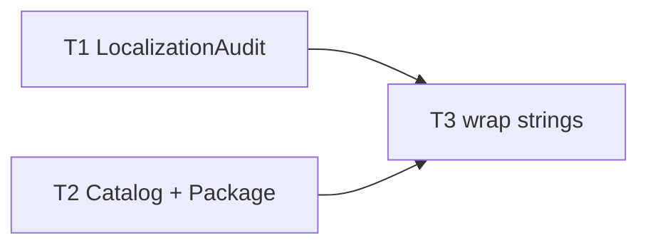

# M18 Localization — Implementation Plan

> **For agentic workers:** REQUIRED SUB-SKILL: Use `executing-plan-time` to run this plan. It handles worktree setup, overlap analysis, parallel-wave dispatch, per-task spec + code-quality review, and branch finishing in one runner. Steps use checkbox `- [ ]` syntax for tracking.

**Goal:** Make MacShot translatable — a String Catalog with base English + es/fr/de for a curated key set, a CI-guard audit, and wrapped UI strings.
**Architecture:** Pure `LocalizationAudit` in headless-tested `MacShotCore` (strict TDD); a `Localizable.xcstrings` catalog + `Package.swift` resource wiring + `String(localized:)` wrapping of curated shell strings. Final v2 milestone; cross-cutting over M7–M17.
**Tech Stack:** Swift 6, MacShotCore (Foundation/JSONSerialization), SwiftPM String Catalog resource, `String(localized:)`, XCTest.
**Max wave width:** 2 tasks in parallel at peak (W1).

> **Base branch:** stacks on M17 — executor creates its worktree FROM `exec/m17-scrolling-capture-20260723`, new branch e.g. `exec/m18-localization-20260723`. Verify `Package.swift`, `Sources/MacShot/AppDelegate.swift`, `Notifier.swift`, `PreferencesWindow.swift` exist first.
> **Verification:** `LocalizationAudit` = strict TDD (synthetic JSON). Catalog + Package + wrapping gate on `swift build` (must PROCESS the `.xcstrings` — verify Swift 6.3/Xcode 26 handles it) + manual-smoke. As part of T2's gate, run `LocalizationAudit` once over the authored catalog to confirm completeness.
> **Curated key set (natural keys — all three tasks MUST use identical strings):** `"Capture Area"`, `"Capture Window"`, `"Capture Fullscreen"`, `"Capture Text (OCR)"`, `"Scrolling Capture"`, `"History…"`, `"Preferences…"`, `"Quit"`, `"Check for Updates…"`, `"Screenshot saved"`, `"No text recognized"`, `"No sensitive data found"`, `"No previous area to capture"`, `"Save Location"`, `"Filename Format"`, `"Include mouse cursor"`, `"Launch at login"`, `"General"`, `"Capture"`, `"Updates"`.
> **Autonomous-mode note:** no graphify graph; manifest grounded in the M17-branch source. Decisions `[auto]`.

---

## File Edit Manifest

| Path | Action | Purpose | First touched in |
|------|--------|---------|------------------|
| `Sources/MacShotCore/LocalizationAudit.swift` | Create | catalog completeness check | T1 |
| `Tests/MacShotCoreTests/LocalizationAuditTests.swift` | Create | audit tests (synthetic JSON) | T1 |
| `Sources/MacShot/Localizable.xcstrings` | Create | String Catalog: en base + es/fr/de | T2 |
| `Package.swift` | Modify | `defaultLocalization` + `.xcstrings` resource | T2 |
| `Sources/MacShot/AppDelegate.swift` | Modify | wrap menu titles in `String(localized:)` | T3 |
| `Sources/MacShot/Notifier.swift` | Modify | wrap notification texts | T3 |
| `Sources/MacShot/PreferencesWindow.swift` | Modify | wrap top labels/section titles | T3 |

**Out of scope (intentionally not touched):** all uncurated strings (stay literal), `FilenameFormatter` (keeps `en_US_POSIX` — filenames NOT localized), MacShotCore user-facing strings (none), capture/editor logic.

---

## Execution Waves



| Wave | Tasks | Parallelizable | Rationale |
|------|-------|----------------|-----------|
| W1 | T1, T2 | yes — disjoint (core audit vs catalog+Package) | detector vs resource authoring |
| W2 | T3 | n/a | wrapping needs the catalog + `.module` resource present |

---

## Task 1: LocalizationAudit

**Depends-on:** none
**Wave:** W1
**Files:**
- Create: `Sources/MacShotCore/LocalizationAudit.swift`
- Test: `Tests/MacShotCoreTests/LocalizationAuditTests.swift`

- [ ] **Step 1: Failing test**
```swift
import XCTest
@testable import MacShotCore

final class LocalizationAuditTests: XCTestCase {
    func testMissingLanguageReported() {
        let json = #"""
        {"sourceLanguage":"en","strings":{"Hello":{"localizations":{
          "es":{"stringUnit":{"value":"Hola"}},"fr":{"stringUnit":{"value":"Bonjour"}}}}}}
        """#.data(using: .utf8)!
        XCTAssertEqual(LocalizationAudit.missingKeys(catalogJSON: json, required: ["Hello"], languages: ["es", "fr", "de"]), ["Hello"])
    }
    func testCompleteCatalogNoMissing() {
        let json = #"""
        {"sourceLanguage":"en","strings":{"Hello":{"localizations":{
          "es":{"stringUnit":{"value":"Hola"}},"fr":{"stringUnit":{"value":"Bonjour"}},"de":{"stringUnit":{"value":"Hallo"}}}}}}
        """#.data(using: .utf8)!
        XCTAssertEqual(LocalizationAudit.missingKeys(catalogJSON: json, required: ["Hello"], languages: ["es", "fr", "de"]), [])
    }
    func testAbsentKeyReported() {
        let json = #"{"sourceLanguage":"en","strings":{}}"#.data(using: .utf8)!
        XCTAssertEqual(LocalizationAudit.missingKeys(catalogJSON: json, required: ["Missing"], languages: ["es"]), ["Missing"])
    }
    func testEmptyValueCountsAsMissing() {
        let json = #"""
        {"sourceLanguage":"en","strings":{"K":{"localizations":{"es":{"stringUnit":{"value":""}}}}}}
        """#.data(using: .utf8)!
        XCTAssertEqual(LocalizationAudit.missingKeys(catalogJSON: json, required: ["K"], languages: ["es"]), ["K"])
    }
}
```
- [ ] **Step 2: Run → FAIL** `swift test --filter LocalizationAuditTests`
- [ ] **Step 3: Implement**
```swift
import Foundation

/// Checks a `.xcstrings` catalog for required keys that lack a base entry or any requested
/// language's non-empty value. Returns the missing keys ([] = complete). CI-guard.
public enum LocalizationAudit {
    public static func missingKeys(catalogJSON: Data, required: [String], languages: [String]) -> [String] {
        let root = (try? JSONSerialization.jsonObject(with: catalogJSON)) as? [String: Any]
        let strings = (root?["strings"] as? [String: Any]) ?? [:]
        var missing: [String] = []
        for key in required {
            guard let entry = strings[key] as? [String: Any] else { missing.append(key); continue }
            let locs = (entry["localizations"] as? [String: Any]) ?? [:]
            let complete = languages.allSatisfy { lang in
                guard let l = locs[lang] as? [String: Any],
                      let unit = l["stringUnit"] as? [String: Any],
                      let v = unit["value"] as? String, !v.isEmpty else { return false }
                return true
            }
            if !complete { missing.append(key) }
        }
        return missing
    }
}
```
- [ ] **Step 4: Run → PASS** `swift test --filter LocalizationAuditTests`
- [ ] **Step 5: Commit**
```bash
git add Sources/MacShotCore/LocalizationAudit.swift Tests/MacShotCoreTests/LocalizationAuditTests.swift
git commit -m "feat(core): LocalizationAudit — .xcstrings completeness guard"
```

---

## Task 2: Localizable.xcstrings + Package resource

**Depends-on:** none
**Wave:** W1
**Verification:** `swift build` processes the catalog; run `LocalizationAudit` once over the authored file → `[]`.
**Files:**
- Create: `Sources/MacShot/Localizable.xcstrings`
- Modify: `Package.swift`

- [ ] **Step 1: Author `Sources/MacShot/Localizable.xcstrings`** — a String Catalog with `"sourceLanguage":"en"`, `"version":"1.0"`, and a `"strings"` object containing **every curated key** (see the plan header list) with `es`/`fr`/`de` `stringUnit` translations each (en is the natural key/source). Example entry:
```json
"Capture Area" : { "localizations" : {
  "es" : { "stringUnit" : { "state" : "translated", "value" : "Capturar área" } },
  "fr" : { "stringUnit" : { "state" : "translated", "value" : "Capturer une zone" } },
  "de" : { "stringUnit" : { "state" : "translated", "value" : "Bereich aufnehmen" } } } }
```
  Provide plausible native translations for all curated keys.
- [ ] **Step 2: Modify `Package.swift`** — on the `MacShot` executable target add `defaultLocalization: "en"` at the package level (SwiftPM `Package(name:defaultLocalization:...)`) and `resources: [.process("Localizable.xcstrings")]` to the target.
- [ ] **Step 3: Verify** `swift build`
  Expected: builds; the catalog is processed into the `MacShot` bundle. (If the toolchain can't process `.xcstrings`, fall back to a `.strings`/`.stringsdict` set per language + `String(localized:table:)` — log the fallback `[auto]`.)
- [ ] **Step 4: Completeness check** — in a scratch snippet or the T4-style check, run `LocalizationAudit.missingKeys(catalogJSON: <file data>, required: <curated keys>, languages: ["es","fr","de"])` and confirm `[]` before committing.
- [ ] **Step 5: Commit**
```bash
git add Sources/MacShot/Localizable.xcstrings Package.swift
git commit -m "feat(app): String Catalog (en + es/fr/de) + SwiftPM localization resource"
```

---

## Task 3: Wrap curated UI strings

**Depends-on:** [T2]
**Wave:** W2
**Verification:** `swift build && swift test` (all core suites green) + manual acceptance.
**Files:**
- Modify: `Sources/MacShot/AppDelegate.swift`
- Modify: `Sources/MacShot/Notifier.swift`
- Modify: `Sources/MacShot/PreferencesWindow.swift`

- [ ] **Step 1: Wrap** each curated literal at its use site with `String(localized: "<key>", bundle: .module)` — using the EXACT curated keys:
  - `AppDelegate.swift`: menu item titles ("Capture Area", "Capture Window", "Capture Fullscreen", "Capture Text (OCR)", "Scrolling Capture", "History…", "Preferences…", "Quit", "Check for Updates…").
  - `Notifier.swift`: banner texts ("Screenshot saved", "No text recognized", "No sensitive data found", "No previous area to capture").
  - `PreferencesWindow.swift`: section/label text ("Save Location", "Filename Format", "Include mouse cursor", "Launch at login", "General", "Capture", "Updates").
  Only these curated strings; leave others literal.
- [ ] **Step 2: Verify** `swift build && swift test`
  Expected: builds; all MacShotCore tests (M1–M11, M16, M17 + M18) pass.
- [ ] **Step 3: Commit**
```bash
git add Sources/MacShot/AppDelegate.swift Sources/MacShot/Notifier.swift Sources/MacShot/PreferencesWindow.swift
git commit -m "feat(app): localize curated menu/notification/preferences strings"
```
- **Manual acceptance (human DoD):** set the macOS language to Spanish/French/German → the menu-bar items, key buttons, and notifications appear translated; English is the fallback for anything uncurated; filenames stay unchanged.

---

## Self-review

- **Spec coverage:** audit guard (T1), catalog + Package resource (T2), string wrapping (T3), locale-aware formatting (system default — no code needed), filenames non-localized (out of scope, unchanged). ✓
- **Manifest ↔ tasks:** each file one task; `Package.swift` only T2; the 3 shell files only T3. ✓
- **Placeholder scan:** none. T1 full failing-test + impl; T2 concrete catalog/Package steps + a completeness gate; T3 an explicit curated key list. ✓
- **Type/name consistency:** `LocalizationAudit.missingKeys`, the curated keys (identical strings across T2 catalog and T3 wrapping), `String(localized:bundle:.module)` — consistent. ✓
- **Wave correctness:** W1 {T1, T2} disjoint (core `.swift` vs `.xcstrings`+`Package.swift`); T3 depends on T2 (catalog/resource must exist). No same-wave overlap. ✓
- **Wave width:** peak 2 (W1). W2 is the single wrapping step (needs the resource). ✓
- **Ponytail first rung:** curated ~20 keys (not every string — YAGNI for full i18n now); natural keys (no separate key table); `LocalizationAudit` is one pure function doubling as the CI guard; filenames deliberately left stable; a `.strings` fallback noted if SwiftPM can't process `.xcstrings`. ✓
