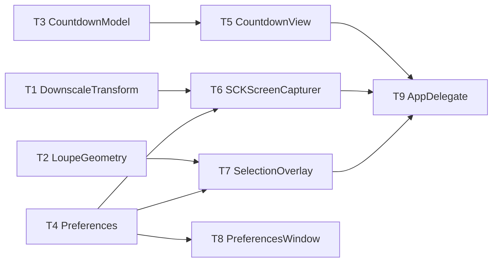

# M7 Capture Conveniences — Implementation Plan

> **For agentic workers:** REQUIRED SUB-SKILL: Use `executing-plan-time` to run this plan. It handles worktree setup, overlap analysis, parallel-wave dispatch, per-task spec + code-quality review, and branch finishing in one runner. Steps use checkbox `- [ ]` syntax for tracking.

**Goal:** Add capture-flow niceties — self-timer + countdown, Capture Last Area, cursor toggle, downscale-Retina, and a correct magnifier loupe.
**Architecture:** Testable logic in `MacShotCore` (`DownscaleTransform`, `LoupeGeometry`, `CountdownModel`, new `Preferences` fields) under strict TDD; thin AppKit shell (`CountdownView`, overlay loupe from a cached snapshot, capturer flags, AppDelegate wiring, prefs UI). Builds on shipped M1–M6.
**Tech Stack:** Swift 6, MacShotCore (CoreGraphics), ScreenCaptureKit, AppKit/SwiftUI, XCTest.
**Max wave width:** 4 tasks in parallel at peak (W1, W2).

> **Base branch:** v2 milestone — executor creates its worktree FROM `master` (has all of M1–M6), new branch e.g. `exec/m7-capture-conveniences-20260723`. Verify `Sources/MacShotCore/Preferences.swift`, `Sources/MacShot/SelectionOverlay.swift`, `Sources/MacShot/SCKScreenCapturer.swift` exist before starting.
> **Verification:** MacShotCore tasks = strict TDD-before-commit. Shell tasks (NSWindow/overlay/ScreenCaptureKit/SwiftUI) gate on `swift build` + manual-smoke; no fabricated GUI unit tests. **Loupe must sample a cached snapshot — never `cacheDisplay`/`bitmapImageRepForCachingDisplay` in `draw()`** (that caused the v1 stack-overflow crash).
> **Autonomous-mode note:** no graphify graph; manifest grounded in the master source. Planning decisions logged tagged `[auto]`.

---

## File Edit Manifest

| Path | Action | Purpose | First touched in |
|------|--------|---------|------------------|
| `Sources/MacShotCore/DownscaleTransform.swift` | Create | retina-halving target size + downsample | T1 |
| `Tests/MacShotCoreTests/DownscaleTransformTests.swift` | Create | downscale tests | T1 |
| `Sources/MacShotCore/LoupeGeometry.swift` | Create | sample-region + clamped loupe rect | T2 |
| `Tests/MacShotCoreTests/LoupeGeometryTests.swift` | Create | loupe geometry tests | T2 |
| `Sources/MacShotCore/CountdownModel.swift` | Create | self-timer tick model | T3 |
| `Tests/MacShotCoreTests/CountdownModelTests.swift` | Create | countdown tests | T3 |
| `Sources/MacShotCore/Preferences.swift` | Modify | add M7 prefs (delay/cursor/downscale/lastRect/loupe) | T4 |
| `Tests/MacShotCoreTests/PreferencesM7Tests.swift` | Create | new-pref roundtrip tests | T4 |
| `Sources/MacShot/CountdownView.swift` | Create | borderless countdown window | T5 |
| `Sources/MacShot/SCKScreenCapturer.swift` | Modify | showsCursor + downscale + captureDisplayImage | T6 |
| `Sources/MacShot/SelectionOverlay.swift` | Modify | loupe from cached snapshot | T7 |
| `Sources/MacShot/PreferencesWindow.swift` | Modify | Capture section controls | T8 |
| `Sources/MacShot/AppDelegate.swift` | Modify | delay, lastRect, Capture Last Area, pass snapshot | T9 |

**Out of scope (intentionally not touched):** editor/annotation (M8), OCR/QR (M9), overlay-panel/history, beautify, recording. `CaptureEngine`/`CaptureMode` unchanged (Capture Last Area reuses `.area(rect)`).

---

## Execution Waves



| Wave | Tasks | Parallelizable | Rationale |
|------|-------|----------------|-----------|
| W1 | T1, T2, T3, T4 | yes — disjoint core files (3 new + Preferences) | independent core logic + pref fields |
| W2 | T5, T6, T7, T8 | yes — disjoint shell files, each dep a W1 task | countdown view / capturer / overlay / prefs UI |
| W3 | T9 | n/a | AppDelegate integrates countdown + snapshot + last-area |

---

## Task 1: DownscaleTransform

**Depends-on:** none
**Wave:** W1
**Files:**
- Create: `Sources/MacShotCore/DownscaleTransform.swift`
- Test: `Tests/MacShotCoreTests/DownscaleTransformTests.swift`

- [ ] **Step 1: Failing test**
```swift
import XCTest
import CoreGraphics
@testable import MacShotCore

final class DownscaleTransformTests: XCTestCase {
    func testRetinaHalvesWhenEnabled() {
        XCTAssertEqual(DownscaleTransform.targetSize(imagePixels: CGSize(width: 2000, height: 1000), displayScale: 2, downscale: true),
                       CGSize(width: 1000, height: 500))
    }
    func testScaleOneUnchanged() {
        XCTAssertEqual(DownscaleTransform.targetSize(imagePixels: CGSize(width: 1000, height: 500), displayScale: 1, downscale: true),
                       CGSize(width: 1000, height: 500))
    }
    func testDisabledUnchanged() {
        XCTAssertEqual(DownscaleTransform.targetSize(imagePixels: CGSize(width: 2000, height: 1000), displayScale: 2, downscale: false),
                       CGSize(width: 2000, height: 1000))
    }
    func testDownsampleProducesRequestedPixelSize() {
        let ctx = CGContext(data: nil, width: 20, height: 10, bitsPerComponent: 8, bytesPerRow: 0,
            space: CGColorSpaceCreateDeviceRGB(), bitmapInfo: CGImageAlphaInfo.premultipliedLast.rawValue)!
        let img = ctx.makeImage()!
        let out = DownscaleTransform.downsampled(img, to: CGSize(width: 10, height: 5))
        XCTAssertEqual(out.width, 10); XCTAssertEqual(out.height, 5)
    }
}
```
- [ ] **Step 2: Run → FAIL** `swift test --filter DownscaleTransformTests`
- [ ] **Step 3: Implement**
```swift
import CoreGraphics

/// Optional Retina downscale: halve the pixel dimensions on hi-DPI displays (~4× fewer pixels).
public enum DownscaleTransform {
    public static func targetSize(imagePixels: CGSize, displayScale: CGFloat, downscale: Bool) -> CGSize {
        guard downscale, displayScale > 1 else { return imagePixels }
        return CGSize(width: (imagePixels.width / displayScale).rounded(),
                      height: (imagePixels.height / displayScale).rounded())
    }
    public static func downsampled(_ image: CGImage, to size: CGSize) -> CGImage {
        let w = max(1, Int(size.width)), h = max(1, Int(size.height))
        guard w != image.width || h != image.height,
              let ctx = CGContext(data: nil, width: w, height: h, bitsPerComponent: 8, bytesPerRow: 0,
                space: CGColorSpaceCreateDeviceRGB(), bitmapInfo: CGImageAlphaInfo.premultipliedLast.rawValue)
        else { return image }
        ctx.interpolationQuality = .high
        ctx.draw(image, in: CGRect(x: 0, y: 0, width: w, height: h))
        return ctx.makeImage() ?? image
    }
}
```
- [ ] **Step 4: Run → PASS** `swift test --filter DownscaleTransformTests`
- [ ] **Step 5: Commit**
```bash
git add Sources/MacShotCore/DownscaleTransform.swift Tests/MacShotCoreTests/DownscaleTransformTests.swift
git commit -m "feat(core): DownscaleTransform — retina-halving target size + downsample"
```

---

## Task 2: LoupeGeometry

**Depends-on:** none
**Wave:** W1
**Files:**
- Create: `Sources/MacShotCore/LoupeGeometry.swift`
- Test: `Tests/MacShotCoreTests/LoupeGeometryTests.swift`

- [ ] **Step 1: Failing test**
```swift
import XCTest
import CoreGraphics
@testable import MacShotCore

final class LoupeGeometryTests: XCTestCase {
    func testSampleRectCenteredAndScaled() {
        // sample side = loupeSize / magnification = 120/8 = 15, centered on the cursor
        let r = LoupeGeometry.sampleRect(cursor: CGPoint(x: 100, y: 100), magnification: 8, loupeSize: 120)
        XCTAssertEqual(r, CGRect(x: 92.5, y: 92.5, width: 15, height: 15))
    }
    func testLoupeRectStaysInsideBoundsNearCorner() {
        let bounds = CGRect(x: 0, y: 0, width: 200, height: 200)
        let r = LoupeGeometry.loupeRect(cursor: CGPoint(x: 195, y: 195), loupeSize: 120, in: bounds)
        XCTAssertTrue(bounds.contains(r), "loupe \(r) must stay within \(bounds)")
    }
    func testLoupeRectOffsetFromCursorWhenRoomy() {
        let bounds = CGRect(x: 0, y: 0, width: 1000, height: 1000)
        let r = LoupeGeometry.loupeRect(cursor: CGPoint(x: 100, y: 100), loupeSize: 120, in: bounds)
        XCTAssertGreaterThan(r.minX, 100)   // offset to the side of the cursor
        XCTAssertEqual(r.size, CGSize(width: 120, height: 120))
    }
}
```
- [ ] **Step 2: Run → FAIL** `swift test --filter LoupeGeometryTests`
- [ ] **Step 3: Implement**
```swift
import CoreGraphics

/// Geometry for the magnifier loupe. The overlay samples a CACHED screen snapshot at
/// `sampleRect` and draws it into `loupeRect` — no live view sampling (no recursion).
public enum LoupeGeometry {
    /// Source region (in the snapshot's coordinate space) magnified into the loupe.
    public static func sampleRect(cursor: CGPoint, magnification: Double, loupeSize: Double) -> CGRect {
        let side = loupeSize / max(1, magnification)
        return CGRect(x: cursor.x - side / 2, y: cursor.y - side / 2, width: side, height: side)
    }
    /// On-screen loupe placement, offset from the cursor and clamped fully inside `bounds`.
    public static func loupeRect(cursor: CGPoint, loupeSize: Double, in bounds: CGRect) -> CGRect {
        let s = CGFloat(loupeSize), offset: CGFloat = 24
        var x = cursor.x + offset, y = cursor.y + offset
        x = min(x, bounds.maxX - s); y = min(y, bounds.maxY - s)
        x = max(bounds.minX, x);     y = max(bounds.minY, y)
        return CGRect(x: x, y: y, width: s, height: s)
    }
}
```
- [ ] **Step 4: Run → PASS** `swift test --filter LoupeGeometryTests`
- [ ] **Step 5: Commit**
```bash
git add Sources/MacShotCore/LoupeGeometry.swift Tests/MacShotCoreTests/LoupeGeometryTests.swift
git commit -m "feat(core): LoupeGeometry — sample region + clamped loupe placement"
```

---

## Task 3: CountdownModel

**Depends-on:** none
**Wave:** W1
**Files:**
- Create: `Sources/MacShotCore/CountdownModel.swift`
- Test: `Tests/MacShotCoreTests/CountdownModelTests.swift`

- [ ] **Step 1: Failing test**
```swift
import XCTest
@testable import MacShotCore

final class CountdownModelTests: XCTestCase {
    func testTicksToZero() {
        var m = CountdownModel(seconds: 3)
        XCTAssertEqual(m.remaining, 3); XCTAssertFalse(m.isDone)
        XCTAssertFalse(m.tick()); XCTAssertEqual(m.remaining, 2)
        XCTAssertFalse(m.tick()); XCTAssertEqual(m.remaining, 1)
        XCTAssertTrue(m.tick());  XCTAssertEqual(m.remaining, 0); XCTAssertTrue(m.isDone)
    }
    func testZeroIsImmediatelyDone() {
        XCTAssertTrue(CountdownModel(seconds: 0).isDone)
    }
    func testNegativeClampsToZero() {
        XCTAssertTrue(CountdownModel(seconds: -5).isDone)
    }
}
```
- [ ] **Step 2: Run → FAIL** `swift test --filter CountdownModelTests`
- [ ] **Step 3: Implement**
```swift
/// Self-timer countdown. The view drives it with a 1s timer; logic is here for testability.
public struct CountdownModel {
    public private(set) var remaining: Int
    public init(seconds: Int) { remaining = max(0, seconds) }
    public var isDone: Bool { remaining <= 0 }
    /// Decrement one second; returns true when it hits 0.
    @discardableResult
    public mutating func tick() -> Bool {
        if remaining > 0 { remaining -= 1 }
        return remaining == 0
    }
}
```
- [ ] **Step 4: Run → PASS** `swift test --filter CountdownModelTests`
- [ ] **Step 5: Commit**
```bash
git add Sources/MacShotCore/CountdownModel.swift Tests/MacShotCoreTests/CountdownModelTests.swift
git commit -m "feat(core): CountdownModel — self-timer tick logic"
```

---

## Task 4: Preferences (M7 fields)

**Depends-on:** none
**Wave:** W1
**Files:**
- Modify: `Sources/MacShotCore/Preferences.swift`
- Test: `Tests/MacShotCoreTests/PreferencesM7Tests.swift`

- [ ] **Step 1: Failing test**
```swift
import XCTest
import CoreGraphics
@testable import MacShotCore

final class PreferencesM7Tests: XCTestCase {
    func testDefaults() {
        let p = Preferences(store: InMemoryKVStore())
        XCTAssertEqual(p.captureDelaySeconds, 0)
        XCTAssertFalse(p.captureCursor)
        XCTAssertFalse(p.downscaleRetina)
        XCTAssertNil(p.lastAreaRect)
        XCTAssertEqual(p.loupeSize, 120, accuracy: 0.001)
        XCTAssertEqual(p.loupeMagnification, 8, accuracy: 0.001)
        XCTAssertTrue(p.loupeOutlineEnabled)
        XCTAssertEqual(p.loupeOutlineColor, .white)
    }
    func testRoundtrip() {
        let store = InMemoryKVStore()
        let p = Preferences(store: store)
        p.captureDelaySeconds = 5
        p.captureCursor = true
        p.downscaleRetina = true
        p.lastAreaRect = CGRect(x: 10, y: 20, width: 300, height: 400)
        p.loupeMagnification = 6
        let r = Preferences(store: store)
        XCTAssertEqual(r.captureDelaySeconds, 5)
        XCTAssertTrue(r.captureCursor)
        XCTAssertTrue(r.downscaleRetina)
        XCTAssertEqual(r.lastAreaRect, CGRect(x: 10, y: 20, width: 300, height: 400))
        XCTAssertEqual(r.loupeMagnification, 6, accuracy: 0.001)
    }
}
```
- [ ] **Step 2: Run → FAIL** `swift test --filter PreferencesM7Tests`
- [ ] **Step 3: Implement** — add to `Preferences` (mirror the existing `s(...)`/`b(...)` accessor style; add `d(...)` for Double):
```swift
    private func d(_ k: String, _ def: Double) -> Double { (store.object(forKey: k) as? Double) ?? def }

    public var captureDelaySeconds: Int {
        get { (store.object(forKey: "captureDelaySeconds") as? Int) ?? 0 }
        nonmutating set { store.set(newValue, forKey: "captureDelaySeconds") }
    }
    public var captureCursor: Bool {
        get { b("captureCursor", false) }; nonmutating set { store.set(newValue, forKey: "captureCursor") }
    }
    public var downscaleRetina: Bool {
        get { b("downscaleRetina", false) }; nonmutating set { store.set(newValue, forKey: "downscaleRetina") }
    }
    public var lastAreaRect: CGRect? {
        get {
            guard let a = store.object(forKey: "lastAreaRect") as? [Double], a.count == 4 else { return nil }
            return CGRect(x: a[0], y: a[1], width: a[2], height: a[3])
        }
        nonmutating set {
            if let r = newValue { store.set([Double(r.minX), Double(r.minY), Double(r.width), Double(r.height)], forKey: "lastAreaRect") }
            else { store.set(nil, forKey: "lastAreaRect") }
        }
    }
    public var lastAreaHotkey: String {
        get { store.string(forKey: "hotkey.lastArea") ?? "" }
        nonmutating set { store.set(newValue, forKey: "hotkey.lastArea") }
    }
    public var loupeSize: Double { get { d("loupeSize", 120) } nonmutating set { store.set(newValue, forKey: "loupeSize") } }
    public var loupeMagnification: Double { get { d("loupeMagnification", 8) } nonmutating set { store.set(newValue, forKey: "loupeMagnification") } }
    public var loupeOutlineEnabled: Bool { get { b("loupeOutlineEnabled", true) } nonmutating set { store.set(newValue, forKey: "loupeOutlineEnabled") } }
    public var loupeOutlineColor: RGBAColor {
        get {
            guard let a = store.object(forKey: "loupeOutlineColor") as? [Double], a.count == 4 else { return .white }
            return RGBAColor(r: a[0], g: a[1], b: a[2], a: a[3])
        }
        nonmutating set { store.set([newValue.r, newValue.g, newValue.b, newValue.a], forKey: "loupeOutlineColor") }
    }
```
  (`RGBAColor` is from M3; `.white` exists.)
- [ ] **Step 4: Run → PASS** `swift test --filter PreferencesM7Tests` (and full `swift test` stays green)
- [ ] **Step 5: Commit**
```bash
git add Sources/MacShotCore/Preferences.swift Tests/MacShotCoreTests/PreferencesM7Tests.swift
git commit -m "feat(core): Preferences — M7 capture/loupe fields + lastAreaRect"
```

---

## Task 5: CountdownView

**Depends-on:** [T3]
**Wave:** W2
**Verification:** `swift build` + manual smoke.
**Files:**
- Create: `Sources/MacShot/CountdownView.swift`

- [ ] **Step 1: Implement** a `CountdownView` controller:
  - A borderless, non-activating, click-through (`ignoresMouseEvents = true`) `NSWindow` at `.screenSaver` level, centered on the main screen, showing a large countdown number.
  - `present(seconds: Int, onFinish: @escaping () -> Void, onCancel: @escaping () -> Void)`: seed a `CountdownModel`, show the window, and on a 1s repeating timer call `model.tick()`, update the label; when `isDone`, close + `onFinish()`. `Esc` (a local key monitor) → close + `onCancel()`. If `seconds == 0`, call `onFinish()` immediately without showing.
- [ ] **Step 2: Verify build** `swift build`
- [ ] **Step 3: Commit**
```bash
git add Sources/MacShot/CountdownView.swift
git commit -m "feat(app): CountdownView — self-timer overlay driven by CountdownModel"
```
- **Manual smoke (T9):** a 3s delay shows 3→2→1 then captures; Esc cancels.

---

## Task 6: SCKScreenCapturer — cursor, downscale, snapshot helper

**Depends-on:** [T1, T4]
**Wave:** W2
**Verification:** `swift build` + manual smoke.
**Files:**
- Modify: `Sources/MacShot/SCKScreenCapturer.swift`

- [ ] **Step 1: Modify** the capturer:
  - Construct it with (or give it access to) a `Preferences`. In `captureDisplay`/window/area config, set `config.showsCursor = prefs.captureCursor`.
  - After producing the final `CGImage`, if `prefs.downscaleRetina`, compute `DownscaleTransform.targetSize(imagePixels: <image size>, displayScale: displayScale(...), downscale: true)` and return `DownscaleTransform.downsampled(image, to: target)`.
  - Add `func captureDisplayImage() async throws -> CGImage` — a public helper that captures the main display at native pixels (reuse the existing display-capture path) for the loupe snapshot.
- [ ] **Step 2: Verify build** `swift build`
- [ ] **Step 3: Commit**
```bash
git add Sources/MacShot/SCKScreenCapturer.swift
git commit -m "feat(app): capturer honors cursor + downscale prefs; add display-snapshot helper"
```
- **Manual smoke (T9):** cursor appears when enabled; downscaled files are ~4× smaller.

---

## Task 7: SelectionOverlay — loupe

**Depends-on:** [T2, T4]
**Wave:** W2
**Verification:** `swift build` + manual smoke.
**Files:**
- Modify: `Sources/MacShot/SelectionOverlay.swift`

- [ ] **Step 1: Modify** the overlay:
  - Add an optional `screenshot: CGImage?` + a `Preferences` to `present(...)`/init (default nil → no loupe).
  - In `draw(_:)`, when `screenshot != nil` and the mode needs selection: compute `LoupeGeometry.loupeRect(cursor:loupeSize:in: bounds)` and `LoupeGeometry.sampleRect(cursor:magnification:loupeSize:)`, crop `screenshot` to the sample rect (convert cursor view-point → snapshot pixel space using the display scale), and draw it magnified into the loupe rect with a rounded clip + outline (color/enabled from `prefs.loupe*`). A crosshair line pair inside the loupe is optional.
  - **Do NOT** call `cacheDisplay`/`bitmapImageRepForCachingDisplay` anywhere — sample only the passed-in `screenshot` (v1 recursion crash).
- [ ] **Step 2: Verify build** `swift build`
- [ ] **Step 3: Commit**
```bash
git add Sources/MacShot/SelectionOverlay.swift
git commit -m "feat(app): SelectionOverlay magnifier loupe from a cached snapshot"
```
- **Manual smoke (T9):** loupe magnifies pixels under the cursor during selection; no crash; clamps at screen edges.

---

## Task 8: PreferencesWindow — Capture section

**Depends-on:** [T4]
**Wave:** W2
**Verification:** `swift build` + manual smoke.
**Files:**
- Modify: `Sources/MacShot/PreferencesWindow.swift`

- [ ] **Step 1: Modify** the prefs model + view:
  - Model: add `@Published` mirrors for `captureDelaySeconds`, `captureCursor`, `downscaleRetina`, `lastAreaHotkey`, `loupeOutlineEnabled`, `loupeSize`, `loupeMagnification`, `loupeOutlineColor`; init from `Preferences`; commit-on-change back to `Preferences` (mirroring the existing `commit*`/`record*` pattern) and fire the hotkeys-changed hook for `lastAreaHotkey`.
  - View: a `Section("Capture")` with a delay `Picker` (Off=0 / 3s / 5s / 10s), a "Include mouse cursor" `Toggle`, a "Downscale Retina screenshots (~4× smaller)" `Toggle`, a `HotkeyRecorderField` for Capture-Last-Area, and a "Loupe" `Section` (enable-outline toggle, size + magnification steppers, an outline `ColorPicker`).
- [ ] **Step 2: Verify build** `swift build`
- [ ] **Step 3: Commit**
```bash
git add Sources/MacShot/PreferencesWindow.swift
git commit -m "feat(app): Preferences UI — capture delay/cursor/downscale/last-area/loupe"
```
- **Manual smoke (T9):** each control persists and takes effect.

---

## Task 9: AppDelegate — wire delay, last-area, snapshot

**Depends-on:** [T5, T6, T7]
**Wave:** W3
**Verification:** `swift build && swift test` (all core suites green) + manual acceptance.
**Files:**
- Modify: `Sources/MacShot/AppDelegate.swift`

- [ ] **Step 1: Modify `AppDelegate`:**
  - In `runCapture(mode:)`: if `prefs.captureDelaySeconds > 0`, present `CountdownView` and continue in its `onFinish` (bail on `onCancel`).
  - For area/window modes, before presenting `SelectionOverlay`, `let snap = try? await capturer.captureDisplayImage()` and pass it (+ `prefs`) into the overlay for the loupe.
  - On a confirmed `.area(rect)` selection, set `prefs.lastAreaRect = rect`.
  - Add a **"Capture Last Area"** menu item (after the capture items) and register `prefs.lastAreaHotkey` (id 5) → if `prefs.lastAreaRect` exists, `runCapture(mode: .area(rect))` **without** the overlay; else `notifier.notifyError("No previous area to capture")`. Re-register on prefs change (extend the existing unregister/register flow).
- [ ] **Step 2: Verify** `swift build && swift test`
  Expected: builds; all MacShotCore tests (M1–M6 + M7) pass.
- [ ] **Step 3: Commit**
```bash
git add Sources/MacShot/AppDelegate.swift
git commit -m "feat(app): self-timer, Capture Last Area, and loupe-snapshot wiring"
```
- **Manual acceptance (human DoD):** 3s self-timer countdown → capture; drag an area then Capture Last Area re-captures it; cursor toggle + downscale reflected in output; loupe aids selection with no crash.

---

## Self-review

- **Spec coverage:** self-timer+countdown (T3/T5/T9), Capture Last Area (T4/T9), cursor toggle (T6), downscale-Retina (T1/T6/T8), loupe (T2/T7/T9). ✓
- **Manifest ↔ tasks:** every manifest file mapped to one task; `Preferences.swift` (T4), each shell file owned by one task; `AppDelegate.swift` only T9. ✓
- **Placeholder scan:** none. Core T1–T4 carry full failing-test + impl; GUI T5–T9 concrete API steps + build/manual gates. ✓
- **Type/name consistency:** `DownscaleTransform.targetSize/downsampled`, `LoupeGeometry.sampleRect/loupeRect`, `CountdownModel.tick/isDone/remaining`, `Preferences.captureDelaySeconds/captureCursor/downscaleRetina/lastAreaRect/lastAreaHotkey/loupe*`, `captureDisplayImage()` — consistent across T5–T9. ✓
- **Wave correctness:** W1 {T1,T2,T3,T4} disjoint core files; W2 {T5,T6,T7,T8} disjoint shell files each dep a W1 task. No same-wave file overlap. ✓
- **Wave width:** peak 4 (W1, W2). W3 is the single integration point (AppDelegate merges countdown+snapshot+last-area). ✓
- **Ponytail first rung:** loupe reuses a snapshot we already can take (no new capture infra) and pure geometry (no recursion trap); Capture Last Area reuses `.area(rect)` + a stored rect (no new capture path); downscale reuses one transform for size + resample; countdown logic is 8 lines in core. ✓
