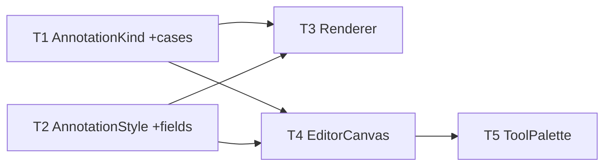

# M8 Editor Parity — Implementation Plan

> **For agentic workers:** REQUIRED SUB-SKILL: Use `executing-plan-time` to run this plan. It handles worktree setup, overlap analysis, parallel-wave dispatch, per-task spec + code-quality review, and branch finishing in one runner. Steps use checkbox `- [ ]` syntax for tracking.

**Goal:** Bring the annotation editor to reference parity — line tool, solid-fill censor, emoji placement, and richer text styling (outline/background/alignment).
**Architecture:** Extend the M3 vector model in headless-tested `MacShotCore` (`AnnotationKind` cases, `AnnotationStyle` fields, `AnnotationRenderer` drawing) with strict TDD; add tools + a text-style row to the SwiftUI editor shell. New kinds are additive — existing M3 docs/tests stay green.
**Tech Stack:** Swift 6, MacShotCore (CoreGraphics/CoreText), SwiftUI/AppKit, XCTest.
**Max wave width:** 2 tasks in parallel at peak (W1, W2).

> **Base branch:** stacks on M7 — executor creates its worktree FROM `exec/m7-capture-conveniences-20260723`, new branch e.g. `exec/m8-editor-parity-20260723`. Verify `Sources/MacShotCore/Annotation.swift`, `AnnotationRenderer.swift`, `Sources/MacShot/EditorCanvas.swift`, `ToolPalette.swift` exist first.
> **Verification:** MacShotCore tasks = strict TDD-before-commit (renderer pixel-tested; emoji = size/non-crash only). Shell tasks gate on `swift build` + manual-smoke. **Existing M3 `AnnotationRendererTests` + Codable tests MUST stay green** — the new cases/fields are additive.
> **Autonomous-mode note:** no graphify graph; manifest grounded in the M7-branch source. Decisions logged `[auto]`.

---

## File Edit Manifest

| Path | Action | Purpose | First touched in |
|------|--------|---------|------------------|
| `Sources/MacShotCore/Annotation.swift` | Modify | add `.line`/`.solidCensor`/`.emoji` kinds + bbox/contains | T1 |
| `Tests/MacShotCoreTests/AnnotationM8Tests.swift` | Create | new-kind bbox + Codable tests | T1 |
| `Sources/MacShotCore/AnnotationStyle.swift` | Modify | add outline/background/alignment + `TextAlignment` + back-compat Codable | T2 |
| `Tests/MacShotCoreTests/AnnotationStyleM8Tests.swift` | Create | new-field defaults + M3-JSON decode + roundtrip | T2 |
| `Sources/MacShotCore/AnnotationRenderer.swift` | Modify | draw new kinds + text styling | T3 |
| `Tests/MacShotCoreTests/AnnotationRendererM8Tests.swift` | Create | line/solid/text-bg pixel + emoji non-crash | T3 |
| `Sources/MacShot/EditorCanvas.swift` | Modify | Tool cases + gestures + emoji picker + VM style fields | T4 |
| `Sources/MacShot/ToolPalette.swift` | Modify | tool buttons + text-style row | T5 |

**Out of scope (intentionally not touched):** existing M3 `AnnotationDocument`/`UndoStack`, `EditorWindow`, capture/overlay, beautify, OCR. Existing `AnnotationKind` cases and `AnnotationRenderer` draw paths are extended, not rewritten.

---

## Execution Waves



| Wave | Tasks | Parallelizable | Rationale |
|------|-------|----------------|-----------|
| W1 | T1, T2 | yes — disjoint core files | kinds vs styles are independent |
| W2 | T3, T4 | yes — disjoint (core renderer vs GUI canvas), both dep T1+T2 | renderer draws kinds; canvas hosts tools |
| W3 | T5 | n/a | palette binds to the canvas VM's tools/styles |

---

## Task 1: AnnotationKind — line / solidCensor / emoji

**Depends-on:** none
**Wave:** W1
**Files:**
- Modify: `Sources/MacShotCore/Annotation.swift`
- Test: `Tests/MacShotCoreTests/AnnotationM8Tests.swift`

- [ ] **Step 1: Failing test**
```swift
import XCTest
import CoreGraphics
@testable import MacShotCore

final class AnnotationM8Tests: XCTestCase {
    func testLineBoundingBoxSpansEndpoints() {
        let a = Annotation(kind: .line(from: CGPoint(x: 0, y: 0), to: CGPoint(x: 10, y: 5)), style: .default)
        XCTAssertEqual(a.boundingBox, CGRect(x: 0, y: 0, width: 10, height: 5))
    }
    func testSolidCensorBoundingBox() {
        let a = Annotation(kind: .solidCensor(CGRect(x: 1, y: 2, width: 3, height: 4)), style: .default)
        XCTAssertEqual(a.boundingBox, CGRect(x: 1, y: 2, width: 3, height: 4))
    }
    func testEmojiContainsCenter() {
        let a = Annotation(kind: .emoji(center: CGPoint(x: 50, y: 50), string: "😀", size: 40), style: .default)
        XCTAssertTrue(a.contains(CGPoint(x: 50, y: 50)))
    }
    func testCodableRoundtripNewKinds() throws {
        let kinds: [AnnotationKind] = [
            .line(from: .zero, to: CGPoint(x: 1, y: 1)),
            .solidCensor(CGRect(x: 0, y: 0, width: 5, height: 5)),
            .emoji(center: CGPoint(x: 2, y: 2), string: "🎯", size: 30),
        ]
        for k in kinds {
            let a = Annotation(kind: k, style: .default)
            XCTAssertEqual(try JSONDecoder().decode(Annotation.self, from: JSONEncoder().encode(a)), a)
        }
    }
}
```
- [ ] **Step 2: Run → FAIL** `swift test --filter AnnotationM8Tests`
- [ ] **Step 3: Implement** — add cases to `AnnotationKind` (leave existing cases untouched) and extend `boundingBox`/`contains`:
```swift
    // add to enum AnnotationKind:
    case line(from: CGPoint, to: CGPoint)
    case solidCensor(CGRect)
    case emoji(center: CGPoint, string: String, size: Double)
```
```swift
    // in boundingBox switch, add:
    case let .line(from, to):
        return CGRect(x: min(from.x, to.x), y: min(from.y, to.y),
                      width: abs(from.x - to.x), height: abs(from.y - to.y))
    case let .solidCensor(r):
        return r
    case let .emoji(c, _, size):
        return CGRect(x: c.x - size/2, y: c.y - size/2, width: size, height: size)
```
  (`contains` already uses `boundingBox.insetBy(dx:-4,dy:-4)` — works for the new kinds.)
- [ ] **Step 4: Run → PASS** `swift test --filter AnnotationM8Tests` (and full `swift test` — M3 tests unaffected)
- [ ] **Step 5: Commit**
```bash
git add Sources/MacShotCore/Annotation.swift Tests/MacShotCoreTests/AnnotationM8Tests.swift
git commit -m "feat(core): AnnotationKind — line, solidCensor, emoji"
```

---

## Task 2: AnnotationStyle — outline / background / alignment (back-compat Codable)

**Depends-on:** none
**Wave:** W1
**Files:**
- Modify: `Sources/MacShotCore/AnnotationStyle.swift`
- Test: `Tests/MacShotCoreTests/AnnotationStyleM8Tests.swift`

- [ ] **Step 1: Failing test**
```swift
import XCTest
@testable import MacShotCore

final class AnnotationStyleM8Tests: XCTestCase {
    func testNewFieldDefaults() {
        let s = AnnotationStyle.default
        XCTAssertFalse(s.textOutline)
        XCTAssertNil(s.textBackgroundColor)
        XCTAssertEqual(s.textAlignment, .left)
    }
    func testM3EraJSONDecodesWithDefaults() throws {
        // an M3 style with NONE of the new keys must still decode
        let json = #"{"strokeColor":{"r":1,"g":0,"b":0,"a":1},"fillColor":null,"lineWidth":3,"fontSize":17}"#
            .data(using: .utf8)!
        let s = try JSONDecoder().decode(AnnotationStyle.self, from: json)
        XCTAssertFalse(s.textOutline)
        XCTAssertNil(s.textBackgroundColor)
        XCTAssertEqual(s.textAlignment, .left)
        XCTAssertEqual(s.lineWidth, 3)
    }
    func testNewFieldsRoundtrip() throws {
        var s = AnnotationStyle.default
        s.textOutline = true; s.textBackgroundColor = .yellow40; s.textAlignment = .center
        XCTAssertEqual(try JSONDecoder().decode(AnnotationStyle.self, from: JSONEncoder().encode(s)), s)
    }
}
```
- [ ] **Step 2: Run → FAIL** `swift test --filter AnnotationStyleM8Tests`
- [ ] **Step 3: Implement** — add the enum + fields, and a **defaulted `init(from:)`** so M3 JSON (missing the new keys) decodes:
```swift
public enum TextAlignment: String, Codable, Sendable { case left, center, right }
```
```swift
// add stored properties (with defaults on the memberwise init):
public var textOutline: Bool
public var textBackgroundColor: RGBAColor?
public var textAlignment: TextAlignment

// update the designated init to default them; keep the existing init signature working by
// giving the new params defaults:
public init(strokeColor: RGBAColor, fillColor: RGBAColor?, lineWidth: Double, fontSize: Double,
            textOutline: Bool = false, textBackgroundColor: RGBAColor? = nil, textAlignment: TextAlignment = .left) {
    self.strokeColor = strokeColor; self.fillColor = fillColor
    self.lineWidth = lineWidth; self.fontSize = fontSize
    self.textOutline = textOutline; self.textBackgroundColor = textBackgroundColor; self.textAlignment = textAlignment
}

// back-compat decoding: new keys are optional-with-default
private enum CodingKeys: String, CodingKey {
    case strokeColor, fillColor, lineWidth, fontSize, textOutline, textBackgroundColor, textAlignment
}
public init(from decoder: Decoder) throws {
    let c = try decoder.container(keyedBy: CodingKeys.self)
    strokeColor = try c.decode(RGBAColor.self, forKey: .strokeColor)
    fillColor = try c.decodeIfPresent(RGBAColor.self, forKey: .fillColor)
    lineWidth = try c.decode(Double.self, forKey: .lineWidth)
    fontSize = try c.decode(Double.self, forKey: .fontSize)
    textOutline = try c.decodeIfPresent(Bool.self, forKey: .textOutline) ?? false
    textBackgroundColor = try c.decodeIfPresent(RGBAColor.self, forKey: .textBackgroundColor)
    textAlignment = try c.decodeIfPresent(TextAlignment.self, forKey: .textAlignment) ?? .left
}
// encode stays synthesized (Encodable) — or provide a matching encode(to:) if the compiler needs it.
```
  (`.default` static keeps working via the defaulted params. `RGBAColor.yellow40` exists from M4/M3.)
- [ ] **Step 4: Run → PASS** `swift test --filter AnnotationStyleM8Tests` (+ full suite green — the M3 AnnotationStyle/renderer Codable tests still pass)
- [ ] **Step 5: Commit**
```bash
git add Sources/MacShotCore/AnnotationStyle.swift Tests/MacShotCoreTests/AnnotationStyleM8Tests.swift
git commit -m "feat(core): AnnotationStyle text outline/background/alignment (back-compat Codable)"
```

---

## Task 3: AnnotationRenderer — draw new kinds + text styling

**Depends-on:** [T1, T2]
**Wave:** W2
**Files:**
- Modify: `Sources/MacShotCore/AnnotationRenderer.swift`
- Test: `Tests/MacShotCoreTests/AnnotationRendererM8Tests.swift`

- [ ] **Step 1: Failing test** (reuse the whiteBase/pixel helpers from the M3 renderer tests — redeclare them here)
```swift
import XCTest
import CoreGraphics
@testable import MacShotCore

final class AnnotationRendererM8Tests: XCTestCase {
    func whiteBase(_ w: Int, _ h: Int) -> CGImage {
        let ctx = CGContext(data: nil, width: w, height: h, bitsPerComponent: 8, bytesPerRow: 0,
            space: CGColorSpaceCreateDeviceRGB(), bitmapInfo: CGImageAlphaInfo.premultipliedLast.rawValue)!
        ctx.setFillColor(gray: 1, alpha: 1); ctx.fill(CGRect(x: 0, y: 0, width: w, height: h)); return ctx.makeImage()!
    }
    func pixel(_ img: CGImage, x: Int, y: Int) -> (UInt8, UInt8, UInt8, UInt8) {
        var px: [UInt8] = [0,0,0,0]
        let ctx = CGContext(data: &px, width: 1, height: 1, bitsPerComponent: 8, bytesPerRow: 4,
            space: CGColorSpaceCreateDeviceRGB(), bitmapInfo: CGImageAlphaInfo.premultipliedLast.rawValue)!
        ctx.draw(img, in: CGRect(x: -x, y: -(img.height - 1 - y), width: img.width, height: img.height))
        return (px[0], px[1], px[2], px[3])
    }

    func testLineStrokePaintsPixels() {
        let base = whiteBase(20, 20)
        var doc = AnnotationDocument(baseSize: CGSize(width: 20, height: 20))
        var style = AnnotationStyle.default; style.strokeColor = .red; style.lineWidth = 4
        doc.add(Annotation(kind: .line(from: CGPoint(x: 0, y: 10), to: CGPoint(x: 20, y: 10)), style: style))
        let out = AnnotationRenderer.flatten(base: base, document: doc)
        let (r, g, b, _) = pixel(out, x: 10, y: 10)
        XCTAssertGreaterThan(r, 150); XCTAssertLessThan(g, 120); XCTAssertLessThan(b, 120)
    }
    func testSolidCensorFullyCovers() {
        let base = whiteBase(20, 20)
        var doc = AnnotationDocument(baseSize: CGSize(width: 20, height: 20))
        var style = AnnotationStyle.default; style.fillColor = RGBAColor(r: 0, g: 0, b: 0, a: 1)
        doc.add(Annotation(kind: .solidCensor(CGRect(x: 4, y: 4, width: 12, height: 12)), style: style))
        let out = AnnotationRenderer.flatten(base: base, document: doc)
        let (r, g, b, a) = pixel(out, x: 10, y: 10)
        XCTAssertLessThan(r, 30); XCTAssertLessThan(g, 30); XCTAssertLessThan(b, 30); XCTAssertGreaterThan(a, 200)
    }
    func testTextBackgroundFills() {
        let base = whiteBase(60, 30)
        var doc = AnnotationDocument(baseSize: CGSize(width: 60, height: 30))
        var style = AnnotationStyle.default; style.textBackgroundColor = RGBAColor(r: 1, g: 1, b: 0, a: 1)
        doc.add(Annotation(kind: .text(CGRect(x: 5, y: 5, width: 50, height: 20), "hi"), style: style))
        let out = AnnotationRenderer.flatten(base: base, document: doc)
        let (r, g, b, _) = pixel(out, x: 8, y: 15)   // inside the bg rect
        XCTAssertGreaterThan(r, 180); XCTAssertGreaterThan(g, 180); XCTAssertLessThan(b, 120)
    }
    func testEmojiFlattenSameSizeNoCrash() {
        let base = whiteBase(40, 40)
        var doc = AnnotationDocument(baseSize: CGSize(width: 40, height: 40))
        doc.add(Annotation(kind: .emoji(center: CGPoint(x: 20, y: 20), string: "😀", size: 24), style: .default))
        let out = AnnotationRenderer.flatten(base: base, document: doc)
        XCTAssertEqual(out.width, 40); XCTAssertEqual(out.height, 40)
    }
}
```
- [ ] **Step 2: Run → FAIL** `swift test --filter AnnotationRendererM8Tests`
- [ ] **Step 3: Implement** — extend the per-kind `draw` switch in `AnnotationRenderer`:
  - `.line(from, to)`: set stroke color/width; `ctx.move(to: from); ctx.addLine(to: to); ctx.strokePath()` (no arrowhead).
  - `.solidCensor(r)`: `ctx.setFillColor((style.fillColor ?? RGBAColor(r:0,g:0,b:0,a:1)).cgColor); ctx.fill(r)`.
  - `.emoji(c, s, size)`: build a `CTFont` at `size`, an `NSAttributedString`(-free) `CTLine` for `s`, center it at `c`, `CTLineDraw`.
  - `.text` path: before drawing glyphs, if `style.textBackgroundColor != nil` fill the text rect with it; apply `style.textAlignment` when positioning the line; if `style.textOutline`, set text drawing mode to stroke (or stroke the glyph path) in `strokeColor`.
- [ ] **Step 4: Run → PASS** `swift test --filter AnnotationRendererM8Tests` (+ full `swift test` — M3 renderer tests still green)
- [ ] **Step 5: Commit**
```bash
git add Sources/MacShotCore/AnnotationRenderer.swift Tests/MacShotCoreTests/AnnotationRendererM8Tests.swift
git commit -m "feat(core): render line/solidCensor/emoji + text background/alignment/outline"
```

---

## Task 4: EditorCanvas — tools + emoji picker

**Depends-on:** [T1, T2]
**Wave:** W2
**Verification:** `swift build` + manual smoke.
**Files:**
- Modify: `Sources/MacShot/EditorCanvas.swift`

- [ ] **Step 1: Modify** the editor:
  - `enum Tool` — add `.line`, `.solidCensor`, `.emoji`.
  - `EditorViewModel` — its `style` already exists (M3); it now carries the new text-style fields (from T2). Add `beginStroke/updateStroke/endStroke` handling for `.line` (two endpoints, like arrow) and `.solidCensor` (drag rect, like the M3 blur). For `.emoji`: on click, add an `.emoji` annotation with an empty string at the point, then call `NSApp.orderFrontCharacterPalette(nil)` with a hidden first-responder `NSTextField` whose text updates the annotation's `string` (drop it if left empty).
  - Live-draw the new kinds in the SwiftUI `Canvas` (line, opaque rect, emoji as a `Text`), mirroring `AnnotationRenderer`.
- [ ] **Step 2: Verify build** `swift build`
- [ ] **Step 3: Commit**
```bash
git add Sources/MacShot/EditorCanvas.swift
git commit -m "feat(app): editor line/solidCensor/emoji tools + emoji picker"
```
- **Manual smoke (T5):** draw a line, solid-censor a region, place an emoji via the palette.

---

## Task 5: ToolPalette — buttons + text-style row

**Depends-on:** [T4]
**Wave:** W3
**Verification:** `swift build` + manual smoke.
**Files:**
- Modify: `Sources/MacShot/ToolPalette.swift`

- [ ] **Step 1: Modify** the palette (bound to the `EditorViewModel`):
  - Add tool buttons: Line (`line.diagonal`), Solid-censor (`rectangle.fill`), Emoji (`face.smiling`), with keyboard shortcuts (`l`, `k`, `e` — avoid clashing with M3's existing shortcuts).
  - Add a text-style row, shown when the active tool is `.text`: an "Outline" `Toggle` (→ `vm.style.textOutline`), a background `ColorPicker` (→ `vm.style.textBackgroundColor`, nullable via a clear button), and an alignment segmented control (→ `vm.style.textAlignment`).
- [ ] **Step 2: Verify** `swift build && swift test`
  Expected: builds; all MacShotCore tests (M1–M7 + M8) pass.
- [ ] **Step 3: Commit**
```bash
git add Sources/MacShot/ToolPalette.swift
git commit -m "feat(app): tool palette — line/censor/emoji buttons + text-style row"
```
- **Manual acceptance (human DoD):** every new tool works; text styling (outline/background/alignment) applies and exports; a pre-M8 annotated doc opens fine.

---

## Self-review

- **Spec coverage:** line (T1/T3/T4/T5), solid censor (T1/T3/T4/T5), emoji (T1/T3/T4/T5), text styling (T2/T3/T5). ✓
- **Manifest ↔ tasks:** each manifest file mapped to one task; core files (T1/T2/T3) and shell files (T4/T5) disjoint per wave. ✓
- **Placeholder scan:** none. Core T1–T3 carry full failing-test + impl (incl. the back-compat `init(from:)`); GUI T4/T5 concrete steps + build/manual gates; emoji pixel-assert deliberately omitted (OS glyph variance). ✓
- **Type/name consistency:** `AnnotationKind.line/solidCensor/emoji`, `AnnotationStyle.textOutline/textBackgroundColor/textAlignment`, `TextAlignment.left/center/right`, `Tool.line/solidCensor/emoji` — consistent across T3/T4/T5. ✓
- **Wave correctness:** W1 {T1,T2} disjoint core files; W2 {T3,T4} disjoint (core renderer vs GUI canvas), both dep T1+T2. No same-wave overlap. ✓
- **Wave width:** peak 2. W3 (palette) genuinely follows T4 (shared VM). ✓
- **Back-compat guard:** T2's `init(from:)` + T1's additive cases keep every M3 serialized doc/style decodable — explicitly tested (`testM3EraJSONDecodesWithDefaults`), and full `swift test` must stay green each task. ✓
- **Ponytail first rung:** new kinds reuse the existing draw/undo/hit-test machinery; `.line` = arrow-minus-head; emoji via the system palette (no bundled asset set); back-compat via `decodeIfPresent` (no migration code). ✓
