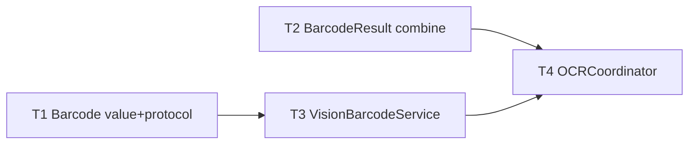

# M9 QR & Barcode Reading — Implementation Plan

> **For agentic workers:** REQUIRED SUB-SKILL: Use `executing-plan-time` to run this plan. It handles worktree setup, overlap analysis, parallel-wave dispatch, per-task spec + code-quality review, and branch finishing in one runner. Steps use checkbox `- [ ]` syntax for tracking.

**Goal:** Decode QR/barcodes in the OCR capture flow — payload → clipboard + notification (Open for URLs), on-device.
**Architecture:** Pure `BarcodeObservation`/`BarcodeService`/`BarcodeResult` in headless-tested `MacShotCore`; `VisionBarcodeService` (VNDetectBarcodes) + an `OCRCoordinator` extension in the shell. Extends the M5 sibling OCR flow — no new hotkey.
**Tech Stack:** Swift 6, MacShotCore (CoreGraphics), Vision, AppKit, XCTest.
**Max wave width:** 2 tasks in parallel at peak (W1).

> **Base branch:** stacks on M8 — executor creates its worktree FROM `exec/m8-editor-parity-20260723`, new branch e.g. `exec/m9-qr-barcode-20260723`. Verify `Sources/MacShotCore/OCR.swift`, `Sources/MacShot/OCRCoordinator.swift`, `VisionOCRService.swift`, `Notifier.swift` exist first.
> **Verification:** MacShotCore tasks = strict TDD (combine precedence, URL detection). Vision/shell tasks gate on `swift build` + manual-smoke. NO Vision-on-synthetic-pixels test (flaky — mirror the M5 decision; the pure combine carries coverage).
> **Autonomous-mode note:** no graphify graph; manifest grounded in the M8-branch source. Decisions logged `[auto]`.

---

## File Edit Manifest

| Path | Action | Purpose | First touched in |
|------|--------|---------|------------------|
| `Sources/MacShotCore/Barcode.swift` | Create | `BarcodeObservation` value + `BarcodeService` protocol | T1 |
| `Tests/MacShotCoreTests/BarcodeTests.swift` | Create | observation/protocol tests | T1 |
| `Sources/MacShotCore/BarcodeResult.swift` | Create | `combinedPayload` + `looksLikeURL` | T2 |
| `Tests/MacShotCoreTests/BarcodeResultTests.swift` | Create | combine + URL tests | T2 |
| `Sources/MacShot/VisionBarcodeService.swift` | Create | VNDetectBarcodes impl | T3 |
| `Sources/MacShot/OCRCoordinator.swift` | Modify | OCR+barcode pass → combine → clipboard + notify | T4 |

**Out of scope (intentionally not touched):** M5 `OCRService`/`OCRTextAssembler`/`VisionOCRService` internals (reused as-is), selection/capture path, editor/beautify. No new hotkey or menu item (auto-detected in the existing OCR capture).

---

## Execution Waves



| Wave | Tasks | Parallelizable | Rationale |
|------|-------|----------------|-----------|
| W1 | T1, T2 | yes — disjoint core files | value/protocol vs pure combine logic |
| W2 | T3 | n/a | Vision impl of the T1 protocol |
| W3 | T4 | n/a | coordinator merges OCR + barcode + combine |

---

## Task 1: Barcode value + service protocol

**Depends-on:** none
**Wave:** W1
**Files:**
- Create: `Sources/MacShotCore/Barcode.swift`
- Test: `Tests/MacShotCoreTests/BarcodeTests.swift`

- [ ] **Step 1: Failing test**
```swift
import XCTest
import CoreGraphics
@testable import MacShotCore

private struct FakeBarcode: BarcodeService {
    let out: [BarcodeObservation]
    func detect(_ image: CGImage) async throws -> [BarcodeObservation] { out }
}

final class BarcodeTests: XCTestCase {
    func testObservationEquatable() {
        let a = BarcodeObservation(payload: "hi", symbology: "QR", boundingBox: .zero)
        let b = BarcodeObservation(payload: "hi", symbology: "QR", boundingBox: .zero)
        XCTAssertEqual(a, b)
    }
    func testServiceReturnsObservations() async throws {
        let obs = [BarcodeObservation(payload: "https://x", symbology: "QR", boundingBox: .zero)]
        let img = CGContext(data: nil, width: 1, height: 1, bitsPerComponent: 8, bytesPerRow: 0,
            space: CGColorSpaceCreateDeviceRGB(), bitmapInfo: CGImageAlphaInfo.premultipliedLast.rawValue)!.makeImage()!
        let r = try await FakeBarcode(out: obs).detect(img)
        XCTAssertEqual(r, obs)
    }
}
```
- [ ] **Step 2: Run → FAIL** `swift test --filter BarcodeTests`
- [ ] **Step 3: Implement**
```swift
import CoreGraphics

/// A decoded QR/barcode. boundingBox in image pixel space.
public struct BarcodeObservation: Equatable, Sendable {
    public var payload: String
    public var symbology: String
    public var boundingBox: CGRect
    public init(payload: String, symbology: String, boundingBox: CGRect) {
        self.payload = payload; self.symbology = symbology; self.boundingBox = boundingBox
    }
}

public protocol BarcodeService: Sendable {
    func detect(_ image: CGImage) async throws -> [BarcodeObservation]
}
```
- [ ] **Step 4: Run → PASS** `swift test --filter BarcodeTests`
- [ ] **Step 5: Commit**
```bash
git add Sources/MacShotCore/Barcode.swift Tests/MacShotCoreTests/BarcodeTests.swift
git commit -m "feat(core): BarcodeObservation value + BarcodeService protocol"
```

---

## Task 2: BarcodeResult — combine + URL detection

**Depends-on:** none
**Wave:** W1
**Files:**
- Create: `Sources/MacShotCore/BarcodeResult.swift`
- Test: `Tests/MacShotCoreTests/BarcodeResultTests.swift`

- [ ] **Step 1: Failing test**
```swift
import XCTest
@testable import MacShotCore

final class BarcodeResultTests: XCTestCase {
    func testBarcodesTakePrecedenceOverText() {
        XCTAssertEqual(BarcodeResult.combinedPayload(text: "some text", barcodes: ["A", "B"]), "A\nB")
    }
    func testFallsBackToTextWhenNoBarcodes() {
        XCTAssertEqual(BarcodeResult.combinedPayload(text: "some text", barcodes: []), "some text")
    }
    func testBothEmptyIsEmpty() {
        XCTAssertEqual(BarcodeResult.combinedPayload(text: "", barcodes: []), "")
    }
    func testLooksLikeURL() {
        XCTAssertTrue(BarcodeResult.looksLikeURL("https://example.com"))
        XCTAssertTrue(BarcodeResult.looksLikeURL("  http://x  "))
        XCTAssertFalse(BarcodeResult.looksLikeURL("hello"))
        XCTAssertFalse(BarcodeResult.looksLikeURL("ftp://x"))
    }
}
```
- [ ] **Step 2: Run → FAIL** `swift test --filter BarcodeResultTests`
- [ ] **Step 3: Implement**
```swift
import Foundation

/// Decides clipboard content for a capture that may contain text and/or barcodes.
public enum BarcodeResult {
    /// Barcodes win when present (payloads newline-joined); otherwise the OCR text.
    public static func combinedPayload(text: String, barcodes: [String]) -> String {
        barcodes.isEmpty ? text : barcodes.joined(separator: "\n")
    }
    public static func looksLikeURL(_ s: String) -> Bool {
        let t = s.trimmingCharacters(in: .whitespacesAndNewlines).lowercased()
        return t.hasPrefix("http://") || t.hasPrefix("https://")
    }
}
```
- [ ] **Step 4: Run → PASS** `swift test --filter BarcodeResultTests`
- [ ] **Step 5: Commit**
```bash
git add Sources/MacShotCore/BarcodeResult.swift Tests/MacShotCoreTests/BarcodeResultTests.swift
git commit -m "feat(core): BarcodeResult — barcode-precedence combine + URL detection"
```

---

## Task 3: VisionBarcodeService

**Depends-on:** [T1]
**Wave:** W2
**Verification:** `swift build` + manual smoke.
**Files:**
- Create: `Sources/MacShot/VisionBarcodeService.swift`

- [ ] **Step 1: Implement** `VisionBarcodeService: BarcodeService`:
  - `detect(_ image:)`: run a `VNDetectBarcodesRequest` via `VNImageRequestHandler(cgImage: image)`; for each `VNBarcodeObservation` with a non-empty `payloadStringValue`, map to `BarcodeObservation(payload:, symbology: obs.symbology.rawValue, boundingBox: <normalized→pixel>)`. Bridge the completion-handler request to `async` via `withCheckedThrowingContinuation`.
- [ ] **Step 2: Verify build** `swift build`
- [ ] **Step 3: Commit**
```bash
git add Sources/MacShot/VisionBarcodeService.swift
git commit -m "feat(app): VisionBarcodeService — VNDetectBarcodes impl of BarcodeService"
```
- **Manual smoke (T4):** a screenshot with a QR decodes to its payload.

---

## Task 4: OCRCoordinator — barcode pass + combine

**Depends-on:** [T2, T3]
**Wave:** W3
**Verification:** `swift build && swift test` (all core suites green) + manual acceptance.
**Files:**
- Modify: `Sources/MacShot/OCRCoordinator.swift`

- [ ] **Step 1: Modify** the coordinator (constructed now with a `BarcodeService` alongside the existing `OCRService`):
  - After capturing the region `CGImage`, run OCR and barcode detection concurrently (`async let text = ...; async let codes = ...`).
  - `let assembled = OCRTextAssembler.assemble(observations)`; `let payloads = codes.map(\.payload)`; `let out = BarcodeResult.combinedPayload(text: assembled, barcodes: payloads)`.
  - If `out.isEmpty` → `notifier.notifyError("No text or code recognized")`. Else write `out` to `NSPasteboard` and notify (preview). If `payloads.count == 1 && BarcodeResult.looksLikeURL(payloads[0])`, add an "Open" notification action that `NSWorkspace.shared.open(url)` — never auto-open.
  - Barcode detection failure → catch and fall back to OCR-only (don't fail the capture).
- [ ] **Step 2: Verify** `swift build && swift test`
  Expected: builds; all MacShotCore tests (M1–M8 + M9) pass.
- [ ] **Step 3: Commit**
```bash
git add Sources/MacShot/OCRCoordinator.swift
git commit -m "feat(app): OCR capture also decodes QR/barcodes; Open action for URLs"
```
- **Manual acceptance (human DoD):** capture a QR region → payload on clipboard + notification; URL QR offers Open; a text-only region still copies text (M5 behavior unchanged).

---

## Self-review

- **Spec coverage:** barcode detection (T1/T3), combine/precedence (T2/T4), clipboard + notification + URL open (T4). ✓
- **Manifest ↔ tasks:** each file mapped to one task; `OCRCoordinator.swift` only T4. ✓
- **Placeholder scan:** none. Core T1/T2 carry full failing-test + impl; T3/T4 concrete API steps + build/manual gates; no flaky Vision unit test. ✓
- **Type/name consistency:** `BarcodeObservation`, `BarcodeService.detect(_:)`, `BarcodeResult.combinedPayload/looksLikeURL` — consistent across T3/T4. ✓
- **Wave correctness:** W1 {T1,T2} disjoint core files. W2/W3 genuinely sequential (Vision impl of the protocol; coordinator merges everything). ✓
- **Wave width:** peak 2 (W1). W2/W3 are true single-dependency steps for a small milestone (not artificially narrow). ✓
- **Ponytail first rung:** reuses the entire M5 OCR capture/selection/notify path (no new hotkey, no duplicate capture), pure combine carries the tests (no flaky Vision test), URL open is user-initiated (no auto-open risk). ✓
