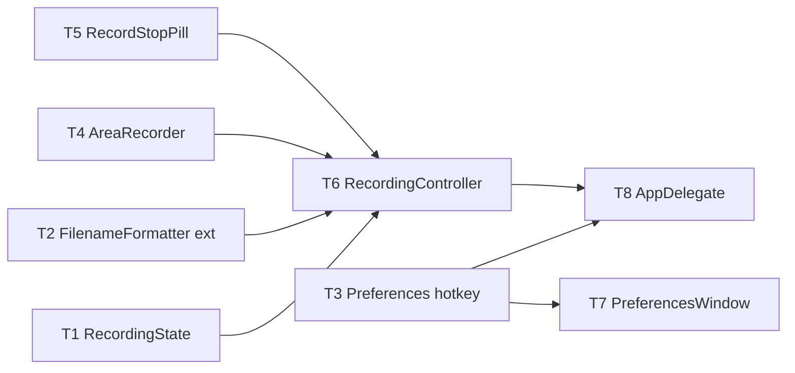

# M19 Area Screen Recording — Implementation Plan

> **For agentic workers:** REQUIRED SUB-SKILL: Use `executing-plan-time` to run this plan. It handles worktree setup, overlap analysis, parallel-wave dispatch, per-task spec + code-quality review, and branch finishing in one runner. Steps use checkbox `- [ ]` syntax for tracking.

**Goal:** Select a screen area and record it silently (no audio) to an H.264 MP4.
**Architecture:** One pure `RecordingState` in headless-tested `MacShotCore` (+ a `FilenameFormatter` ext param + a `recordAreaHotkey` pref); the recording pipeline (`AreaRecorder` = `SCStream` → `AVAssetWriter`), a `RecordingController`, a floating stop pill, and the menu/hotkey wiring are build-gated shell. Reuses M1 area selection + permission + notifier.
**Tech Stack:** Swift 6, ScreenCaptureKit (`SCStream`), AVFoundation (`AVAssetWriter`), AppKit, XCTest.
**Max wave width:** 5 tasks in parallel at peak (W1 — all dep-free disjoint files).

> **Base branch:** stacks on `main` (has M1–M18 + hardening) — executor creates its worktree FROM `main`, new branch e.g. `exec/m19-area-recording-20260725`. Verify `Sources/MacShot/SelectionOverlay.swift`, `SCKScreenCapturer.swift`, `AppDelegate.swift`, `Notifier.swift`, `PermissionFlow.swift`, `HotkeyRecorderField.swift`, `Sources/MacShotCore/FilenameFormatter.swift`, `Preferences.swift` exist first.
> **Verification:** `RecordingState` + `FilenameFormatter` ext = strict TDD. **AreaRecorder/RecordingController/RecordStopPill/AppDelegate/PreferencesWindow = `swift build` + manual-smoke ONLY** — SCStream frame delivery + AVAssetWriter can't run headless; do NOT fabricate unit tests around them. This is the biggest never-run GUI surface — the human DoD (record a clip → it plays) is mandatory.
> **FilenameFormatter change is ADDITIVE** (`ext` defaults to `"png"`) — existing `FilenameFormatterTests` must stay green.
> **Coordinate contract:** `SelectionOverlay` area completion returns `.area(rect)` in **display-local top-left POINTS** (the M7 convention). `SCStreamConfiguration.sourceRect` is also display-local top-left points → pass `rect` straight through; set `config.width/height = Int(rect.width*scale) / Int(rect.height*scale)` (pixels). Verify in manual smoke.

---

## File Edit Manifest

| Path | Action | Purpose | First touched in |
|------|--------|---------|------------------|
| `Sources/MacShotCore/RecordingState.swift` | Create | idle/recording + elapsed + label | T1 |
| `Tests/MacShotCoreTests/RecordingStateTests.swift` | Create | state tests | T1 |
| `Sources/MacShotCore/FilenameFormatter.swift` | Modify | add `ext:` param (default "png") | T2 |
| `Tests/MacShotCoreTests/FilenameFormatterExtTests.swift` | Create | ext=mp4 + default-png tests | T2 |
| `Sources/MacShotCore/Preferences.swift` | Modify | add `recordAreaHotkey` (default ⌃⌘⇧V) | T3 |
| `Tests/MacShotCoreTests/PreferencesM19Tests.swift` | Create | pref roundtrip | T3 |
| `Sources/MacShot/AreaRecorder.swift` | Create | SCStream → AVAssetWriter MP4 pipeline | T4 |
| `Sources/MacShot/RecordStopPill.swift` | Create | floating red "● Stop" panel | T5 |
| `Sources/MacShot/RecordingController.swift` | Create | orchestrate select→record→save | T6 |
| `Sources/MacShot/PreferencesWindow.swift` | Modify | Record-Area hotkey recorder field | T7 |
| `Sources/MacShot/AppDelegate.swift` | Modify | Record/Stop menu item + hotkey | T8 |

**Out of scope (intentionally not touched):** capture/OCR/editor/pin, `SCKScreenCapturer` internals (AreaRecorder is its own SCStream pipeline, not a change to the still-capturer), audio, GIF, window/fullscreen recording.

---

## Execution Waves



| Wave | Tasks | Parallelizable | Rationale |
|------|-------|----------------|-----------|
| W1 | T1, T2, T3, T4, T5 | yes — 5 disjoint dep-free files | state / formatter / prefs / recorder pipeline / stop pill |
| W2 | T6, T7 | yes — disjoint (controller new vs PreferencesWindow) | controller merges the pieces; prefs UI needs only T3 |
| W3 | T8 | n/a | AppDelegate wires the controller + hotkey + menu |

---

## Task 1: RecordingState

**Depends-on:** none
**Wave:** W1
**Files:**
- Create: `Sources/MacShotCore/RecordingState.swift`
- Test: `Tests/MacShotCoreTests/RecordingStateTests.swift`

- [ ] **Step 1: Failing test**
```swift
import XCTest
@testable import MacShotCore

final class RecordingStateTests: XCTestCase {
    func testStartTickStop() {
        var s = RecordingState()
        XCTAssertFalse(s.isRecording); XCTAssertEqual(s.elapsedSeconds, 0)
        s.start(); XCTAssertTrue(s.isRecording)
        s.tick(); s.tick(); s.tick(); XCTAssertEqual(s.elapsedSeconds, 3)
        s.stop(); XCTAssertFalse(s.isRecording)
    }
    func testNoTickWhenIdle() {
        var s = RecordingState(); s.tick(); XCTAssertEqual(s.elapsedSeconds, 0)
    }
    func testStartResetsElapsed() {
        var s = RecordingState(); s.start(); s.tick(); s.stop(); s.start()
        XCTAssertEqual(s.elapsedSeconds, 0)
    }
    func testLabelMMSS() {
        var s = RecordingState(); s.start(); for _ in 0..<75 { s.tick() }
        XCTAssertEqual(s.label, "1:15")
    }
}
```
- [ ] **Step 2: Run → FAIL** `swift test --filter RecordingStateTests`
- [ ] **Step 3: Implement**
```swift
/// Pure recording state — drives the stop pill + menu label. The actual capture is in the shell.
public struct RecordingState: Sendable {
    public private(set) var isRecording = false
    public private(set) var elapsedSeconds = 0
    public init() {}
    public mutating func start() { isRecording = true; elapsedSeconds = 0 }
    public mutating func stop() { isRecording = false }
    public mutating func tick() { if isRecording { elapsedSeconds += 1 } }
    public var label: String { String(format: "%d:%02d", elapsedSeconds / 60, elapsedSeconds % 60) }
}
```
- [ ] **Step 4: Run → PASS** `swift test --filter RecordingStateTests`
- [ ] **Step 5: Commit**
```bash
git add Sources/MacShotCore/RecordingState.swift Tests/MacShotCoreTests/RecordingStateTests.swift
git commit -m "feat(core): RecordingState — idle/recording + elapsed + mm:ss label"
```

---

## Task 2: FilenameFormatter ext param

**Depends-on:** none
**Wave:** W1
**Files:**
- Modify: `Sources/MacShotCore/FilenameFormatter.swift`
- Test: `Tests/MacShotCoreTests/FilenameFormatterExtTests.swift`

- [ ] **Step 1: Failing test**
```swift
import XCTest
@testable import MacShotCore

final class FilenameFormatterExtTests: XCTestCase {
    let ts = Date(timeIntervalSince1970: 1_600_000_000)
    func testExtMp4() {
        let f = FilenameFormatter(format: "Rec {date}", calendar: .utc)
        XCTAssertTrue(f.filename(for: ts, mode: "recording", ext: "mp4").hasSuffix(".mp4"))
    }
    func testDefaultExtStillPng() {
        let f = FilenameFormatter(format: "x", calendar: .utc)
        XCTAssertTrue(f.filename(for: ts, mode: "area").hasSuffix(".png"))
    }
    func testUniqueFilenameExt() {
        let f = FilenameFormatter(format: "clip", calendar: .utc)
        let taken: (String) -> Bool = { $0 == "clip.mp4" }
        XCTAssertEqual(f.uniqueFilename(for: ts, mode: "recording", ext: "mp4", isTaken: taken), "clip (1).mp4")
    }
}
// (Calendar.utc helper already exists in FilenameFormatterTests; if the target complains about
//  duplicate, reference the existing one rather than redeclaring.)
```
- [ ] **Step 2: Run → FAIL** `swift test --filter FilenameFormatterExtTests`
- [ ] **Step 3: Implement** — add an `ext: String = "png"` parameter to `filename(for:mode:)` and `uniqueFilename(for:mode:isTaken:)`, replacing the hard-coded `".png"`/`.dropLast(4)` with `"." + ext` and `.dropLast(ext.count + 1)`:
```swift
    public func filename(for date: Date, mode: String, ext: String = "png") -> String {
        // …existing token expansion + sanitize…
        return s.isEmpty ? "Screenshot." + ext : s + "." + ext
    }
    public func uniqueFilename(for date: Date, mode: String, ext: String = "png", isTaken: (String) -> Bool) -> String {
        let base = filename(for: date, mode: mode, ext: ext)
        if !isTaken(base) { return base }
        let stem = String(base.dropLast(ext.count + 1))
        var n = 1
        while isTaken("\(stem) (\(n)).\(ext)") { n += 1 }
        return "\(stem) (\(n)).\(ext)"
    }
```
- [ ] **Step 4: Run → PASS** `swift test --filter FilenameFormatterExtTests` (+ full `swift test` — the M1 `FilenameFormatterTests` still pass with the default `png`)
- [ ] **Step 5: Commit**
```bash
git add Sources/MacShotCore/FilenameFormatter.swift Tests/MacShotCoreTests/FilenameFormatterExtTests.swift
git commit -m "feat(core): FilenameFormatter ext param (default png; mp4 for recordings)"
```

---

## Task 3: Preferences — recordAreaHotkey

**Depends-on:** none
**Wave:** W1
**Files:**
- Modify: `Sources/MacShotCore/Preferences.swift`
- Test: `Tests/MacShotCoreTests/PreferencesM19Tests.swift`

- [ ] **Step 1: Failing test**
```swift
import XCTest
@testable import MacShotCore

final class PreferencesM19Tests: XCTestCase {
    func testDefault() {
        XCTAssertEqual(Preferences(store: InMemoryKVStore()).recordAreaHotkey, "⌃⌘⇧V")
    }
    func testRoundtrip() {
        let store = InMemoryKVStore()
        Preferences(store: store).recordAreaHotkey = "⌥⌘R"
        XCTAssertEqual(Preferences(store: store).recordAreaHotkey, "⌥⌘R")
    }
}
```
- [ ] **Step 2: Run → FAIL** `swift test --filter PreferencesM19Tests`
- [ ] **Step 3: Implement** — mirror the existing hotkey accessors:
```swift
    public var recordAreaHotkey: String {
        get { s("hotkey.recordArea", "⌃⌘⇧V") }
        nonmutating set { store.set(newValue, forKey: "hotkey.recordArea") }
    }
```
- [ ] **Step 4: Run → PASS** `swift test --filter PreferencesM19Tests`
- [ ] **Step 5: Commit**
```bash
git add Sources/MacShotCore/Preferences.swift Tests/MacShotCoreTests/PreferencesM19Tests.swift
git commit -m "feat(core): Preferences.recordAreaHotkey (default ⌃⌘⇧V)"
```

---

## Task 4: AreaRecorder (SCStream → AVAssetWriter)

**Depends-on:** none
**Wave:** W1
**Verification:** `swift build` + manual smoke.
**Files:**
- Create: `Sources/MacShot/AreaRecorder.swift`

- [ ] **Step 1: Implement** `AreaRecorder` (`@preconcurrency import ScreenCaptureKit`, `import AVFoundation`):
  - `final class AreaRecorder: NSObject, SCStreamOutput` holding an `SCStream?`, `AVAssetWriter?`, `AVAssetWriterInput?`, `AVAssetWriterInputPixelBufferAdaptor?`, a serial `DispatchQueue`, and a `sessionStarted` flag.
  - `func start(area: CGRect, display: SCDisplay, scale: CGFloat, to url: URL) async throws`:
    - `let config = SCStreamConfiguration()`; `config.sourceRect = area` (display-local top-left points); `config.width = Int(area.width * scale)`; `config.height = Int(area.height * scale)`; `config.showsCursor = true`; `config.capturesAudio = false`; `config.minimumFrameInterval = CMTime(value: 1, timescale: 30)`; `config.pixelFormat = kCVPixelFormatType_32BGRA`.
    - Set up the writer: `AVAssetWriter(url: url, fileType: .mp4)`; a `.video` `AVAssetWriterInput` with `[.codec: AVVideoCodecType.h264, .width: config.width, .height: config.height]`, `expectsMediaDataInRealTime = true`; an `AVAssetWriterInputPixelBufferAdaptor(assetWriterInput: input, sourcePixelBufferAttributes: [kCVPixelBufferPixelFormatTypeKey: kCVPixelFormatType_32BGRA])`. `writer.add(input)`.
    - `let filter = SCContentFilter(display: display, excludingWindows: [])`; `let stream = SCStream(filter: filter, configuration: config, delegate: nil)`; `try stream.addStreamOutput(self, type: .screen, sampleHandlerQueue: queue)`; `try await stream.startCapture()`.
  - `SCStreamOutput`: `stream(_:didOutputSampleBuffer:of:)` for `.screen` — validate the buffer (`CMSampleBufferGetImageBuffer` non-nil, `SCStreamFrameInfo.status == .complete`); on the first valid frame `writer.startWriting(); writer.startSession(atSourceTime: pts); sessionStarted = true`; while `input.isReadyForMoreMediaData` append the pixel buffer via the adaptor at the buffer's pts.
  - `func stop() async -> URL?`: `try? await stream?.stopCapture()`; `input?.markAsFinished()`; `await writer?.finishWriting()`; return the url if `writer?.status == .completed` and at least one frame was written, else nil (and remove a zero-byte file).
- [ ] **Step 2: Verify build** `swift build`
- [ ] **Step 3: Commit**
```bash
git add Sources/MacShot/AreaRecorder.swift
git commit -m "feat(app): AreaRecorder — SCStream(area, no audio) → AVAssetWriter H.264 MP4"
```
- **Manual smoke (T8):** the recorded MP4 shows exactly the selected area, correct size, cursor visible, no audio.

---

## Task 5: RecordStopPill

**Depends-on:** none
**Wave:** W1
**Verification:** `swift build` + manual smoke.
**Files:**
- Create: `Sources/MacShot/RecordStopPill.swift`

- [ ] **Step 1: Implement** a small borderless floating `NSPanel` (`.floating` level, `.nonactivatingPanel`, `collectionBehavior` all-spaces): a red "● Stop 0:00" button; `func show(near rect: CGRect?)` positions it (top-center of the active screen, or just above the recorded area if a rect is given); `func updateLabel(_ text: String)`; `func hide()`. The button fires an injected `onStop: () -> Void`.
- [ ] **Step 2: Verify build** `swift build`
- [ ] **Step 3: Commit**
```bash
git add Sources/MacShot/RecordStopPill.swift
git commit -m "feat(app): RecordStopPill — floating stop button with elapsed label"
```
- **Manual smoke (T8):** the pill appears while recording and clicking it stops.

---

## Task 6: RecordingController

**Depends-on:** [T1, T2, T4, T5]
**Wave:** W2
**Verification:** `swift build` + manual smoke.
**Files:**
- Create: `Sources/MacShot/RecordingController.swift`

- [ ] **Step 1: Implement** `RecordingController` (`@MainActor`), constructed with a `SelectionOverlay` presenter, a `PermissionFlow`, a `Notifier`, and `Preferences`; holds a `RecordingState`, an `AreaRecorder`, a `RecordStopPill`, and a `Timer`.
  - `func toggle()`: if not recording → `guard permissionFlow.hasScreenAccess() else { permissionFlow.request…; return }`; present `SelectionOverlay` in `.area(nil)`; on a resolved `.area(rect)`, resolve the `SCDisplay` under the rect (via `SCShareableContent.current`, main display fallback) and its `backingScale` (NSScreen for that display, default 2); build the save URL: `FilenameFormatter(format: prefs.filenameFormat).uniqueFilename(for: Date(), mode: "recording", ext: "mp4") { fileExists in saveDir }` under `prefs.saveDirectoryPath` (create the dir); `try await recorder.start(area: rect, display:, scale:, to: url)`; `state.start()`; `pill.show(near: rect)`; start a 1 s `Timer` → `state.tick(); pill.updateLabel("● Stop " + state.label)`; on start error → `notifier.notifyError("Couldn't start recording")`, reset.
  - if recording → invalidate timer; `let out = await recorder.stop()`; `state.stop()`; `pill.hide()`; if `let out { notifier.notifyCaptured?/notify "Recording saved" ; NSWorkspace.shared.activateFileViewerSelecting([out]) }` else `notifier.notifyError("Recording produced no file")`.
  - `var isRecording: Bool { state.isRecording }` for the menu/AppDelegate.
- [ ] **Step 2: Verify build** `swift build`
- [ ] **Step 3: Commit**
```bash
git add Sources/MacShot/RecordingController.swift
git commit -m "feat(app): RecordingController — area select → record → save + reveal"
```
- **Manual smoke (T8):** full flow works.

---

## Task 7: PreferencesWindow — record hotkey field

**Depends-on:** [T3]
**Wave:** W2
**Verification:** `swift build` + manual smoke.
**Files:**
- Modify: `Sources/MacShot/PreferencesWindow.swift`

- [ ] **Step 1: Modify** — in the model add a `@Published var recordAreaHotkey` initialized from `Preferences.recordAreaHotkey`, and a `recordRecordArea(_ spec:)` that persists `prefs.recordAreaHotkey = spec.description` + fires the hotkeys-changed hook (mirror the existing `recordArea`/`recordOCR`). In the Capture section add a `HotkeyRecorderField` labeled "Record Area" bound to it.
- [ ] **Step 2: Verify build** `swift build`
- [ ] **Step 3: Commit**
```bash
git add Sources/MacShot/PreferencesWindow.swift
git commit -m "feat(app): Preferences — configurable Record-Area hotkey field"
```
- **Manual smoke (T8):** recording the hotkey persists + re-registers.

---

## Task 8: AppDelegate — menu + hotkey wiring

**Depends-on:** [T6, T7]
**Wave:** W3
**Verification:** `swift build && swift test` (all core suites green) + manual acceptance.
**Files:**
- Modify: `Sources/MacShot/AppDelegate.swift`

- [ ] **Step 1: Modify `AppDelegate`:**
  - Construct a `RecordingController` in `applicationDidFinishLaunching` (reuse the existing `SelectionOverlay`/`PermissionFlow`/`Notifier`/`prefs`).
  - Add a menu item whose title is "Record Area" when idle and "Stop Recording" while `recordingController.isRecording` (update on menu open) → `recordingController.toggle()`.
  - Register `prefs.recordAreaHotkey` (id 8) → `recordingController.toggle()`; include it in the unregister/re-register-on-prefs-change flow.
  - `applicationWillTerminate` → if recording, best-effort `Task { await recordingController.stopIfRecording() }` (add that helper) so a partial file finalizes.
- [ ] **Step 2: Verify** `swift build && swift test`
  Expected: builds; all MacShotCore tests (M1–M18 + M19 core) pass.
- [ ] **Step 3: Commit**
```bash
git add Sources/MacShot/AppDelegate.swift
git commit -m "feat(app): Record Area / Stop Recording menu + configurable hotkey"
```
- **Manual acceptance (human DoD — REQUIRED):** press the record hotkey → select an area → pill counts up → act on screen → stop (via pill, menu, and hotkey each work) → an `.mp4` lands in the save dir, opens in QuickTime, shows exactly the selected area with the cursor, no audio, ~30 fps. Edge cases: cancel selection → no file; stop immediately → no empty file; Retina/multi-monitor area.

---

## Self-review

- **Spec coverage:** state (T1), mp4 name (T2), configurable hotkey (T3/T7/T8), recording pipeline (T4), stop pill (T5), orchestration+save+reveal (T6), menu+hotkey toggle (T8). ✓
- **Manifest ↔ tasks:** each file one task; `Preferences.swift`/`FilenameFormatter.swift` core-modify each single-owner; `AppDelegate.swift` only T8; `PreferencesWindow.swift` only T7. ✓
- **Placeholder scan:** none. Core T1–T3 full failing-test + impl; shell T4–T8 concrete API steps + build/manual gates; NO fabricated SCStream/AVAssetWriter unit tests (documented — can't run headless). ✓
- **Type/name consistency:** `RecordingState.start/stop/tick/label`, `FilenameFormatter.filename(…,ext:)`, `Preferences.recordAreaHotkey`, `AreaRecorder.start(area:display:scale:to:)/stop()`, `RecordingController.toggle()/isRecording`, `RecordStopPill.show/updateLabel/hide/onStop` — consistent across T4–T8. ✓
- **Wave correctness:** W1 {T1,T2,T3,T4,T5} touch 5 disjoint dep-free files. W2 {T6,T7} disjoint (new controller vs PreferencesWindow). No same-wave overlap. ✓
- **Wave width:** peak 5 (W1). W3 (AppDelegate) is the single integration point. ✓
- **Ponytail first rung:** reuses M1 area-select/permission/notifier/filename/hotkey-recorder (no new capture/permission/UI infra); one pure `RecordingState` is the only new testable surface (recording itself is un-unit-testable — honest build+manual gate); MP4/H.264 native (no encoder dep); additive `ext` param (no formatter rewrite). ✓
