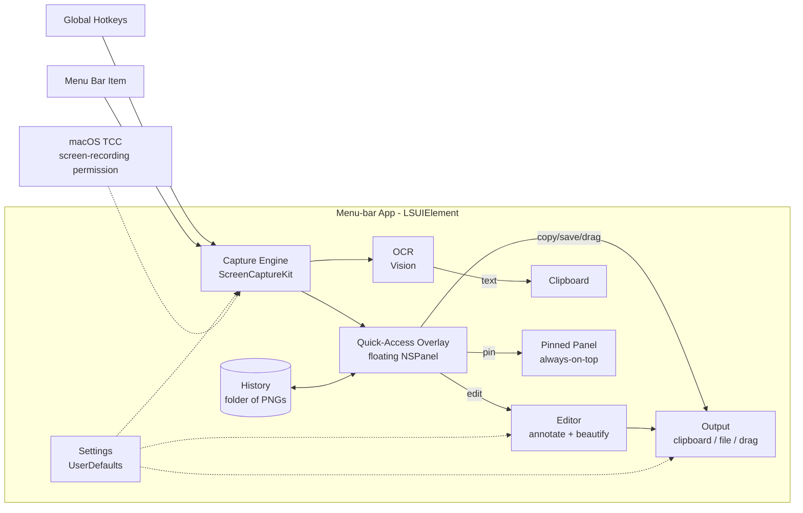

# Roadmap: MacShot *(working title)*

Native macOS screenshot tool covering CleanShot X + BridgeShot feature sets. Greenfield, solo, on-device only.

## Vision

A free, native macOS screenshot tool for the author (and eventually other devs) that replaces CleanShot X and covers BridgeShot's pitch: capture, quick-access overlay, annotate, beautify, OCR — 100% on-device, zero dependencies, menu-bar resident.

**In scope v1:** area/window/fullscreen capture, global hotkeys, quick-access overlay, history + pinned screenshots, vector annotation, beautify/export styling, OCR, settings, notarized DMG.

**Out of scope v1:** cloud upload/sharing, video/GIF recording, scrolling capture, AI features (smart blur, alt-text), licensing/payments, Sparkle auto-update.

## Tech stack & rationale

| Choice | Rejected alternative | Rationale |
|---|---|---|
| Swift 6 + SwiftUI, AppKit interop | Electron/Tauri | Native capture APIs, TCC, floating panels — web stack fights all three |
| ScreenCaptureKit | CGWindowListCreateImage | Modern supported API; old one deprecated |
| Vision framework OCR | Tesseract dependency | Free, on-device, zero-dep |
| SwiftUI Canvas for editor | AppKit/CALayer up front | Simpler; documented fallback if perf fails (R2) |
| Carbon RegisterEventHotKey (~50 LOC) | KeyboardShortcuts SPM lib | Trivial to hand-roll; add lib only if hotkey-recording UI hurts |
| PNG files + UserDefaults | SQLite/Core Data | History is a folder; no query needs |
| macOS 14+, universal binary | macOS 12 compat | Modern SwiftUI + full ScreenCaptureKit without compat code |
| No App Sandbox, Developer ID direct | App Store | Save-anywhere + drag friction; no review delays |

## System architecture

- **Capture Engine is the single entry point** — hotkeys and menu route through it; every capture mode (area/window/full/OCR) is a mode flag, not a separate path.
- **Quick-Access Overlay is the hub** — every capture lands there; editor, pin, OCR, save are actions off it.
- **History = folder of PNGs**; no database.
- Only external interface: macOS TCC screen-recording permission.

## Data model spine

1. **Capture** — image file + metadata (timestamp, mode, source display/window, dimensions). Central noun.
2. **Annotation** — vector element (arrow/shape/text/blur/step number) with geometry + style, belonging to a Capture. Non-destructive until export.
3. **BeautifyStyle** — background/padding/shadow/corner config applied at export; presets are saved instances.
4. **HistoryEntry** — a Capture's presence in history (file path + thumbnail); derived from the folder.
5. **Preferences** — hotkeys, save location, filename format, after-capture behavior.

Relations: Capture 1—N Annotation; Capture 0..1 BeautifyStyle; HistoryEntry 1—1 Capture.

## Non-functional targets

- **Latency:** hotkey → selection UI < 100ms; capture → overlay < 200ms
- **Memory:** idle < 50MB; no image leaks across repeated captures
- **Offline/privacy:** 100% on-device, zero network calls, zero telemetry; all data local plain files
- **Scale:** single user; history smooth at ~10k captures
- **Compat:** macOS 14+, Apple Silicon + Intel (universal binary)

## Risks & assumptions

1. **ScreenCaptureKit friction** — window picking, multi-display coords, TCC persistence across rebuilds. Retired by M1.
2. **Editor canvas performance** on Retina-sized captures; fallback is AppKit/CALayer canvas layer. Retired by M3.
3. **Parity-chasing scope creep** — the out-of-scope list is the contract; checked at every milestone's definition of done.

Assumptions: Apple Developer ID available ($99/yr — needed for stable TCC grants and notarization); macOS 14+ dev machine.

## Milestones

### M1 — Capture core

- **Goal:** menu-bar app that replaces ⌘⇧4 for daily use.
- **Scope in:** menu-bar item, global hotkeys, area/window/fullscreen capture, save to clipboard + file, TCC first-run flow, basic prefs (save dir, format).
- **Scope out:** overlay, editor, OCR; any post-capture UI beyond a notification.
- **Already decided at roadmap level:** ScreenCaptureKit, single Capture Engine entry point, hand-rolled Carbon hotkeys, no sandbox, macOS 14+.
- **Open questions for brainstorming-time:** selection UI interaction details (crosshair, magnifier, dim), window-highlight UX, hotkey defaults, working app name.
- **Depends on:** none.
- **Definition of done:** author retires ⌘⇧4 on own machine for a week.
- **Hand-off:** `Use brainstorming-time on milestone M1: Capture core`

### M2 — Quick-access overlay & history

- **Goal:** every capture lands on a floating overlay with instant actions.
- **Scope in:** post-capture floating thumbnail panel, copy/save/delete/drag-out, history folder + browser UI, pinned screenshots.
- **Scope out:** editing of any kind; multi-select bulk operations.
- **Already decided at roadmap level:** overlay is the hub; history = folder of PNGs, no DB.
- **Open questions for brainstorming-time:** overlay dismissal/stacking behavior for rapid captures, history browser layout.
- **Depends on:** M1.
- **Definition of done:** capture → drag into Slack/mail without touching Finder.
- **Hand-off:** `Use brainstorming-time on milestone M2: Quick-access overlay & history`

### M3 — Annotation editor

- **Goal:** mark up any capture without leaving the app.
- **Scope in:** arrows, rect/ellipse, text, highlighter, blur/pixelate, numbered steps; undo/redo; vector model per data spine.
- **Scope out:** beautify styling (M4); AI-anything.
- **Already decided at roadmap level:** SwiftUI Canvas first with CALayer fallback (R2); annotations stored as vectors.
- **Open questions for brainstorming-time:** toolbar UX, editor keyboard shortcuts, default styles.
- **Depends on:** M2 (overlay hosts the "edit" action).
- **Definition of done:** annotated bug report produced end-to-end in-app.
- **Hand-off:** `Use brainstorming-time on milestone M3: Annotation editor`

### M4 — Beautify

- **Goal:** share-ready styled exports (BridgeShot's pitch).
- **Scope in:** background gradients/colors/images, padding, shadow, rounded corners, presets, export size options.
- **Scope out:** device-frame mockups; watermarks.
- **Already decided at roadmap level:** BeautifyStyle applied at export, non-destructive.
- **Open questions for brainstorming-time:** preset management UX, built-in background set.
- **Depends on:** M3 (lives in the editor).
- **Definition of done:** one-click pretty screenshot posted publicly.
- **Hand-off:** `Use brainstorming-time on milestone M4: Beautify`

### M5 — OCR

- **Goal:** capture-to-text as a first-class capture mode.
- **Scope in:** OCR capture mode (hotkey → select area → text in clipboard), Vision recognition, language auto-detect, notification with preview.
- **Scope out:** searchable history by text content; live-text hover.
- **Already decided at roadmap level:** Vision framework, on-device only.
- **Open questions for brainstorming-time:** multi-line/column layout handling, result-review UI vs silent copy.
- **Depends on:** M1 only (parallel-safe with M3/M4).
- **Definition of done:** text lifted from a screenshot of a terminal error, pasted clean.
- **Hand-off:** `Use brainstorming-time on milestone M5: OCR`

### M6 — Ship

- **Goal:** installable, signed, distributable app.
- **Scope in:** settings UI polish (hotkey recorder, all prefs), notarized DMG build script, GitHub Actions CI (build + tests), README.
- **Scope out:** Sparkle updates, website, licensing.
- **Already decided at roadmap level:** Developer ID + notarytool, GitHub Actions macOS runner.
- **Open questions for brainstorming-time:** final app name + icon, repo public or private.
- **Depends on:** M1–M5.
- **Definition of done:** a friend installs the DMG on their Mac and captures successfully, no Xcode involved.
- **Hand-off:** `Use brainstorming-time on milestone M6: Ship`

## Open questions deferred to milestone brainstorms

- Working app name → M1; final name + icon → M6
- Selection UI interaction details → M1
- Overlay stacking/dismissal behavior → M2
- Editor toolbar UX + Canvas perf verdict → M3
- Preset/background management → M4
- OCR result-review UX → M5

## Post-v1 backlog (not milestones)

Video/GIF recording, scrolling capture, cloud upload/sharing, AI smart blur, alt-text generation, Sparkle auto-update, App Store distribution.
