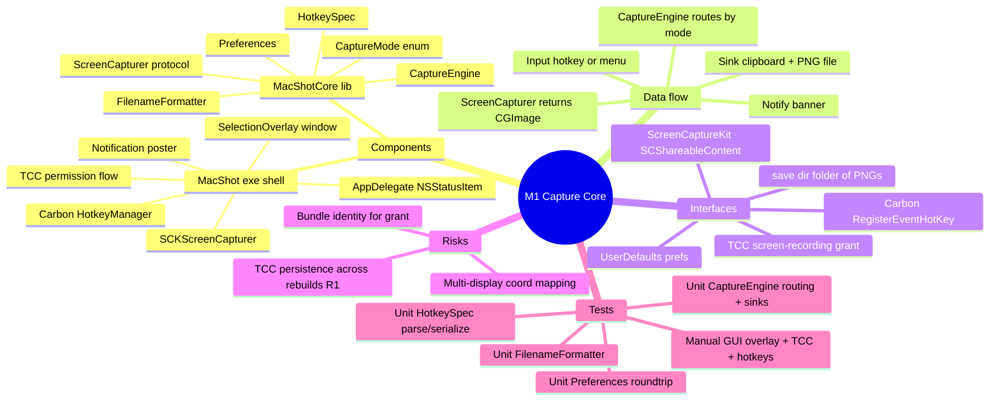

# Spec — M1: Capture Core

> Milestone M1 of `docs/roadmaps/2026-07-21-macshot.md`. Written autonomously under `/dev --auto`; open questions resolved with reversible defaults (see `.dev/memory/decisions.md` → phase1/brainstorm). No graphify graph (greenfield) — context is the roadmap + memory, not file reads.

## Mind map

## Purpose

A menu-bar-resident macOS app that captures area / window / fullscreen screenshots via global hotkeys (or a menu item), copies the result to the clipboard, saves a PNG to a configured folder, and posts a notification. Success = the author retires the system `⌘⇧4` on their own machine for a week. Foundation for all later milestones.

## Scope

**In:** menu-bar `NSStatusItem`, global hotkeys (area/window/fullscreen), the three capture modes, save-to-clipboard + save-to-file, TCC first-run permission flow, basic preferences (save directory, filename format, hotkeys, after-capture toggle), a selection overlay for area/window modes, a first-capture notification.

**Out (the contract):** quick-access overlay, annotation editor, OCR, beautify, history browser, pinned screenshots — all later milestones. Any post-capture UI beyond a notification banner.

## Architecture

SwiftPM package, two targets + tests:

- **`MacShotCore`** (library, 100% headless-testable): all logic with no AppKit/SCK/Carbon symbols leaking into public API except via protocols.
  - `CaptureMode` — `.area(Rect?)`, `.window(id?)`, `.fullscreen(displayID?)`.
  - `ScreenCapturer` protocol — `func capture(_ mode: CaptureMode) async throws -> CGImage`. Real impl (`SCKScreenCapturer`) lives in the exe; a `FakeCapturer` in tests returns a canned image.
  - `CaptureEngine` — the single entry point. Takes a `ScreenCapturer` + `CaptureSink` + `Preferences`; routes any mode, then fans out to sinks (clipboard, file) and returns metadata.
  - `CaptureSink` protocol — `clipboard(CGImage)`, `writePNG(CGImage, to: URL) throws -> URL`. Test fake records calls.
  - `FilenameFormatter` — expands a format string (e.g. `Screenshot {date} at {time}`) + timestamp → sanitized filename, dedupes collisions with ` (n)`.
  - `Preferences` — `UserDefaults`-backed: save dir, filename format, per-mode `HotkeySpec`, after-capture toggle. Pure struct + a store protocol so tests use an in-memory store.
  - `HotkeySpec` — `{ keyCode: UInt32, modifiers: UInt32 }` with parse (`⌘⇧2`) / serialize; maps to Carbon `EventHotKeyID`.

- **`MacShot`** (executable, thin GUI shell — manually verified, not unit-tested):
  - `AppDelegate` — `LSUIElement` agent app; builds the `NSStatusItem` menu (Capture Area / Window / Fullscreen / Preferences… / Quit).
  - `HotkeyManager` — hand-rolled Carbon `RegisterEventHotKey` (~50 LOC); each registered hotkey invokes `CaptureEngine`.
  - `SCKScreenCapturer` — ScreenCaptureKit impl of `ScreenCapturer`; enumerates `SCShareableContent`, captures full display / a window / a cropped area.
  - `SelectionOverlay` — borderless full-screen `NSWindow` per display: dim, crosshair, live dimension readout, magnifier loupe, drag rectangle, Space-reposition, Esc-cancel. Window mode: highlight the window under cursor, click to pick.
  - `PermissionFlow` — on launch/first capture, check `CGPreflightScreenCaptureAccess()`; if not granted, `CGRequestScreenCaptureAccess()` and guide the user to System Settings.
  - `Notifier` — `UserNotifications` banner after capture.
  - `PreferencesWindow` — minimal SwiftUI form (save dir picker, filename format field, after-capture toggle). Hotkey editing is a plain text field in M1; the recorder UI is M6.

`Scripts/make_app.sh` — builds release, assembles `MacShot.app/Contents/{MacOS/MacShot, Info.plist, Resources}`. `Info.plist`: `LSUIElement=true`, bundle id `com.omerronen.macshot`, `CFBundleName=MacShot`. Ad-hoc codesign for local dev (real Developer ID signing is M6). No sandbox entitlement.

## Data flow

hotkey / menu → `CaptureEngine.capture(mode)` → (area/window) present `SelectionOverlay`, resolve target rect/window → `SCKScreenCapturer.capture` → `CGImage` → `CaptureSink`: copy to `NSPasteboard` **and** write PNG to `Preferences.saveDir` via `FilenameFormatter` → `Notifier` banner. Fullscreen skips the overlay.

## Interfaces

- **ScreenCaptureKit** — `SCShareableContent`, `SCScreenshotManager` (or `SCStream` single-frame). External, permission-gated.
- **TCC** — screen-recording grant via `CGPreflight/RequestScreenCaptureAccess`. No Info.plist usage-description key (screen recording is prompted by the system, not declared). Grant keyed to the signed bundle identity — hence a stable bundle id (R1).
- **Carbon** — `RegisterEventHotKey` / `EventHotKeyID` for global hotkeys.
- **Filesystem** — save dir is a user-chosen folder of PNGs (security-scoped bookmark since no sandbox is trivial, but store the path).
- **UserDefaults** — preferences.

## Error handling

- TCC not granted → capture aborts, notification explains, opens the Screen Recording pane. No crash.
- Save dir unwritable/missing → fall back to `~/Pictures/MacShot` (created on demand); surface in notification.
- Filename collision → append ` (n)`.
- No window under cursor (window mode) / zero-area drag → cancel silently, no file written.
- Capture API throws → notification with the error; engine returns a failure result, no partial file.

## Testing

Unit (`swift test`, headless, TDD-before-commit):
- `CaptureEngine`: each mode routes to the capturer, both sinks fire on success, no sink fires on capturer error, metadata is populated.
- `FilenameFormatter`: format expansion, sanitization, collision dedupe.
- `Preferences`: roundtrip through the in-memory store; defaults when unset.
- `HotkeySpec`: parse/serialize symmetry, Carbon modifier mapping.

Manual (human DoD): install `MacShot.app`, grant TCC, verify all three hotkeys, overlay interactions (crosshair/magnifier/window-highlight/Esc), clipboard + file output, notification. Author uses it for a week in place of `⌘⇧4`.

## Open questions

None blocking — all M1 open questions resolved with reversible `[auto]` defaults (app name, hotkey defaults, selection UI, window-highlight UX; see decisions.md). Final app name/icon and hotkey-recorder UI are explicitly M6. TCC-persistence (R1) is validated during M1 manual acceptance, not automatable.
