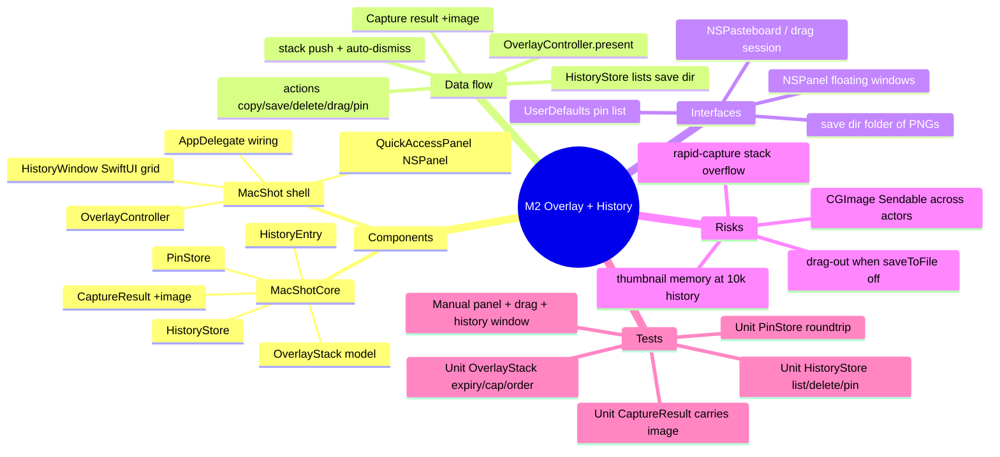

# Spec — M2: Quick-Access Overlay & History

> Milestone M2 of `docs/roadmaps/2026-07-21-macshot.md`. Written autonomously under `/dev --auto`; open questions (overlay stacking, history layout) resolved with reversible `[auto]` defaults (see `.dev/memory/decisions.md` → phase2/brainstorm). Stacks on M1 branch `exec/m1-capture-core-20260721`. No graphify graph — M1 API read directly from the worktree.

## Mind map

## Purpose

Turn every capture into an actionable moment: a floating **Quick-Access Panel** appears at capture, offering instant copy / save / delete / drag-out / pin without touching Finder. A **History** window browses the folder of saved PNGs (newest first, pinned on top). Definition of done: capture → drag into Slack/mail without opening Finder.

## Scope

**In:** post-capture floating panel with per-capture actions; vertical stacking + auto-dismiss for rapid captures; History browser window (grid of thumbnails); pinned screenshots; menu "History…" item; overlay replaces the M1 success notification.

**Out (the contract):** any editing/annotation (M3), beautify (M4), OCR (M5), multi-select bulk operations, cloud/sharing. The panel exposes an "Edit" affordance only from M3 onward.

## Architecture

Stacks on M1. New **MacShotCore** (testable) types:

- `CaptureResult` **(modify)** — add `image: CGImage`; mark the struct `@unchecked Sendable` (CGImage is immutable + thread-safe, merely un-annotated). Engine already holds the image; populate it.
- `OverlayStack` — pure model of the on-screen panel stack. `push(id:at:)`, `visible(at:) -> [PanelSlot]` applying auto-expiry (default 8s), a visible cap (5, older collapse), newest-at-bottom order, and `keepAlive(id:)` (hover pauses that panel's timer). Injected `now`/clock — no wall-clock in the type.
- `HistoryEntry` — value type: `url`, `filename`, `captureDate` (file modification date), `isPinned`.
- `HistoryStore` — over a directory URL + a `PinStore`: `entries() -> [HistoryEntry]` (PNGs in the save dir, sorted newest-first, pinned surfaced), `delete(_:)` (removes the file), `pin(_:)`/`unpin(_:)`. Filesystem + KV — tested against a temp dir.
- `PinStore` — pinned paths persisted as a `[String]` in the M1 `KeyValueStore` (UserDefaults in prod, in-memory in tests). `pins() -> Set<String>`, `add`, `remove`.

New **MacShot** shell (manual-verified — AppKit/drag/NSPanel can't run headless):

- `QuickAccessPanel` — a borderless non-activating `NSPanel` at `.floating` level rendering the thumbnail + action buttons (Copy, Save As…/Reveal, Delete, Pin) and acting as an `NSDraggingSource` (drag the file URL out; write a temp PNG on demand if `fileURL` is nil).
- `OverlayController` — owns live panels, positions them per `OverlayStack.visible(...)` in the chosen screen corner, runs the auto-dismiss timers (pausing on hover), and routes button actions to `HistoryStore`/pasteboard.
- `HistoryWindow` — SwiftUI window: `LazyVGrid` of thumbnails newest-first, a pinned row on top, per-item context actions mirroring the panel. Thumbnails loaded lazily/downsampled to bound memory at ~10k entries.
- `AppDelegate` **(modify)** — after `engine.capture(...)`, call `overlayController.present(result)` instead of the success banner; keep `Notifier` for errors; add a "History…" menu item opening `HistoryWindow`.

Delete orphan `Sources/MacShotCore/Placeholder.swift` (M1 scaffold).

## Data flow

hotkey/menu → M1 `CaptureEngine.capture` → `CaptureResult{image,fileURL,...}` → `OverlayController.present(result)` → `OverlayStack.push` → `QuickAccessPanel` rendered in corner, auto-dismiss armed. User action on panel → Copy (`NSPasteboard`) / Delete (`HistoryStore.delete`) / Pin (`PinStore.add`) / Drag-out (drag session with the file URL). Separately: menu "History…" → `HistoryWindow` → `HistoryStore.entries()` → grid; item actions reuse the same store.

## Interfaces

- **Filesystem** — save dir (folder of PNGs) is the single source of truth for history; delete removes files.
- **UserDefaults** — pinned path list (via `PinStore`/`KeyValueStore`).
- **NSPasteboard / NSDraggingSession** — copy + drag-out.
- **NSPanel** — floating non-activating panels (so capture focus isn't stolen).

## Error handling

- `CaptureResult.fileURL == nil` (saveToFile off) → Copy/Drag still work (drag writes a temp PNG); Delete is a no-op/disabled; panel still shows the image.
- File already deleted externally when an action fires → `HistoryStore` skips gracefully, refreshes the list, no crash.
- Save dir unreadable → History window shows an empty state + a "choose folder" hint (reuses M1 prefs).
- Panel stack overflow (rapid captures) → `OverlayStack` caps visible panels; excess collapse (still in History), no unbounded window creation.

## Testing

Unit (`swift test`, headless TDD-before-commit):
- `OverlayStack`: expiry at the threshold, hover keep-alive pauses expiry, visible cap collapses oldest, newest-at-bottom ordering, push/dismiss.
- `HistoryStore`: lists only PNGs newest-first, pinned surfaced on top, `delete` removes the file + drops the entry, pin/unpin toggles `isPinned`.
- `PinStore`: add/remove/roundtrip through in-memory store; dedupe.
- `CaptureResult`: engine populates `image` with correct dimensions (extend M1 `CaptureEngineTests`).

Manual (human DoD): capture → panel appears bottom-right; Copy pastes elsewhere; drag-out drops the PNG into Slack/mail; rapid captures stack + auto-dismiss; History window shows the grid, pin sticks a shot to the top, delete removes it from disk.

## Open questions

None blocking — stacking behavior and history layout resolved with reversible `[auto]` defaults. Thumbnail memory strategy at 10k entries is a known perf watch item (downsample-on-load), validated during manual acceptance, not a blocker.
