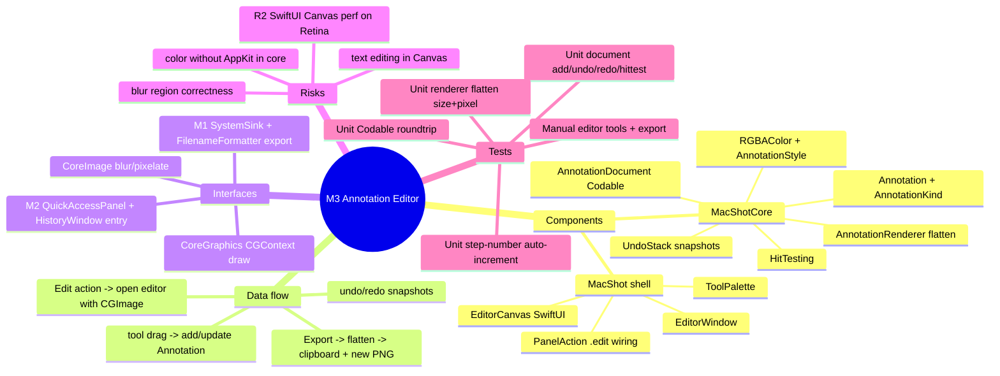

# Spec — M3: Annotation Editor

> Milestone M3 of `docs/roadmaps/2026-07-21-macshot.md`. Autonomous under `/dev --auto`; open questions (toolbar UX, shortcuts, default styles) resolved with reversible `[auto]` defaults (see `.dev/memory/decisions.md` → phase3/brainstorm). Stacks on M2 branch `exec/m2-overlay-history-20260721`. No graphify graph — M1/M2 API read from the worktree.

## Mind map

## Purpose

Mark up any capture without leaving the app: arrows, shapes, text, highlighter, blur/pixelate, numbered steps, with undo/redo. Annotations are a **non-destructive vector document** over the base image; export flattens to a new PNG + clipboard. Definition of done: an annotated bug report produced end-to-end in-app.

## Scope

**In:** the seven annotation tools; selection/move/resize; undo/redo; z-order; step-number auto-increment; a flatten-to-PNG export (non-destructive); editor opened from the M2 overlay/history Edit action; tool palette + keyboard shortcuts.

**Out (the contract):** beautify styling/backgrounds (M4), OCR (M5), AI (smart blur/alt-text), cross-session annotation persistence (sidecar deferred), multi-capture batch editing.

## Architecture

Stacks on M2. All logic in **MacShotCore** (headless-testable — CoreGraphics/CoreImage render without a GUI); only the live canvas is the manual GUI shell.

**MacShotCore (new):**
- `RGBAColor` — `{r,g,b,a: Double}`, AppKit-free; `cgColor` computed. Keeps core free of NSColor (M1 lesson: core stays headless).
- `AnnotationStyle` — `strokeColor: RGBAColor`, `fillColor: RGBAColor?`, `lineWidth: Double`, `fontSize: Double`.
- `AnnotationKind` — `arrow(from:CGPoint,to:CGPoint)`, `rectangle(CGRect)`, `ellipse(CGRect)`, `text(CGRect,String)`, `highlighter(CGRect)`, `blur(CGRect, radius:Double, pixelate:Bool)`, `stepNumber(center:CGPoint, number:Int)`.
- `Annotation` — `{id: UUID, kind: AnnotationKind, style: AnnotationStyle}`, `Identifiable`, `Codable`. `boundingBox: CGRect` + `contains(_ point:) -> Bool` for hit-testing.
- `AnnotationDocument` — `{baseSize: CGSize, annotations: [Annotation]}`, `Codable`. Mutations: `add`, `remove(id:)`, `update(id:transform:)`, `moveToFront(id:)`; `nextStepNumber` (= count of stepNumber kinds + 1); `hitTest(_ point:) -> UUID?` (top-most).
- `UndoStack` — snapshot stack of `[Annotation]`: `record(_:)` before a mutation, `undo()`, `redo()`, `canUndo/canRedo`. New action clears the redo branch.
- `AnnotationRenderer` — `flatten(base: CGImage, document: AnnotationDocument) -> CGImage`: bitmap `CGContext` sized to the base; draw base, then each annotation in z-order (arrow with head, stroked/filled shapes, `CTLine`/`NSAttributedString`-free text via CoreText, highlighter as multiply-blended translucent rect, blur/pixelate via `CIGaussianBlur`/`CIPixellate` clipped to the region, step number as filled circle + centered digit). Returns the composited image.

**MacShot shell (new/modified, manual gate):**
- `EditorWindow` — `NSWindow` hosting the editor; constructed with a base `CGImage`, a `SystemSink`, and `Preferences` for export.
- `EditorCanvas` — SwiftUI view: renders the base + live annotations (SwiftUI `Canvas`), routes drag gestures to create/move/resize the active tool's element, hosts an inline text field for the text tool, shows live blur preview. Bound to an `AnnotationDocument` + `UndoStack` (as `@Observable` view state).
- `ToolPalette` — tool row (Select/Arrow/Rect/Ellipse/Text/Highlighter/Blur/Step), color well, width stepper, Undo/Redo, Done/Export; keyboard shortcuts wired.
- Integration **(modify)**: add `.edit` to M2 `PanelAction`; `QuickAccessPanel` gets an Edit button; `HistoryWindow` gets a per-item Edit action; `AppDelegate` opens `EditorWindow` on `.edit` with the capture's `CGImage` (from `result.image` or loaded from `fileURL`).

## Data flow

Edit action (panel/history) → `AppDelegate` opens `EditorWindow(base: image)` → user picks a tool, drags → `AnnotationDocument.add/update` (each mutation `UndoStack.record`s first) → `EditorCanvas` re-renders live → ⌘Z/⌘⇧Z traverse the undo stack → **Export**: `AnnotationRenderer.flatten(base, document)` → `SystemSink.copyToClipboard` + `writePNG(..., mode "annotated")` into the save dir (new file; original untouched).

## Interfaces

- **CoreGraphics** — `CGContext` bitmap for flatten; drawing primitives.
- **CoreImage** — `CIGaussianBlur` / `CIPixellate` for the blur tool.
- **CoreText** — text rendering in flatten (no AppKit in core).
- **M1** — `SystemSink` (clipboard + PNG), `FilenameFormatter` (export name), `Preferences` (save dir).
- **M2** — `PanelAction.edit`, `QuickAccessPanel`, `HistoryWindow` as the editor entry points.

## Error handling

- Empty document export → flatten returns the base image unchanged (valid PNG), no error.
- Blur region outside image bounds → clamp to the base rect before filtering; skip if zero-area.
- Text annotation with empty string → dropped on commit (no invisible element left in the doc).
- Undo with empty stack → no-op (`canUndo` guards the UI).
- Export write failure (dir gone) → falls back to `~/Pictures/MacShot` (reusing M1 behavior) + error banner via `Notifier`.
- CoreImage filter failure → annotation skipped, rest of the flatten proceeds; logged, not fatal.

## Testing

Unit (`swift test`, headless TDD-before-commit):
- `AnnotationDocument`: add/remove/update, z-order `moveToFront`, `hitTest` returns top-most, `nextStepNumber` auto-increments.
- `UndoStack`: record→undo restores prior snapshot, redo re-applies, new action clears redo, `canUndo/canRedo` flags.
- `AnnotationRenderer.flatten`: output size == base size; a red rectangle annotation flattened over a white base → the pixel at the rect center is red-dominant; blur region differs from the source region (variance/known-pixel check); empty doc → equals base dimensions.
- `Annotation`/`AnnotationDocument` `Codable`: encode→decode roundtrip preserves kinds + styles.

Manual (human DoD): open editor from the overlay/history; place each of the 7 tools; move/resize/delete; undo/redo; blur a region; add numbered steps; Export → annotated PNG in the save dir + on the clipboard; produce a real annotated bug report end-to-end. Verify SwiftUI Canvas perf on a Retina-sized capture (R2 verdict); note if the CALayer fallback is needed.

## Open questions

None blocking — toolbar, shortcuts, and default styles resolved with reversible `[auto]` defaults. R2 (Canvas perf) is a manual-acceptance verdict, not an automatable gate; the flatten renderer (the perf-independent export path) is fully unit-tested regardless.
