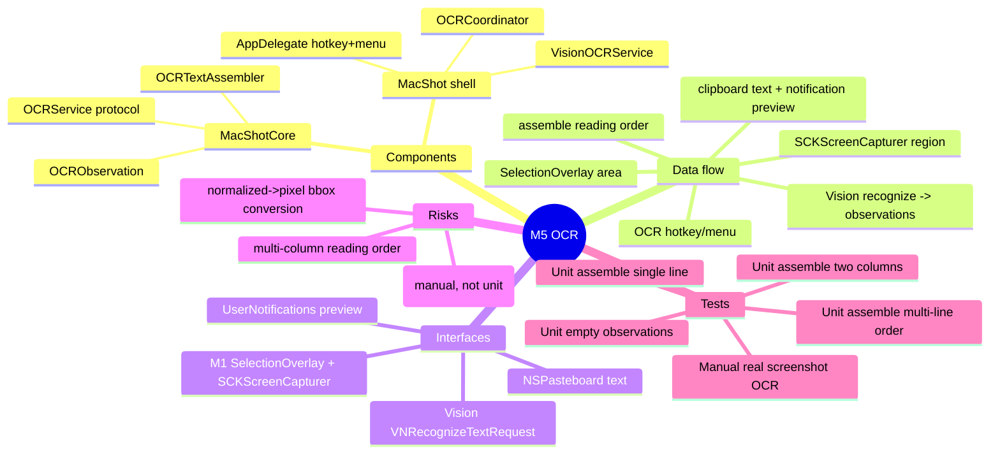

# Spec — M5: OCR

> Milestone M5 of `docs/roadmaps/2026-07-21-macshot.md`. Autonomous under `/dev --auto`; open questions (column handling, result-review UI) resolved with reversible `[auto]` defaults (see `.dev/memory/decisions.md` → phase5/brainstorm). Depends on **M1 only** (parallel-safe with M3/M4) but stacked on M4 branch `exec/m4-beautify-20260721` for a single linear stack. No graphify graph — M1 API read from the worktree.

## Mind map

## Purpose

Capture-to-text as a first-class capture mode: hotkey → select an area → recognized text lands on the clipboard, with a notification previewing the result. 100% on-device (Vision framework). Definition of done: text lifted from a screenshot of a terminal error, pasted clean.

## Scope

**In:** an OCR capture mode (hotkey + menu item), area selection (reused from M1), on-device Vision recognition with automatic language detection, reading-order text assembly (multi-line + basic multi-column), copy-to-clipboard, and a notification with a text preview.

**Out (the contract):** searchable history by text content, live-text hover, translation, a full result-review/edit window (silent copy + preview only), any cloud/AI. OCR does not go through `CaptureEngine` (which is image-only) and writes no PNG.

## Architecture

Depends on M1; stacked on M4. Pure logic in **MacShotCore**; Vision + wiring in the shell.

**MacShotCore (new, TDD):**
- `OCRObservation` — `{ text: String, boundingBox: CGRect, confidence: Double }` (Vision-free value; boundingBox in image pixel space).
- `OCRService` — protocol `func recognize(_ image: CGImage) async throws -> [OCRObservation]`. Real impl in the shell; a fake in tests.
- `OCRTextAssembler` — `assemble(_ observations: [OCRObservation]) -> String`: cluster observations into columns by horizontal gaps, order columns left→right, order lines within a column top→bottom (image y descending), join with `\n`; trims empties. Deterministic → fully unit-tested with synthetic observations.

**MacShot shell (new/modified, manual gate):**
- `VisionOCRService` (new) — implements `OCRService` via `VNRecognizeTextRequest` (`.accurate`, `usesLanguageCorrection = true`, `automaticallyDetectsLanguage = true`), running on the captured `CGImage`. Converts each `VNRecognizedTextObservation`'s normalized boundingBox (0–1, bottom-left origin) into pixel-space `CGRect` for the assembler.
- `OCRCoordinator` (new) — the sibling flow: present M1 `SelectionOverlay` in `.area(nil)` mode → on a resolved `.area(rect)`, call `SCKScreenCapturer.capture(.area(rect))` → `VisionOCRService.recognize` → `OCRTextAssembler.assemble` → write the text to `NSPasteboard` → `Notifier` banner with a preview (first ~80 chars). Cancel/empty selection → no-op.
- `AppDelegate` (modify) — register an OCR hotkey (default `⌃⌘⇧O`) and add a "Capture Text (OCR)" menu item, both invoking `OCRCoordinator.run()`.

## Data flow

OCR hotkey/menu → `OCRCoordinator.run()` → `SelectionOverlay.present(.area(nil))` → `.area(rect)` → `SCKScreenCapturer.capture(.area(rect))` → `CGImage` → `VisionOCRService.recognize` → `[OCRObservation]` → `OCRTextAssembler.assemble` → `String` → `NSPasteboard.general` (string) + `Notifier` preview banner.

## Interfaces

- **Vision** — `VNRecognizeTextRequest` / `VNImageRequestHandler`, on-device.
- **M1** — `SelectionOverlay` (area selection), `SCKScreenCapturer` (region capture), `Notifier` (banner).
- **NSPasteboard** — recognized text to the clipboard.

## Error handling

- No text found → notification "No text recognized"; clipboard untouched.
- TCC not granted (screen recording) → reuse M1 `PermissionFlow` path before capture; abort with guidance.
- Vision request throws → notification with the error; no clipboard change.
- Empty/cancelled area selection → silent no-op (no capture, no recognition).
- Normalized→pixel conversion guards against zero-size crops (skips them).

## Testing

Unit (`swift test`, headless TDD-before-commit):
- `OCRTextAssembler`: single observation → its text; three stacked lines → joined top-to-bottom in reading order; two side-by-side columns → left column fully, then right column (not interleaved); empty input → empty string; low-confidence still included (assembly is order-only, not filtering).
- `OCRObservation`: value semantics / Equatable if used in assertions.

Manual (human DoD): OCR hotkey → select a terminal-error screenshot region → recognized text on the clipboard, pasted clean; notification shows a preview; multi-language text auto-detected; a two-column layout reads in a sensible order. (Vision accuracy is validated here, not in unit tests — the deterministic assembler carries the automated coverage.)

## Open questions

None blocking — column handling and result-review UI resolved with reversible `[auto]` defaults. Vision recognition accuracy is inherently a manual-acceptance concern; the reading-order assembler (the part we control) is fully unit-tested.
