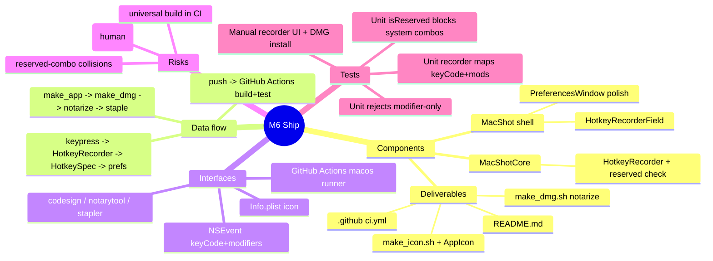

# Spec — M6: Ship

> Milestone M6 of `docs/roadmaps/2026-07-21-macshot.md`. Autonomous under `/dev --auto`; open questions (final name/icon, repo visibility) resolved with reversible `[auto]` defaults (see `.dev/memory/decisions.md` → phase6/brainstorm). Stacks on M5 branch `exec/m5-ocr-20260721`. No graphify graph — M1 API read from the worktree.
>
> **No escalation:** the roadmap already fixes the shipping design (Developer ID + notarytool + GitHub Actions). Notarization credentials are a human runtime input for the DoD, not a design fork — M6 produces all artifacts and stays buildable/testable; the notarized-DMG run is manual acceptance.

## Mind map

## Purpose

Make MacShot installable, signed, and distributable: a polished settings window with a real hotkey recorder, a notarized-DMG build script, GitHub Actions CI (build + tests), and a README. Definition of done: a friend installs the DMG on their Mac and captures successfully, no Xcode involved.

## Scope

**In:** hotkey-recorder UI + reserved-combo guard, full preferences surface (all prefs incl. the M5 OCR hotkey), a `make_dmg.sh` that codesigns with Developer ID + notarizes + staples, a placeholder app icon + `make_icon.sh`, a GitHub Actions CI workflow, a README.

**Out (the contract):** Sparkle auto-update, a marketing website, licensing/payments, App Store distribution. Final app name/icon artwork are deferred (working title MacShot + placeholder icon ship now).

## Architecture

Stacks on M5. One new testable core type; the rest is GUI polish + build/CI deliverables.

**MacShotCore (new, TDD):**
- `HotkeyRecorder` — pure conversion + validation:
  - `spec(fromKeyCode keyCode: UInt32, cocoaModifierRawValue: UInt) -> HotkeySpec?` — map Cocoa `NSEvent.ModifierFlags` raw bits (⌘/⇧/⌥/⌃) to `HotkeyModifiers`, reverse the M1 `HotkeySpec.keyCodes` map (Carbon keyCode → label), and return a `HotkeySpec`; `nil` if modifier-only or the keyCode is unmapped.
  - `isReserved(_ spec: HotkeySpec) -> Bool` — true for macOS system screenshot combos (⌘⇧3/4/5/6) so the recorder can reject them.

**MacShot shell (new/modified, manual gate):**
- `HotkeyRecorderField` (new) — an AppKit/SwiftUI field that, when focused, captures the next key-down `NSEvent`, feeds `keyCode`+`modifierFlags.rawValue` to `HotkeyRecorder.spec(...)`, rejects `nil`/reserved (with a shake/beep), and writes the resulting `HotkeySpec.description` to prefs.
- `PreferencesWindow` (modify M1) — replace the plain hotkey text fields with `HotkeyRecorderField`s for area/window/fullscreen **and** the M5 OCR hotkey; surface all prefs (save dir, filename format + live preview, after-capture toggles). 

**Deliverables (authored; run by the human/CI, not headless here):**
- `Scripts/make_icon.sh` (new) — generate a placeholder `AppIcon.icns` from a single rendered PNG via `iconutil`; `make_app.sh` (modify) copies it into `Contents/Resources` and Info.plist gains `CFBundleIconFile`.
- `Scripts/make_dmg.sh` (new) — `codesign --deep --options runtime --sign "$DEVELOPER_ID_APP"` the app, build a DMG (`hdiutil create`), `xcrun notarytool submit --keychain-profile "$AC_NOTARY_PROFILE" --wait`, `xcrun stapler staple`. Env-parameterized on the credential names; `set -euo pipefail`; validated with `bash -n`.
- `.github/workflows/ci.yml` (new) — `macos-latest`: checkout, select Xcode, `swift build`, `swift test`.
- `README.md` (new) — what MacShot is, features (M1–M5), build-from-source (`swift build` / `make_app.sh`), install (the notarized DMG), and the Developer-ID prerequisite for producing a signed build.

## Data flow

**Hotkey recording:** field focused → next `NSEvent` (keyCode + modifierFlags) → `HotkeyRecorder.spec(...)` → reject if nil/reserved, else write `HotkeySpec.description` to `Preferences` → `HotkeyManager` re-registers.
**Distribution:** `make_app.sh` (universal `.app` + icon) → `make_dmg.sh` (codesign → DMG → notarytool → staple) → distributable DMG.
**CI:** push → GitHub Actions macOS runner → `swift build` + `swift test`.

## Interfaces

- **NSEvent** — keyCode + `ModifierFlags.rawValue` for recording.
- **codesign / notarytool / stapler** — Developer-ID signing + notarization (human credentials).
- **iconutil / hdiutil** — icon + DMG packaging.
- **GitHub Actions** — macOS runner CI.
- **M1** — `HotkeySpec`, `Preferences`, `HotkeyManager`, `make_app.sh`, `Info.plist`.

## Error handling

- Recorder gets a modifier-only or unmapped key → `spec(...)` returns nil → field rejects (no pref change), gives feedback.
- Recorder gets a reserved system combo → `isReserved` true → rejected with a message.
- `make_dmg.sh` with missing `DEVELOPER_ID_APP`/`AC_NOTARY_PROFILE` → fail fast with a clear message (don't produce an unsigned DMG silently).
- Notarization rejection → the script surfaces `notarytool` log; does not staple.
- CI: a failing `swift test` fails the workflow (non-zero exit) — the intended gate.

## Testing

Unit (`swift test`, headless TDD-before-commit):
- `HotkeyRecorder.spec(...)`: a known keyCode + ⌘⇧ bits → the expected `HotkeySpec` (`⌘⇧` + label); modifier-only (no key) → nil; unmapped keyCode → nil.
- `HotkeyRecorder.isReserved`: ⌘⇧3/4/5 → true; ⌃⌘⇧2 (an app default) → false.

Static checks (deliverables): `bash -n Scripts/make_dmg.sh` and `bash -n Scripts/make_icon.sh` parse clean; `.github/workflows/ci.yml` is valid YAML.

Manual (human DoD): open Preferences → record a new hotkey via the recorder field (incl. OCR), reserved combos rejected; run `make_app.sh` then `make_dmg.sh` **with a Developer ID** → a notarized DMG; a friend installs the DMG on their Mac and captures — no Xcode. Push to GitHub → CI green.

## Open questions

None blocking. Final name (kept: MacShot), icon (placeholder now), and repo visibility (author's call at push; no remote yet) are reversible `[auto]` defaults. The **only external prerequisite** is an Apple Developer ID for the notarization/DoD step — a human runtime input, prominently flagged in the README and the final report, not a design fork.
