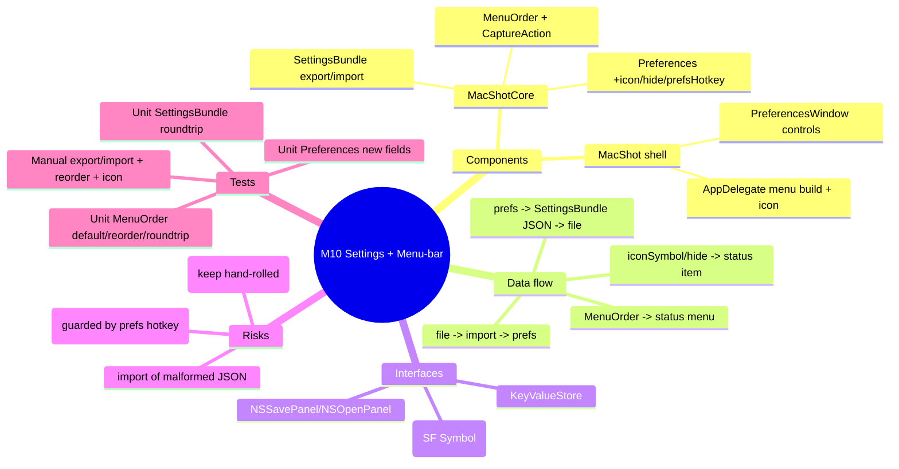

# Spec — M10: Settings & Menu-Bar Polish

> Milestone M10 of `docs/roadmaps/2026-07-23-macshot-v2.md`. Autonomous under `/dev --auto`; open questions resolved with reversible `[auto]` defaults (see `.dev/memory/decisions.md` → phase10). Builds on M1 + M6; stacks on M9 branch `exec/m9-qr-barcode-20260723`. No graphify graph — M1/M6 API known from building it.

## Mind map

## Purpose

Settings management + menu-bar customization: export/import all preferences to a JSON file, reorder the capture actions in the menu-bar menu, choose a custom menu-bar icon (or hide it), and keep the existing hand-rolled updater (Sparkle evaluated and declined).

## Scope

**In:** settings export/import (JSON); configurable menu-bar action order; SF-Symbol menu-bar icon + hide toggle (with a preferences-hotkey lockout guard); the Sparkle-vs-hand-rolled decision (→ keep hand-rolled).

**Out (the contract):** cloud/upload settings (M14), any new capture/editor features, an actual Sparkle integration.

## Architecture

Testable logic in **MacShotCore**; UI + menu wiring in the shell.

**MacShotCore (new / modified, TDD):**
- `SettingsBundle` — `static func export(_ prefs: Preferences) -> Data` (a flat JSON object of the exportable pref keys via the `KeyValueStore`) and `static func `import`(_ data: Data, into prefs: Preferences)` (set each present key). Excludes the screenshot history (a folder) and any secret keys; includes format/hotkeys/toggles/capture/loupe/menu prefs. A static `exportableKeys` list defines the surface.
- `MenuOrder` — `enum CaptureAction: String, Codable, CaseIterable { case area, window, fullscreen, ocr, lastArea }`; `struct MenuOrder { var items: [CaptureAction]; static var `default`: MenuOrder (canonical order); mutating func move(from: Int, to: Int) }` — `Codable`, persisted via the store (`Preferences.menuOrder`).
- `Preferences` **(modify)** — add `menuBarIconSymbol: String` (default `"camera.viewfinder"`), `hideMenuBarIcon: Bool` (false), `preferencesHotkey: String` (`"⌃⌘⇧,"`), and `menuOrder: MenuOrder` (stored as the Codable JSON of the action list).

**MacShot shell (modify, `swift build` + manual gate):**
- `PreferencesWindow` — a "General" section: Export Settings… (`NSSavePanel` → `SettingsBundle.export`), Import Settings… (`NSOpenPanel` → `SettingsBundle.import` then reload the model); a menu-bar subsection: a reorderable `List` of `CaptureAction` (drag to reorder → `Preferences.menuOrder`), an SF-Symbol name `TextField` with a live `Image(systemName:)` preview, a "Hide menu-bar icon" toggle, and a `HotkeyRecorderField` for the preferences hotkey.
- `AppDelegate` — build the status-menu capture items in `prefs.menuOrder` order; set the `NSStatusItem` button image from `prefs.menuBarIconSymbol` (`NSImage(systemSymbolName:)`), falling back to the default symbol if invalid; if `hideMenuBarIcon`, remove the status item but register the global `preferencesHotkey` (id 6) → open Preferences (never lock the user out). Re-apply on prefs change.

## Data flow

**Export:** Preferences → `SettingsBundle.export` → JSON `Data` → `NSSavePanel` file. **Import:** file → `SettingsBundle.import(into:)` → prefs updated → model reload → hotkeys/menu re-applied. **Menu:** `prefs.menuOrder` → AppDelegate builds items in order. **Icon:** `prefs.menuBarIconSymbol`/`hideMenuBarIcon` → status item image or removal + prefs-hotkey.

## Interfaces

- **AppKit** — `NSSavePanel`/`NSOpenPanel`, `NSStatusItem`, `NSImage(systemSymbolName:)`, `HotkeyRecorderField`.
- **KeyValueStore/UserDefaults** — pref storage; `SettingsBundle` roundtrips through it.
- **M6** — `HotkeyManager`/`HotkeyRecorderField` reused for the prefs hotkey.

## Error handling

- Malformed/foreign import JSON → validate keys; apply only recognized ones; ignore the rest; never crash.
- Invalid SF-Symbol name → fall back to the default symbol (menu item still shows).
- `hideMenuBarIcon` on → status item removed but the preferences hotkey remains registered (guaranteed access).
- Import that omits keys → those prefs keep their current values (partial import is fine).
- Empty/duplicate `menuOrder` after import → normalize to include every `CaptureAction` once (default order for any missing).

## Testing

Unit (`swift test`, headless TDD):
- `SettingsBundle`: set several prefs → `export` → `import` into a fresh `Preferences(InMemoryKVStore)` → all values match; foreign/extra JSON keys ignored; missing keys leave defaults.
- `MenuOrder`: `.default` lists all `CaptureAction`s once; `move(from:to:)` reorders; Codable roundtrip; normalization fills a missing action.
- `Preferences`: roundtrip `menuBarIconSymbol`, `hideMenuBarIcon`, `preferencesHotkey`, `menuOrder`; defaults when unset.

Manual (human DoD): export settings to a file, change some, import to restore; reorder the menu items and see the menu reflect it; set a custom SF-Symbol icon and preview it; hide the icon and confirm the preferences hotkey still opens settings.

## Open questions

None blocking — Sparkle declined (keep hand-rolled), icon picker is a name field + preview, export is flat JSON, and the hide-icon lockout is guarded by the preferences hotkey. All reversible `[auto]`.
