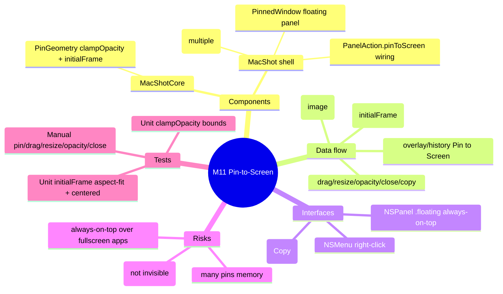

# Spec — M11: Pin-to-Screen

> Milestone M11 of `docs/roadmaps/2026-07-23-macshot-v2.md`. Autonomous under `/dev --auto`; open questions resolved with reversible `[auto]` defaults (see `.dev/memory/decisions.md` → phase11). Reuses the M2 floating-panel pattern; stacks on M10 branch `exec/m10-settings-menubar-20260723`. No graphify graph — M2 API known from building it.

## Mind map

## Purpose

Pin a screenshot as a floating, always-on-top window so it stays visible while you work — draggable, resizable, opacity-adjustable, and closable, with multiple pins at once. Reference-app parity for "Pin to Screen".

## Scope

**In:** a "Pin to Screen" action from the quick-access overlay and the history window; a floating `PinnedWindow` (move/resize/opacity/copy/close); multiple simultaneous pins.

**Out (the contract):** annotating pinned windows, persisting pins across relaunch (ephemeral), snapping/tiling.

## Architecture

One tiny testable geometry helper in **MacShotCore**; the window + controller in the shell.

**MacShotCore (new, TDD):**
- `PinGeometry` — `static func clampOpacity(_ v: Double) -> Double` (clamp to `0.2...1.0`, so a pin never becomes invisible) and `static func initialFrame(imageSize: CGSize, screen: CGRect, maxFraction: CGFloat = 0.5) -> CGRect` (scale the image down to fit within `maxFraction` of the screen's smaller dimension, preserve aspect, center in `screen`).

**MacShot shell (new / modified, `swift build` + manual gate):**
- `PinnedWindow` — a borderless `NSPanel`, `level = .floating`, `collectionBehavior` incl. `.canJoinAllSpaces`/`.fullScreenAuxiliary` (visible over other spaces), `isMovableByWindowBackground = true` (drag), `styleMask` includes `.resizable` (corner resize), content = an `NSImageView` of the shot (aspect-fit). `alphaValue` = opacity. A right-click `NSMenu`: Opacity (25/50/75/100 %, via `PinGeometry.clampOpacity`), Copy (image → `NSPasteboard`), Close.
- `PinController` — holds `[PinnedWindow]`; `pin(_ image: CGImage)` creates one at `PinGeometry.initialFrame(...)` on the active screen and orders it front; removes on close.
- Wiring **(modify)** — add `case pinToScreen` to `PanelAction`; `QuickAccessPanel` gains a "Pin to Screen" button; `HistoryWindow` gains a per-item "Pin to Screen"; `OverlayController` gains `onPinToScreen: ((CGImage) -> Void)?` (routed from the panel action); `AppDelegate` constructs a `PinController` and wires overlay + history → `pinController.pin(image)`.

## Data flow

quick-access panel / history item → "Pin to Screen" → (`PanelAction.pinToScreen` / history callback) → `AppDelegate` → `PinController.pin(result.image or entry image)` → `PinnedWindow(frame: PinGeometry.initialFrame(...))` shown floating → user drags/resizes/sets opacity/copies/closes.

## Interfaces

- **AppKit** — `NSPanel` (floating, all-spaces), `NSImageView`, `NSMenu` (right-click), `NSPasteboard` (Copy).
- **M2** — `QuickAccessPanel`/`OverlayController`/`HistoryWindow` (entry points), `PanelAction`.

## Error handling

- Huge image → `initialFrame` caps to `maxFraction` of the screen (never larger than the display).
- Opacity slider/menu → `clampOpacity` floors at 0.2 (never invisible/unrecoverable).
- Close → window removed from `PinController` (no leak); closing all is safe.
- No active screen edge case → default to the main screen frame.

## Testing

Unit (`swift test`, headless TDD):
- `PinGeometry.clampOpacity`: `0.0→0.2`, `0.5→0.5`, `2.0→1.0`.
- `PinGeometry.initialFrame`: a 4000×2000 image on a 1440×900 screen → fits within `maxFraction` (≤720 wide by default), preserves ~2:1 aspect, centered (frame midpoint == screen midpoint).

Manual (human DoD): pin a shot from the overlay → it floats above other windows; pin another from history; drag + resize; lower opacity; Copy; Close; confirm multiple pins coexist and vanish on close (not restored after relaunch).

## Open questions

None blocking — interactions (drag/resize/right-click menu), ephemeral persistence, and the `.pinToScreen` naming resolved with reversible `[auto]` defaults.
