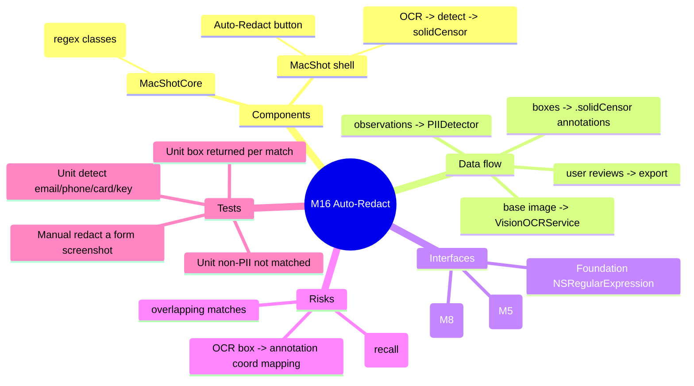

# Spec — M16: AI Auto-Redact

> Milestone M16 of `docs/roadmaps/2026-07-23-macshot-v2.md`. Autonomous under `/dev --auto`; open questions resolved with reversible `[auto]` defaults (see `.dev/memory/decisions.md` → phase16). Reuses M5 OCR + M8 solid censor; stacks on M11 branch `exec/m11-pin-to-screen-20260723`. No graphify graph — M5/M8 API known from building them.

## Mind map

## Purpose

One click to auto-censor sensitive data: OCR the image, detect PII (emails, phones, credit cards, long digit runs, API-key-like tokens), and drop opaque solid-censor bars over each match — as normal editor annotations the user can review/adjust before export. 100% on-device.

## Scope

**In:** `PIIDetector` (regex-based PII classification of OCR observations → redaction boxes); an editor "Auto-Redact" action that OCRs the base image, detects, and adds `.solidCensor` annotations.

**Out (the contract):** face/image redaction, cloud, translation, a separate review UI (the editor *is* the review). No change to OCR or the censor renderer (reused as-is).

## Architecture

Pure detection in **MacShotCore** (headless-tested); OCR + annotation wiring in the shell.

**MacShotCore (new, TDD):**
- `PIIDetector` — `static func detect(_ observations: [OCRObservation]) -> [CGRect]`: for each observation, if `matches(observation.text)`, include its `boundingBox`. `static func matches(_ text: String) -> Bool` is true if the text matches any PII class:
  - **email** `[\w.%+-]+@[\w.-]+\.[A-Za-z]{2,}`
  - **phone** loose: a run of 8+ digits allowing spaces/`()`/`-`/`+`
  - **credit card** 13–19 digits with optional single space/dash separators
  - **long digits** `\b\d{9,}\b`
  - **API-key-like** `\b[A-Za-z0-9_-]{20,}\b` containing at least one letter AND one digit
  All via `NSRegularExpression` (deterministic → testable). Optional `PIIClass` set for future toggling; default = all.

**MacShot shell (modify, `swift build` + manual gate):**
- `ToolPalette` / `EditorViewModel` — an "Auto-Redact" button (SF Symbol `eye.slash`). On tap: `let obs = try await VisionOCRService().recognize(base)` → `let boxes = PIIDetector.detect(obs)` → for each box add `Annotation(kind: .solidCensor(box), style: <black solid>)` to the document (undo recorded). Boxes are in OCR pixel space (bottom-left) which matches the M3 renderer/annotation space — convert only if the base differs; the executor verifies alignment with a manual smoke.
- The redactions appear as editable annotations; the user removes/adds/moves them, then exports (M3/M4 pipeline flattens them opaquely).

## Data flow

editor open (has base `CGImage`) → tap Auto-Redact → `VisionOCRService.recognize(base)` → `[OCRObservation]` → `PIIDetector.detect` → `[CGRect]` → add `.solidCensor` annotations (one per box) → user reviews in the editor → export flattens.

## Interfaces

- **Foundation** — `NSRegularExpression` for PII classes.
- **M5** — `VisionOCRService`, `OCRObservation` (pixel-space boxes).
- **M8/M3** — `.solidCensor` `AnnotationKind`, `AnnotationDocument`, editor VM, renderer.

## Error handling

- OCR finds nothing / throws → Auto-Redact is a no-op with a brief "No sensitive data found" note; no annotations added.
- Overlapping matches (a card also matches long-digits) → still one `.solidCensor` per observation (dedupe identical boxes).
- Coordinate mismatch risk → the box origin convention is asserted in manual smoke; if OCR boxes are bottom-left and the renderer top-left, apply the same flip used elsewhere.
- False negatives are expected (recall isn't guaranteed) → the user can add manual censors; documented, not a failure.

## Testing

Unit (`swift test`, headless TDD):
- `PIIDetector.matches`: `"john@example.com"`, `"(555) 123-4567"`, `"4111 1111 1111 1111"`, `"sk_live_abc123XYZ456def789"` → true; `"hello world"`, `"42"`, `"just some text"` → false.
- `PIIDetector.detect`: given observations mixing PII and non-PII → returns exactly the PII boxes (one per match), non-PII excluded; identical duplicate boxes deduped.

Manual (human DoD): open a screenshot of a form with an email/phone/card → Auto-Redact → opaque bars land over each; adjust/remove one; export → the sensitive text is gone (fully covered, not blurred).

## Open questions

None blocking — PII classes (regex set), review-in-editor UX, and the toolbar placement resolved with reversible `[auto]` defaults. Recall/precision tuning is a future refinement, not a blocker.
