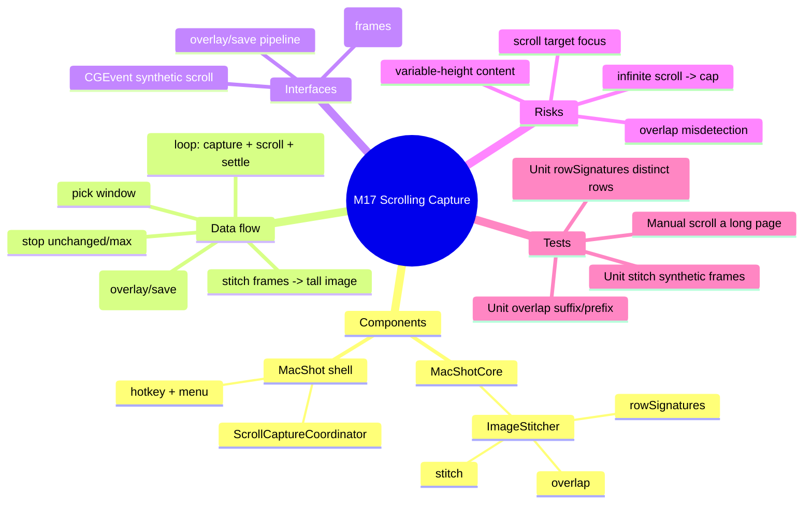

# Spec — M17: Scrolling Capture

> Milestone M17 of `docs/roadmaps/2026-07-23-macshot-v2.md`. Autonomous under `/dev --auto`; open questions resolved with reversible `[auto]` defaults (see `.dev/memory/decisions.md` → phase17). Reuses M1 capture; stacks on M16 branch `exec/m16-auto-redact-20260723`. No graphify graph — M1 API known from building it.

## Mind map

## Purpose

Capture content taller than the screen (long web pages, chats) into one tall image: auto-scroll the target window while capturing frames, then stitch them — removing overlap — into a single screenshot.

## Scope

**In:** `ImageStitcher` (row-signature overlap + stitch); a `ScrollCaptureCoordinator` that picks a window, auto-scrolls via synthetic `CGEvent`, captures frames, stops on unchanged-frame or a max cap, stitches, and presents; a hotkey + menu item.

**Out (the contract):** horizontal scrolling, a manual capture-each-frame mode, editing during capture. No change to the capture/overlay/save internals (reused).

## Architecture

The stitching logic (the correctness-critical part) lives in **MacShotCore** (headless-tested); the scroll+capture loop is the shell.

**MacShotCore (new, TDD):**
- `ImageStitcher`:
  - `rowSignatures(_ image: CGImage) -> [UInt64]` — one hash per pixel row (e.g. FNV over the row bytes) so identical rows share a signature.
  - `overlap(_ a: [UInt64], _ b: [UInt64]) -> Int` — the largest `k` (0…min(count)) such that `a.suffix(k) == b.prefix(k)`; pure array logic.
  - `stitch(_ frames: [CGImage]) -> CGImage?` — start with frame 0; for each next frame, compute `overlap(sig(prev), sig(next))` and append only `next`'s rows below the overlap into a growing bitmap `CGContext`; returns the composited tall image (nil for empty input).

**MacShot shell (new / modified, `swift build` + manual gate):**
- `ScrollCaptureCoordinator` — `run()`: pick the window under the cursor (reuse the M1 window-selection/`SCShareableContent` list); loop: capture the window frame (`SCKScreenCapturer`), append it, post a synthetic scroll-down `CGEvent` (fixed lines ≈ ½ the frame height), wait a ~150 ms settle; **stop** when the newest frame's `rowSignatures` equal the previous frame's (bottom reached) or after **30 frames**; then `ImageStitcher.stitch(frames)` → hand the result to the existing overlay/save pipeline (as a `CaptureResult`).
- `AppDelegate` **(modify)** — register a "Scrolling Capture" hotkey (default `⌃⌘⇧S`, id 7) and add a menu item → `ScrollCaptureCoordinator.run()`.

## Data flow

hotkey/menu → `ScrollCaptureCoordinator.run()` → pick window → **loop** [capture frame → append → synthetic scroll → settle] until unchanged/cap → `ImageStitcher.stitch` → tall `CGImage` → overlay panel + save (existing pipeline).

## Interfaces

- **ScreenCaptureKit** — `SCKScreenCapturer` per-frame window capture.
- **CoreGraphics `CGEvent`** — synthetic scroll-wheel events targeting the window.
- **M1/M2** — window selection; overlay/save of the stitched result.

## Error handling

- Content shorter than one screen → one frame captured; `stitch` returns it unchanged.
- Infinite/virtualized scroll (never "unchanged") → the 30-frame cap stops it; the partial tall image is still produced.
- `overlap` returns 0 (no match — e.g. a jump) → append the whole next frame (no data lost, just a visible seam).
- Scroll target not focused / scroll ignored → frames stay identical → stops after 2 frames with a single-screen result (no crash).
- TCC not granted → reuse M1 `PermissionFlow` before capturing.

## Testing

Unit (`swift test`, headless TDD):
- `overlap`: `[1,2,3,4]` vs `[3,4,5,6]` → 2; `[1,2,3]` vs `[4,5,6]` → 0; identical arrays → full length.
- `rowSignatures`: an image with per-row distinct colors → all signatures distinct; two identical rows → equal signatures.
- `stitch`: build frame A (rows 0–99, per-row gray = row index) and frame B (= A scrolled down 50 rows, i.e. rows 50–149) → stitched height == 150, and sampled rows match the expected pattern; single-frame input → equals the frame; empty → nil.

Manual (human DoD): trigger Scrolling Capture over a long web page → it auto-scrolls, stops at the bottom, and produces one tall image of the whole page with no duplicated/overlapping bands.

## Open questions

None blocking — overlap-via-row-signatures, window-under-cursor selection, unchanged-or-30-frame stop, auto-scroll-only, and the scroll-step/settle timing resolved with reversible `[auto]` defaults. Overlap robustness on anti-aliased/animated content is a known limitation (0-overlap → seam, not data loss).
