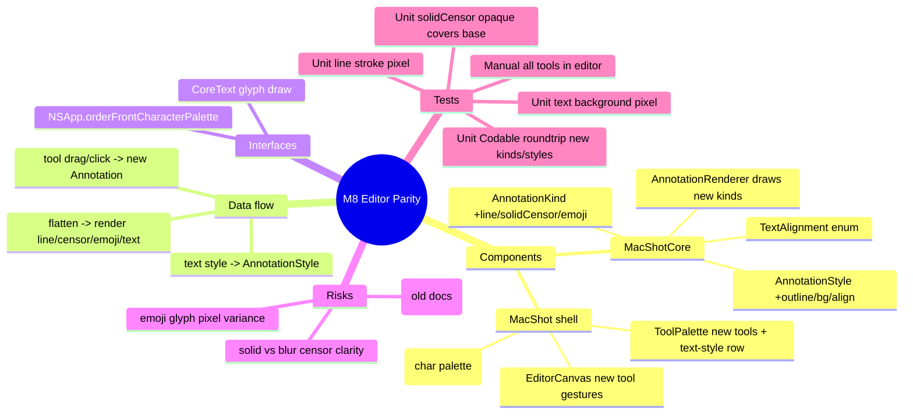

# Spec — M8: Editor Parity (annotation tools)

> Milestone M8 of `docs/roadmaps/2026-07-23-macshot-v2.md`. Autonomous under `/dev --auto`; open questions resolved with reversible `[auto]` defaults (see `.dev/memory/decisions.md` → phase8). Extends the M3 editor; stacks on M7 branch `exec/m7-capture-conveniences-20260723`. No graphify graph — M3 API known from building it.

## Mind map

## Purpose

Bring the annotation editor toward the reference app's tool set: a plain line tool, an opaque solid-fill censor (alongside blur/pixelate), emoji/sticker placement, and richer text styling (outline, background, alignment).

## Scope

**In:** `.line`, `.solidCensor`, `.emoji` annotation kinds + renderer support; text-style additions (outline, background, alignment); editor UI for all of them.

**Out (the contract):** AI auto-redact (M16), translation (M15), beautify (M4 already shipped), any capture/recording changes. Existing M3 kinds unchanged.

## Architecture

Extend the M3 vector model in **MacShotCore** (headless-tested); editor UI in the shell.

**MacShotCore (modify, TDD):**
- `Annotation.AnnotationKind` — add cases (existing cases untouched → old docs still decode): `.line(from: CGPoint, to: CGPoint)`, `.solidCensor(CGRect)`, `.emoji(center: CGPoint, string: String, size: Double)`. Extend `boundingBox`/`contains` for each.
- `AnnotationStyle` — add `textOutline: Bool = false`, `textBackgroundColor: RGBAColor? = nil`, `textAlignment: TextAlignment = .left`; add `public enum TextAlignment: String, Codable, Sendable { case left, center, right }`. Provide a custom `Codable` (or defaulted init) so M3-serialized styles decode with the new defaults.
- `AnnotationRenderer.flatten` — draw the new kinds: `.line` = stroke `from`→`to` (no arrowhead); `.solidCensor` = `ctx.setFillColor(style.fillColor ?? black); ctx.fill(rect)` (fully opaque, covers the base); `.emoji` = draw `string` via `CTLine` centered at `center` at `size`. Text drawing gains: optional `textBackgroundColor` rect behind the text, `textAlignment` for multi-line, and `textOutline` (stroke the glyph path) when set.

**MacShot shell (modify, `swift build` + manual gate):**
- `EditorCanvas` / `EditorViewModel` — add `Tool` cases `.line`, `.solidCensor`, `.emoji`; line drags like the arrow (endpoints), solid-censor drags like a rectangle, emoji tool places at click then opens the emoji picker; the current `style` carries the new text-style fields.
- `ToolPalette` — add Line, Solid-censor, Emoji buttons; a text-style row for the text tool: outline `Toggle`, background `ColorPicker`, alignment segmented control.
- **Emoji picker** — the emoji tool inserts a placeholder `.emoji` and calls `NSApp.orderFrontCharacterPalette(nil)` targeting a hidden first-responder text field; the chosen glyph updates the annotation's `string`.

## Data flow

tool selected → gesture (drag for line/censor, click for emoji/text) → `AnnotationDocument.add(Annotation(kind:style:))` (undo recorded) → `EditorCanvas` live render → Export flatten (M3 pipeline) draws the new kinds. Text-style controls mutate `EditorViewModel.style` → applied to new/selected text annotations.

## Interfaces

- **CoreText** — glyph rendering for text + emoji in `flatten`.
- **AppKit** — `NSApp.orderFrontCharacterPalette` for emoji; SwiftUI controls for the style row.
- **M3** — `AnnotationDocument`, `AnnotationRenderer`, `AnnotationStyle`, `RGBAColor`, editor VM.

## Error handling

- Old (M3) serialized documents/styles → decode with new fields defaulted (no data loss).
- Empty emoji string (picker cancelled) → drop the placeholder annotation.
- `.solidCensor` with no `fillColor` → black default.
- Zero-area line/censor drag → dropped (reuse M3 min-size guard).
- Unknown future kind on decode → skip gracefully (don't crash the doc).

## Testing

Unit (`swift test`, headless TDD):
- `AnnotationRenderer`: a red `.line` over white → a pixel on the segment is red; `.solidCensor` (black) over a patterned base → the region is uniformly black (fully covers, unlike blur); text with a yellow `textBackgroundColor` → background pixel is yellow.
- `.emoji`: flatten with an emoji annotation → output size == base, non-nil (no glyph-pixel assertion — emoji rendering varies by OS).
- `Codable`: roundtrip `.line`/`.solidCensor`/`.emoji` and the new `AnnotationStyle` fields; an M3-era style JSON (without the new keys) decodes with defaults.
- `boundingBox`/`contains` for the new kinds.

Manual (human DoD): in the editor, draw a line, solid-censor a region (content fully hidden), place an emoji via the picker, and style text (outline + background + alignment); export and confirm all render correctly; open a pre-M8 annotated doc without error.

## Open questions

None blocking — emoji source (system palette), solid-censor color (black), emoji rendering (CoreText glyph), and the style-row layout resolved with reversible `[auto]` defaults.
