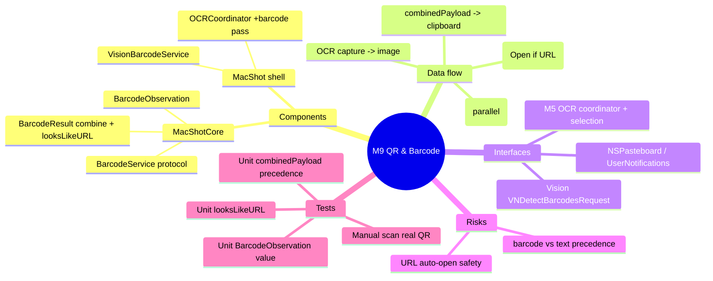

# Spec — M9: QR & Barcode Reading

> Milestone M9 of `docs/roadmaps/2026-07-23-macshot-v2.md`. Autonomous under `/dev --auto`; open questions resolved with reversible `[auto]` defaults (see `.dev/memory/decisions.md` → phase9). Extends the M5 OCR flow; stacks on M8 branch `exec/m8-editor-parity-20260723`. No graphify graph — M5 API known from building it.

## Mind map

## Purpose

Add QR/barcode decoding to the capture-to-text flow: the existing OCR capture now also detects QR/common barcodes and puts the decoded payload on the clipboard, with a notification (offering to open URL payloads). On-device via Vision.

## Scope

**In:** `VNDetectBarcodesRequest` in the OCR capture pass; decoded payload → clipboard + notification; "Open" affordance for URL payloads.

**Out (the contract):** generating codes, translation (M15), a separate QR hotkey/mode (auto-detected in the OCR flow), auto-opening URLs.

## Architecture

Extend the M5 sibling OCR flow. Pure logic in **MacShotCore**; Vision + wiring in the shell.

**MacShotCore (new, TDD):**
- `BarcodeObservation` — `{ payload: String, symbology: String, boundingBox: CGRect }` (Vision-free value, `Equatable`).
- `BarcodeService` — protocol `func detect(_ image: CGImage) async throws -> [BarcodeObservation]`.
- `BarcodeResult` — `static func combinedPayload(text: String, barcodes: [String]) -> String` (barcodes present → `barcodes.joined("\n")`; else `text`) and `static func looksLikeURL(_ s: String) -> Bool` (`http://`/`https://` prefix, trimmed).

**MacShot shell (new / modified, `swift build` + manual gate):**
- `VisionBarcodeService` — implements `BarcodeService` via `VNDetectBarcodesRequest` on the `CGImage`; maps each `VNBarcodeObservation` to `BarcodeObservation` (`payloadStringValue`, `symbology.rawValue`, normalized→pixel `boundingBox`). Skips empty payloads.
- `OCRCoordinator` **(modify)** — after capturing the region image, run OCR (`OCRService`) **and** barcode detection (`BarcodeService`); assemble text (`OCRTextAssembler`) + collect barcode payloads; `let out = BarcodeResult.combinedPayload(text:barcodes:)`; if `out.isEmpty` → "No text or code recognized"; else write `out` to `NSPasteboard` and post a notification (if a single payload and `looksLikeURL`, add an "Open" action via `UNNotificationAction`/handler → `NSWorkspace.open`).

## Data flow

OCR hotkey/menu → area select → capture region `CGImage` → **parallel**: `OCRService.recognize` + `BarcodeService.detect` → `OCRTextAssembler.assemble(text)` + `barcodes.map(\.payload)` → `BarcodeResult.combinedPayload` → `NSPasteboard` + notification (Open for URL).

## Interfaces

- **Vision** — `VNDetectBarcodesRequest` (+ existing `VNRecognizeTextRequest`).
- **M5** — `OCRCoordinator`, `OCRService`, `OCRTextAssembler`, selection/capture path.
- **AppKit** — `NSPasteboard`, `UserNotifications`, `NSWorkspace.open` (URL, user-initiated).

## Error handling

- No text and no barcode → "No text or code recognized" notification; clipboard untouched.
- Barcode detect throws → fall back to OCR-only (log, don't fail the capture).
- Non-URL payload → notification shows it, no Open action.
- Multiple barcodes → payloads newline-joined; Open only when exactly one URL payload.

## Testing

Unit (`swift test`, headless TDD):
- `BarcodeResult.combinedPayload`: barcodes present → payloads joined (text ignored); no barcodes → the text; both empty → empty.
- `BarcodeResult.looksLikeURL`: `https://x` true; `hello` false; leading/trailing spaces trimmed.
- `BarcodeObservation`: value equality.
- (No Vision-on-synthetic-pixels test — flaky; the pure combine carries coverage, mirroring the M5 OCR decision.)

Manual (human DoD): capture a region with a QR code → payload on clipboard + notification; a URL QR offers Open; a region with only text still copies the text (unchanged M5 behavior).

## Open questions

None blocking — auto-detect-both mode, barcode precedence, and URL safety resolved with reversible `[auto]` defaults.
