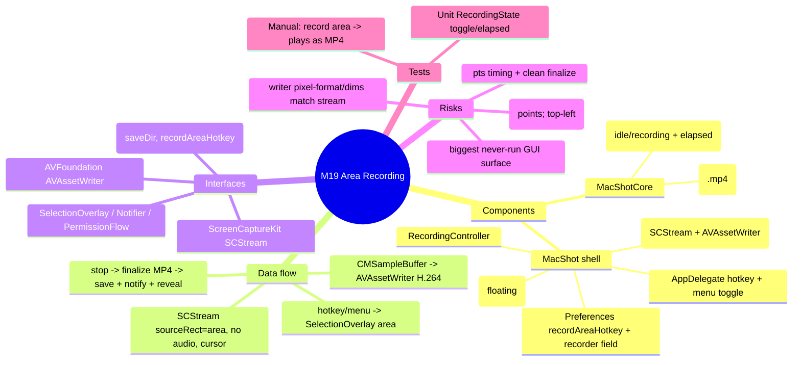

# Spec — M19: Area Screen Recording (video-only)

> User-initiated feature (post-v2). Reversible defaults + user picks recorded in `.dev/memory/decisions.md` → phase19. Builds on the shipped app on `main`. No graphify graph — M1 API known from building it.

## Mind map

## Purpose

Select a screen area (like Capture Area) and record it **silently** (no audio) to an MP4 video. A lean recording MVP: area only, video only, H.264/MP4, 30 fps, cursor shown.

## Scope

**In:** a "Record Area" action (configurable hotkey + menu item); reuse the area selection; `SCStream` capture of that region; H.264 MP4 encode via `AVAssetWriter`; start/stop (menu toggle + hotkey + floating stop pill); save to the save dir + notify/reveal.

**Out (the contract):** audio/microphone, GIF/WebP, webcam/keystroke overlays, countdown, video editor, window/fullscreen recording. Those stay out for now.

## Architecture

Recording is inherently GUI/system → **thin** `MacShotCore` (one testable model), the rest is build-gated + manual-acceptance shell.

**MacShotCore (new / reuse, TDD for the pure bit):**
- `RecordingState` — `{ isRecording: Bool; elapsedSeconds: Int; mutating func start(); mutating func stop(); mutating func tick() }`. Pure, unit-tested. Drives the pill/menu label ("Stop Recording · 0:12").
- Reuse `FilenameFormatter` — the recording filename uses mode `"recording"` and an `.mp4` extension (a small extension-parameter or a wrapper; the formatter currently hard-codes `.png`, so add an `ext` parameter defaulting to `png`).
- `Preferences` **(modify)** — add `recordAreaHotkey: String` (default `"⌃⌘⇧V"`).

**MacShot shell (new / modified, `swift build` + manual gate):**
- `AreaRecorder` — the recording pipeline:
  - `start(area: CGRect, display: SCDisplay, scale: CGFloat, to url: URL) async throws`: build an `SCStreamConfiguration` with `sourceRect = area` (display-local **top-left points**, the M7 SelectionOverlay convention), `width/height = area.size × scale` (pixels), `showsCursor = true`, `capturesAudio = false`, `minimumFrameInterval = CMTime(value:1, timescale:30)`, `pixelFormat = kCVPixelFormatType_32BGRA`; `SCContentFilter(display:excludingWindows:[])`; create the `SCStream`, add an `SCStreamOutput` (of type `.screen`) on a dedicated queue.
  - The output handler appends each valid `CMSampleBuffer`'s pixel buffer to an `AVAssetWriterInputPixelBufferAdaptor` (writer: `AVAssetWriter(url:fileType:.mp4)`, input: `AVAssetWriterInput(mediaType:.video, outputSettings: H.264 + width/height)`), starting the session at the first buffer's pts.
  - `stop() async -> URL?`: stop the stream, mark input finished, `finishWriting`, return the MP4 URL.
- `RecordingController` (`@MainActor`) — holds a `RecordingState` + an `AreaRecorder`. `toggle()`: if idle → `PermissionFlow` check → present `SelectionOverlay` in `.area(nil)` → on a resolved rect, resolve the display + scale, compute the save-dir `.mp4` URL, `AreaRecorder.start(...)`, show `RecordStopPill`, start a 1 s timer ticking `RecordingState`; if recording → `AreaRecorder.stop()` → hide pill → `Notifier` "Recording saved" + reveal in Finder. Errors (TCC, writer, no target) → notify, reset state.
- `RecordStopPill` — a small borderless floating `NSPanel` with a red "● Stop N:SS" button, positioned near the recorded area (or top-center); click → `RecordingController.toggle()`.
- `AppDelegate` **(modify)** — a "Record Area" menu item whose title toggles to "Stop Recording" while recording; register `prefs.recordAreaHotkey` (id 8) → `recordingController.toggle()`; re-register on prefs change.
- `PreferencesWindow` **(modify)** — a `HotkeyRecorderField` for the Record-Area hotkey (in the Capture section, mirroring the other recorders).

## Data flow

hotkey/menu → `RecordingController.toggle()` (idle) → `SelectionOverlay(.area)` → `.area(rect)` → resolve `SCDisplay` + `backingScale` → `AreaRecorder.start(area:rect, …, to: saveDir/<name>.mp4)` → `SCStream` delivers `CMSampleBuffer`s → `AVAssetWriter` appends → pill + menu show elapsed. Toggle again → `AreaRecorder.stop()` → finalized MP4 → `Notifier` + reveal.

## Interfaces

- **ScreenCaptureKit** — `SCStream`, `SCStreamConfiguration.sourceRect`, `SCStreamOutput`, `SCShareableContent` (display resolve).
- **AVFoundation** — `AVAssetWriter`, `AVAssetWriterInput`, `AVAssetWriterInputPixelBufferAdaptor`.
- **M1** — `SelectionOverlay` (area), `Notifier`, `PermissionFlow`, `FilenameFormatter`, `Preferences`, `HotkeyManager`, `HotkeyRecorderField`.

## Error handling

- TCC not granted → `PermissionFlow` prompt; abort start, no orphan file.
- `SCStream`/writer setup fails → notify "Couldn't start recording", reset state, delete any partial file.
- Zero-area / cancelled selection → no-op (no recording).
- Stop with zero frames written → discard the empty file, notify.
- `sourceRect` outside the display / display resolve fails → notify, abort.
- App quits while recording → best-effort finalize in `applicationWillTerminate` (or accept a lost partial — documented).

## Testing

Unit (`swift test`, headless TDD):
- `RecordingState`: `start()` → isRecording true, elapsed 0; `tick()` × 3 → elapsed 3; `stop()` → isRecording false; toggle sequence.
- `FilenameFormatter` with `ext: "mp4"` → filename ends `.mp4`; existing `.png` default unchanged (existing tests stay green).

Manual (human DoD — REQUIRED, this is unavoidable): press the record hotkey → select an area → the pill shows and counts up → do something on screen → stop → an `.mp4` lands in the save dir, opens in QuickTime, shows exactly the selected area with the cursor, no audio, ~30 fps, correct dimensions. Try: cancel selection (no file), stop immediately (no empty file), record across a Retina/multi-monitor boundary.

## Open questions

None blocking — area-only/video-only/MP4/30fps/cursor-on and the three-way stop with a configurable hotkey are decided. The **coordinate mapping** (SelectionOverlay top-left points → `sourceRect`; area×scale → writer pixel dims) is the top runtime risk and is verified in manual acceptance. This is the biggest never-run GUI surface in the app — plan for runtime iteration.
